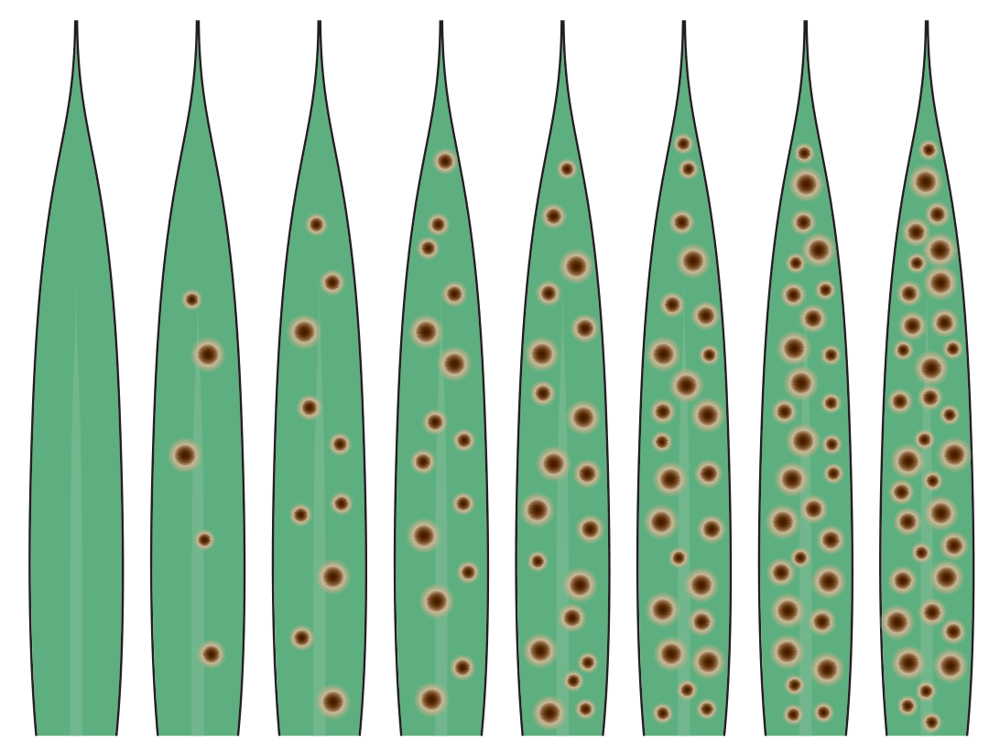

```{r setup, include=FALSE}
library(knitr)
Sys.setenv(RSTUDIO_PDFLATEX = Sys.which("latexmk"))
require(tidyverse)
set.seed(453)
# invalidate cache when the package version changes
knitr::opts_chunk$set(tidy = FALSE, echo = FALSE, 
                  message = FALSE, warning = FALSE,
                  out.width = "45%", cache = TRUE, 
                  dev.args=list(bg=grey(0.9), pointsize=11))
options(knitr.table.format = "latex")
options(knitr.kable.NA = "", digits = 2)
options(kableExtra.latex.load_packages = FALSE)
# Beamer cheatsheet can be found at:
# http://www.cpt.univ-mrs.fr/~masson/latex/Beamer-appearance-cheat-sheet.pdf
# All beamer themes and colorthemes can be assessed at:
# https://hartwork.org/beamer-theme-matrix/

# A complete book on biolgy view this link
# https://github.com/philschatz/biology-book/blob/master/SUMMARY.md
```

# Terminologies

##

\bcolumns
\column{0.65\textwidth}
\begin{description}
\footnotesize
\item[Disease] Physiological disturbance of a plant/part of a plant caused by a stress factor or a combination of stress factors resulting in symptoms.
\item[Host] An individual/species/group susceptible to a natural enemy and serves both as source of nutrition and as living substrate.
\item[Parasite] Organism that more or less permanently and sometimes of part of its life cycle lives in close connection with a living organism (host) and withdraws its nutrients completely or partially at the expense of that organism; i.e., an insect, mite, nematode, parasitic angiosperm\footnote[frame]{\scriptsize Recent classification of weeds based on ecology establishes them as competitors -- not parasites!} (broomrape, witchweed, dodder), or any categories of plant pathogen (fungi, bacteria, virus).
\item[Pathogen] Having the capacity to infect plants; exploits the plants as a source of nutrition.
\end{description}
\column{0.35\textwidth}

```{r strawberry-rust, fig.cap="Rust on mock strawberry (\\textit{Potentilla indica}) caused by \\textit{Phragmidium mexicanum} with urediniospores and teliospores.", out.width="96%"}
knitr::include_graphics("../images/FCpHrYNWEAIhiv9.jpg")
```

\ecolumns

##

\begin{description}
\small
\item[Infection] The use of a plant as nutrient source by a pathogen, usually resulting in reproduction of that enemy.
\item[Infestation] The use of a plant as nutrient source by natural enemy and lives on that plant.
\item[Sign] Visible parts of pathogen by which it can be recognized.
\item[Symptom] Deviation from normal growth and development of a plant by stress factor(s).
\item[Stress factor] Identifiable factor that potentially results in damage.
\item[Damage] Reduction in physical or economic yield of a crop due to stress factors.
\end{description}

## Classification of pathogens

\begin{description}
\small
\item[Biotrophs] Withdrawing nutrients from living host tissue (viruses, PM, rust fungi, loose smut).
\item[Necrotrophs] Withdrawing nutrients from tissue killed by natural enemy (\textit{Septoria} spp., \textit{Helminthosporium} spp.)
\item[Hemi-biotrophs] Withdrawing nutrients from living host tissue that soon after this will die (\textit{Phyophthora infestans}, Downy mildew fungus).
\item[Weakness pathogen] That only can infect weakened plant parts with reduced fitness.
\item[Vascular wilts] Pathogen that causes wilting of the host plant by blocking of the xylem and lives in and spreads through the vascular tissue (\textit{Fusarium} spp., \textit{Verticillium} spp.).
\end{description}

# Complex nature of plant-pathogen-environment interaction

##

```{r}
# Figure 2 from Interactions and coadaptations in plant metaorganisms
```


```{r}
# Figure 3 from Navigating complexity to breed disease-resistant crops
```

```{r}
# Figure 3 from Plant–microbiome interactions: from community assembly to plant health
```


##

\footnotesize
- Biological efficiency of production (expressed as unit of the product per unit of absorbed solar energy, or conveniently as kg/hectare) is a relative measurement and it varies according to the environment, with the cultivar, and especially with its variations.
- A proper biological index could help plant breeders in obtaining cultivars with better efficiency in using natural resources.
- Yield potential (a theoretical idea) can be defined as the yield obtained when the cultivar is grown with no environmental restrictions -- with no biotic or abiotic stresses.
  \begin{itemize}
  \footnotesize
  \item soil nutrients and water are not limiting
  \item pests and weeds are effectively controlled
  \end{itemize}
- Crop yield potential (genetic) is much larger than the biological efficiency per area (recorded yield) owing to several environmental influences and management practices -- collectively called \alert{stresses}.
- Infection or infestation by plant pests and diseases affects \alert{yield} and \alert{end-use quality}

##

```{r crop-pandemic-history, fig.cap="Major disease outbreaks in the last 150 years and current critical disease challenges. (i) Introduction of the oomycete \\textit{Phytophthora infestans} which causes potato late blight. (ii) The rust fungus \\textit{Hemileia vastatrix} wipes out the coffee crop in Sri-Lanka; the British become tea drinkers. (iii) The vascular fungal pathogen causing Fusarium wilt of banana nearly wipes out the Gros Michel variety; the resistant Cavendish banana is adopted. (iv) The fungus \\textit{Cochliobolus miyabeanus}, which causes Brown spot disease of rice is a factor in the Great Bengal Famine in which 2 million people died of starvation. (v) Bacterial leaf blight or rice (\\textit{Xanthomonas oryzae} pv. \\textit{oryzae}) causes epidemics throughout Southeast Asia with yield losses up to 80\\%. (vi) Witches\' broom caused by the fungus \\textit{Moniliophthora perniciosa} caused losses of upto 75\\% of annual cacao production in Brazil. (vii) The new \\textit{Fusarium} wilt isolate TR4 is identified and threatens Cavendish banana. (viii) Ringspot virus devastates the papaya industry in Hawaii; a GM variety is introduced that resists infection. (ix) A new race of the stem rust fungus \\textit{Puccinia graminis} (UG99) is spreading throughout Africa and Middle East, threatening the world supply of wheat. (x) Asian soybean rust caused by \\textit{Phakopsora pachyrhizi} reaches Brazil, costing growers US \\$2 billion annually in damages and control measures.", out.width="40%"}

```

##

```{r wheat-blast, fig.cap="Past present and future of Wheat blast. Countries that imported wheat from Brazil in 2016/17 are thought to have received much of the pathogen inoculums.", out.width="86%"}

```

\footnotesize Note: For more discussion on Wheat blast refer to @ceresini2018wheat.

# Disease epidemiology (The Disease Triangle)

```{r disease-triangle, fig.cap="The disease triangle.", out.width="45%"}
# pdftools::pdf_convert("../literatures/10.1038@s43016-020-0075-0.pdf", format = "png",
#                       pages = 3, filenames = "../images/disease_triangle.png", dpi = 350)

```

## Pathogen -- Specificity and virulence

- Infectious disease result from infection caused by plant pathogen.
- Pathogen can grow and multiply rapidly on diseased plants, and can spread from diseased to healthy plants and cause additional plant to become diseased -- epidemic.
- A plant parasite is an organism that becomes intimately associated with a plant and multiplies or grows at the expense of the plant (removes nutrients and water from the host) 
- Parasitism is associated with pathogenicity, i.e., the ability of a pathogen to cause disease, as the ability of the parasite to invade and become established in the host generally results in the development of a diseased condition.

##

- Only a few members of a few groups of living organisms can parasitize plants.
- Some parasites are biotrophs (obligate parasites, can grow and reproduce in nature only in living hosts)
  - viruses
  - viroids
  - mollicutes
  - fastidious bacteria
  - nematodes
  - protozoa
  - downy mildew, powdery mildew and rust fungi
- Others are semi-biotrophs (facultative saprophytes), necrotrophs
- Obligate and nonobligate parasites generally differ in the ways in which they attack their host plants and procure their nutrients from the host

## Host -- Abundance and susceptibility

\small
- For most plant disease (particularly foliar) caused by fungi, $\big\Uparrow$ host density $\sim$ disease $\big\Uparrow$ epidemics.
- $\big\Uparrow$ the pathogen spores travel from infected source plants, $\big\Downarrow$ concentrated will be the innoculum load that reaches the nearest uninfected plants.
- $\big\Uparrow$ canopy density $~$ $\big\Uparrow$ humidity, the condition conducive for initial stages of infection.
- Factors contributing to the loss of crop production stability relate to:
  - $\big\Uparrow$ field aggregation and size
  - $\big\Uparrow$ host plant density ($\big\Uparrow$ fertilizer use)
  - $\big\Uparrow$ crop species uniformity through specialization
  - $\big\Uparrow$ of genetic uniformity at the cultivar level
  - $\big\Uparrow$ reliance on race-specific resistance and neglect of resistance to currently less-damaging disease
- $\big\Uparrow$ international exchange of seed and planting stock has contributed to the dispersal of pathogens into newer parts of world
- Shorter crop duration $\big\Uparrow$ pathogen innoculum survival from one crop cycle to the next.

## Environment -- Permissiveness

\small
- Each pathogen favor a specific set of environmental conditions for disease development
- Mostly, soil-borne pathogens are most damaging in wet soil
- Foliar diseases such as wheat stem rust, thrive in hot weather while other, such as wheat stripe rust, require cool temperatures.
- Nearly all foliar pathogens (with exclusion of powdery mildew fungi) require high moisture for their initial growth on leaf or stem surface before they penetrate the interior regions.
- Breeding for disease resistance involves exposing breeding populations to induced epidemics or to natural epidemics in known "hot spots".
- Breeder's objective is to optimize the pathogen and environmental sides of the disease triangle to provide consistent epidemics of sufficient severity to clearly damage susceptible breeding lines without also destroying lines with useful levels of resistance.
- Three sides of the triangle as main effects as well as interactions between them need to be considered.

##

- Seedling blight in winter wheat is most severe at soil temperatures of \SIrange{20}{28}{\celsius} and does not occur below \SI{12}{\celsius}.
- In maize, seedling blight does not occur at soil temperatures above \SI{24}{\celsius} and is most severe at \SIrange{8}{20}{\celsius}.
- $\because$ Wheat, as cool season crop, is adapted to rapid seedling development in cool soils, whereas maize is a warm season crop adapted to rapid seedling development in warm soils.
  - Breeding for reduced seedling blight in early planted maize entails selection for lines with greater cold tolerance and faster germination in cool soils.
- Susceptibility of upland and lowland ecotypes to rice blast.
- H x E interaction also are prominent in many diseases caused by biotrophic pathogens, such as the rust fungi, that are highly specialized parasites.

##

- Pathogen x Environment interactions are encountered in field plot tests as:
  - non-uniform distribution of soilborne pathogens due to variable moisture regimes at low and high spots of the field and due to difference in water-holding capacity
  - vector borne virus may be more prominent at the edges of field (edge effect)
- Collections of \textit{H. spontaneum} from hot, dry regions of Israel were more susceptible to leaf rust and powdery mildew than were collections from other areas of Israel where rust and mildew were more prevalent.
  - disease resistance tend to be lost from plant populations when there is no disease pressure to maintain selection for resistance

<!-- Seedling blight of wheat and maize are a classic example of the role of host x environment interactions in disease development. The soilborne fungi that are commonly involved in seedling blights are weak pathogens that do not seriously damage the host plants except under conditions in which seedling growth is slow and the development of defensive morphological barriers to root and hypocotyl infection, termed "hardening off", is delayed. The same soilborne fungi can cause seedling blight in both wheat and maize, but the disease occur under different environmental conditions for the two crops. -->

<!-- High silicon concentration in epidermal cells of rice foliage is related to reduced disease severity, apparently because silicic acid condenses into a glass-like coating of polymerized SiO2 on epidermal surfaces that impedes pathogen penetration. The highly weathered upland soils in the tropics contain lower silicon concentrations than the rich alluvial soils of the bottom lands. Ecotypes of rice adapted to lowlands are generally more susceptible to rice blast than the upland rice ecotypes when grown side by side in upland plots without supplemental silicon applied to soil. The reason for this is that the upland ecotypes have evolved more efficient mechanisms of silicon uptake from the silicon-deficient soils of the uplands and, thus, are able to form a stronger barrier against pathogen peneration. -->

<!-- The partial resistance of the wheat cultivars Gaines and Nugaines to stripe rust caused by Puccinia striiformis is effective during the summer months in the Pacific Northwest region of the US. This resistance is referred to as high-temperature adult plant resistance. Although HTAP resistance does not protect winter wheat plants during cool spring weather, it becomes effective during early summer in nearly all years before the stripe rust epidemics have progressed far enough to cause significant yield losses. The HTAP resistance of Gaines and Nugaines wheat has remained effective for more than 40 years. -->

##

- Development of resistant cultivars involves consideration of the genetic variability of the pest/diseases as well as the variability in resistance (or sometimes tolerance) within the crop species or related group.
- Durability of resistance is affected by emergence of new races of the disease/pest that are able to overcome existing resistance 
- Environmental changes (brought about by global warming) also affects the dynamics of plant interactions with pests and diseases and render crops more or less susceptible to biotic stresses, owing to:
  - changed distribution of phytophagous insects (lepidopterans)
  - changes in crop and insect phenology synchrony (emergence)
  - over one-third of the total variance in caterpillar parasitism (activity of natural predators) is explained by variability in precipitation

##

\small
- Sources of alleles conferring disease resistance have traditionally been landraces and old cultivars/materials kept by small farmers.
- A range of pests -- ranging upto large foraging mammals -- inflict crop damage, not all of which amenable to resistance breeding
  - Wheat crop in and around the wildlife protection buffer zones knocked down by a herd of Rhinoceri is hard! to breed for.  
- For much of 20th century, scientific plant breeding has been successful in first 3 of 4 main objectives:
  - yield improvement
  - quality improvement
  - agronomic suitability improvement
  - resistance to parasites
- $\because$ resistance keeps breaking down because of new strains of the parasite and then an endless repetition of resistance failures and a "boom and bust" cycle of cultivar production. 

# Gene for gene hypothesis

##

- @flor1956complementary was the first to show there was a 'gene-for-gene' relationship between the pathogen's avirulence ( _Avr_) genes and the resistance ( _R_) genes of its host.
- "A resistance gene, $R$ is only effective if the infecting pathogen carries the corresponding avirulence gene, $A$".
- Host resistance is conditioned by dominant allele, $R$.
- In the pathogen, virulence is conditioned by recessive allele, $a$
- Resistance reaction occurs when complementary genes in both host and pathogen are dominant.
- A host genotype that carries no dominant alleles at any of the loci is susceptible for all the races of pathogen (even if avirulent).
- An $A$ (avirulent) allele is dominant over $a$ (virulent) allele and resistant allele $R$ is dominant over susceptible allele $r$.
- Compatibility depends on the genotype of the host and the genotype of the pathogen.

##

\begin{columns}[T, onlytextwidth]
\column{0.4\textwidth}

```{r host-path-compatibility-mono}
host_path_compat_mono <- tribble(
  ~"Host genotype", ~"A (avirulence)", ~"a (non-avirulence)",
  "R (resistance)", "-", "+",
  "r (susceptible)", "+", "+"
) 

host_path_compat_mono %>% 
  knitr::kable(booktabs = TRUE, caption = "Host-pathogen compatibility reactions in monogenic resistance due to allelic variants of $R$ and $A$ genes. '-' symbol indicates incompatible reaction implying host immunity while '+' symbol denotes compatible interaction.") %>% 
  kableExtra::add_header_above(header = c(" "=1, "Pathogen genotype"=2)) %>% 
  kableExtra::kable_styling(font_size = 6) %>% 
  kableExtra::column_spec(column = 1:3, width = c("8em", "6em", "6em"))
```

\column{0.6\textwidth}

```{r host-path-compatibility-tri}

host_haplotype <- expand_grid(R1 = c("R_1", "r_1"),
                              R2 = c("R_2", "r_2"),
                              R3 = c("R_3", "r_3")) %>%
  unite("host_haplotype", sep = " ") %>% pull(host_haplotype)
pathogen_haplotype <- expand_grid(A1 = c("A_1", "a_1"),
                                  A2 = c("A_2", "a_2"),
                                  A3 = c("A_3", "a_3")) %>% 
  unite("pathogen_haplotype", sep = " ") %>% pull(pathogen_haplotype)

# map_dfr(list(host_haplotype = str_split(host_haplotype, "\\s|_"),
#              pathogen_haplotype = str_split(pathogen_haplotype, "\\s|_")), enframe, .id = "names")

host_path_compat_tri <- expand_grid(host_haplotype, pathogen_haplotype) %>% 
  mutate(h1 = str_sub(host_haplotype,start = 1,end = -12+1),
         h2 = str_sub(host_haplotype,start = 5,end = -12+5),
         h3 = str_sub(host_haplotype,start = 9,end = -12+9),
         a1 = str_sub(pathogen_haplotype,start = 1,end = -12+1),
         a2 = str_sub(pathogen_haplotype,start = 5,end = -12+5),
         a3 = str_sub(pathogen_haplotype,start = 9,end = -12+9)) %>% 
  mutate(compatibility_reaction = case_when(
    h1 == "R" & a1 == "A" ~ "-",
    h2 == "R" & a2 == "A" ~ "-",
    h3 == "R" & a3 == "A" ~ "-",
    TRUE ~ "+"
  )) %>% 
  select(-c(h1:a3)) %>% 
  pivot_wider(names_from = pathogen_haplotype, values_from = compatibility_reaction) %>% 
  mutate(host_haplotype = paste("$", host_haplotype, "$", sep = "")) %>% 
  rename_with(.cols = 2:9, ~paste("$", .x, "$", sep = "")) %>% 
  rename("Host haplotype" = host_haplotype)

host_path_compat_tri %>% 
  knitr::kable(booktabs = TRUE, caption = "Host-pathogen compatibility reactions in trigenic resistance due to allelic variants of $R_1, R_2, R_3$ and $A_1, A_2, A_3$ genes. '-' symbol indicates incompatible reaction implying host immunity while '+' symbol denotes compatible interaction.", escape = FALSE) %>% 
  kableExtra::add_header_above(header = c(" "=1, "Pathogen genotype"=8)) %>% 
  kableExtra::kable_styling(font_size = 6) %>% 
  kableExtra::column_spec(column = 1:9, width = c("7.5em", rep("2.2em", 8)))
```

\end{columns}

## Tolerance and Sensitivity

\small
- \alert{Resistance} is the extent to which a plant prevents the entry or subsequent growth of the pathogen within its tissues or the extent to which a plant is damaged by a pathogen.
- \alert{Susceptibility} is the incapacity of a plant to reduce the growth, development and reproduction of the natural enemy.
- \alert{Tolerance} neither restricts parasitic contact nor the growth and development of the parasite after establishment.
  - Amount of damage/symptoms per unit quantity of parasite present is unaffected
- \alert{Sensitivity} is the character of the host plant to develop relatively severe symptoms or severe damage per unit quantity of the natural enemy.

$$
\text{Sensitivity} = \frac{\frac{\text{Yield without pathogen}-\text{Yield with pathogen}}{\text{Yield without pathogen}}}{\text{Concentration of pathogen}}
$$

##

```{r}
tribble(
  ~"Variety", ~"Virus concentration", ~"Yellowing", ~"Yield with virus (kg)", ~"Yield without virus (kg)",
  "A", 100, 8, 80, 90,
  "B", 60, 5, 100, 110,
  "C", 50, 4, 75, 90,
  "D", 70, 6, 50, 100
) %>% 
  knitr::kable(booktabs = TRUE) %>% 
  kableExtra::kable_styling(font_size = 6) %>% 
  kableExtra::column_spec(column = 1:5, width = c("5em", "6em", "5em", "7em", "7em"))
```

\footnotesize
- Which variety is the most susceptible and why ?
- Which variety is the most resistant and why ?
- Which variety is the most tolerant and why ?
- Which variety is the most sensitive and why ?

##

```{r pathotype-genotype-determination}
tribble(~Pathotype, ~A, ~B, ~F1, ~F2,
        "P1", "R", "S", "All R", "3 R, 1 S",
        "P2", "S", "R", "All R", "3 R, 1 S",
        "P3", "R", "R", "All R", "15 R, 1 S",
        "P1 + P2", "S", "S", "All R", "9 R, 7 S"
        ) %>% 
  knitr::kable(booktabs = TRUE) %>% 
  kableExtra::kable_styling(font_size = 7) %>% 
  kableExtra::add_header_above(c(" " = 1, "Variety" = 2, "Progeny ratio" = 2)) %>%
  kableExtra::column_spec(column = 1:5, width = c("6em", rep("2.5em", 2), "3.5em", "4.5em"))
```

##

- Var $A$: $AAbb$
- Var $B$: $aaBB$
- $F_1$: $AaBb$
- $P_1$: $A_1 A_1 a_2 a_2$ ($\because F_2$ ratio = $3:1$)
- $P_2$: $a_1 a_1 A_2 A_2$ ($\because F_2$ ratio = $3:1$)
- $P_3$: $A_1 a_1 A_2 a_2$ ($\because F_2$ ratio = $15:1$, phenotype is due to duplicate gene action)
- $P_1 + P_2$: $A_1 A_1 a_2 a_2 + a_1 a_1 A_2 A_2$ ($\because F_2$ ratio = $9:7$, phenotype is due to complementary gene action)

## Molecular basis of gene-for-gene interaction

\small
- Any heritable characteristic of the plant that contributes to localization and isolation of the pathogen at the points of entry, to reduction of the harmful effects of toxic substances produced by the pathogen, or to inhibition of the reproduction and, thereby, further spread of the pathogen, contributes to the resistance of the plant to disease.
- Flor's 'gene-for-gene' postulate follows that resistance and avirulence genes possess the '+' functions, for if the host and parasite genomes contain only one pair of definitive genes, an incompatibility response will develop despite of the presence of many indefinitive gene pairs.
- Evidence of '+' function of gene pairs has been exemplified,
  \begin{itemize}
  \footnotesize
  \item In mutant study of \textit{Melampsora lini} (by Flor, 1960) 
  \item In planned crossing of wheat lines possessing genes of resistance to stem rust \textit{Puccinia. graminis}
  \item In temperature sensitive (\textit{ts}) resistance genes of wheat ($Sr6$ against stem rust) and \textit{Nicotiana glutinosa} ($N$ gene against TMV)
  \end{itemize}

<!-- - In 1960, Flor reported about receiving the mutants virulent to the flax cultivar Koto after X-ray irradiation of the spores of race 1 of the rust fungus _Melampsora lini_ avirulent to the flax cultivars Koto and Leone. After inbreeding of the mutant isolates, 191 strains M1 were tested for virulence. All of them were found to be virulent to cultivar Koto, like the parent mutant; however, 12 strains also became virulent to cultivar Leone. The results of the observations were interpreted as follows: race 1 is heterozygotous (more correctly, heteroallelic, as rust fungal cells contain two haploid nuclei each, the heteroallelity of which is phenotypically indistinguishable from heterozygosis) in avirulence to cultivar Koto and homozygotous in avirulence to cultivar Leone. Since virulence is recessive, this race is virulent to both cultivars. Genes of avirulence to cultivars Koto and Leone are linked. X-ray irradiation resulted in a deletion of the nucleus carrying the gene of avirulence to cultivar Koto. The deletion covered both linked avirulence genes (to cultivars Koto and Leone). The spores became heterozygous in deletion and virulent to cultivar Koto due to the presence of a recessive gene of virulence to this cultivar in the second (unaffected) nucleus of the dikaryon. The inbreeding produced three types of dikaryotic cells: (1) homozygotes in the gene of virulence to Koto (virulent to Koto and avirulent to Leone); (2) heterozygotes in deletion (also virulent to Koto and avirulent to Leone), and (3) homozygotes in deletion (virulent to both cultivars due to the absence of dominant alleles of avirulence genes). These data suggest that a virulence gene constitutes an inactive allele of the avirulence gene, phenotypically indistinguishable from deletion. -->

##

\bcolumns
\column{0.65\textwidth}
\footnotesize
- First step in any infection is recognition of the host by the pathogen and perhaps the opposite, some type of recognition of the pathogen by the host.
  \begin{itemize}
  \footnotesize
  \item absence of recognition factor(s) in the host could help it avoid infection by particular pathogen
  \end{itemize}
- During formation of the haustorium, carbohydrates of the parasitic fungus cell wall closely contact the plant plasmalemma. H. H. Flor assumed that in the presence of complementarity in the structure of carbohydrate chains of the fungus cell wall and tertiary structure of the plasmalemma protein, the parasite is recognized and a signal to trigger the defense responses is generated.
  \begin{itemize}
  \footnotesize
  \item \emph{R} genes control the synthesis of receptor protein on cytoplasmic membrane of the host
  \item \emph{Avr} genes control the synthesis of the enzyme glucosyltransferases that connect monosaccharides in a fixed order and build carbohydrate chains in the fungus cell walls
  \end{itemize}

\column{0.35\textwidth}

```{r molecular-mechanism-gene-for-gene, fig.cap="Basic interaction of pathogen avirulence (A)/virulence (a) genes with host resistance (R)/susceptibility (r) genes in a gene-for-gene relationship and final outcomes of the interaction; Source: \\cite{agrios2005plant}.", out.width="70%", fig.align='center'}

```

\ecolumns

##

\footnotesize
- After demonstration of specificity (of $R$ and $Avr$ genes), upon the preparation of factioning and isolation of the specific inducer (or as suggested by N. Keen, elicitor), labeling it with a radioactive isotope, and treatment of the leaves of a resistant plant or (rather) protoplasts produced from its cell, binding of protein (of host plasmalemma) to the elicitor can be shown by (again) fractioning.
  \begin{itemize}
  \scriptsize
  \item susceptible cultivar either has no such protein, or, if it does, its elicitor binding constant is considerably low
  \end{itemize}
- Finally receptor protein can be sequenced from which cDNA strand could be synthesized, which again can be used to isolate the resistance gene from plant genome through probe hybridization.

\bcolumns
\column{0.25\textwidth}
\footnotesize
- Many elicitors have been discovered, only some of them have been produced as highly purified preparations

\column{0.75\textwidth}

<!-- Crude preparations bear many hazards: (1) unpurified extract may contain various elicitors with a synergistic effect; their structure may be similar, which complicates purification of individual compounds; (2) extraction may produce a complex of the elicitor and another substance; (3) the elicitor may be active only in the presence of a certain cofactor which may be lost in purification; (4) the elicitor yield may depend on culturing conditions, crop age, and other factors. -->

```{r fungal-elicitors, fig.cap="Highly purified fungal elicitors inducing formation of phytoalexins (FA) in plants.", out.width="68%"}

```

\ecolumns

## Suppressors

<!-- Difficulties with elicitor model: First, it was not just one parasite metabolite that induced defense response but many metabolites localized in different cell compartments (the membrane, the wall, the periplasm, the cytosol) and belonging to different classes of chemical compounds (carbohydrates, proteins, fatty acids, etc.). Second, elicitor compounds have been found both in avirulent and virulent races, and even in saprotroph fungi. Third, these elicitors induce defense responses both in resistant and susceptible plant cultivars, including species and cultivars without genes of resistance to a given parasite.  -->

<!-- Elicitors can be classified into several groups. First, there are elicitors isolated from the pathogens or media where they have grown (exogenous biogenic elicitors); second, the elicitors formed in an infested plant (endogenous biogenic elicitors); and third, the abiogenic elicitors not involved in pathogenesis. Biogenic or biotic elicitors can, in turn, be divided into non-specific and specific. Abiogenic elicitors are always non-specific. -->

\small
- Studies showing the results of nonspecificity of most isolated pathogen elicitors brought many biochemists studying plant immunity mechanisms to believe that induction of defense responses by the parasite and their development in a plant are non-specific, and resistance and avirulence genes are indefinitive, while suppression (inhibition) of defense responses by the parasite and responsiveness of the host to the \alert{suppressor} is specific.
- In some fungus-host plant combinations, such patterns have been confirmed experimentally, and the specific suppressors have been identified.

<!-- Apparently, in different plant-pathogen partnerships both interaction patterns can work: (1) non-specific induction of defense responses and specific suppression by the parasite; (2) specific induction of defense responses and its loss due to mutations of the avirulence gene. Genes controlling formation of specific elicitors are usually called avirulence genes (avr-genes); genes controlling synthesis of specific suppressors are called virulence genes (vir-genes). Plant–parasite interaction undergoes the following stages: release of the elicitor $\rightarrow$ its interaction with cell receptors $\rightarrow$ transduction of the signal in genes $\rightarrow$ activation of the immune response genes $\rightarrow$ accumulation of toxic and barrier compounds (stress metabolites) $\rightarrow$ suppression by the parasite of various stages of stress metabolism, from elicitor reception to detoxification of antimicrobial substances. -->

# Resistance types

## Vertical (race-specific) and horizontal (race non-specific) resistance

\begin{columns}[T, onlytextwidth]
\column{0.5\textwidth}

```{r vertical-resistance, fig.cap="Vertical resistance to concerned pathogen races of cultivar A of wheat.", fig.width=6, fig.height=5, out.width="98%"}
vert_res <- tribble(~pathogen_race, ~resistance,
                    "1", 35,
                    "2", 20,
                    "3", 28,
                    "4", 55,
                    "5", 100,
                    "6", 22,
                    "7", 43,
                    "8", 58)

ggplot(data = vert_res, aes(pathogen_race, resistance)) +
  geom_bar(stat = "identity", position = "stack", fill = "red", color = "black") +
  theme_bw() +
  labs(x = "Races of pathogen", 
       y = "Resistance") +
  scale_y_continuous(labels = scales::percent_format(scale = 1))
  
``` 

\column{0.5\textwidth}

```{r horizontal-resistance, fig.cap="Horizontal resistance to concerned pathogen races of cultivar C and cultivar B of wheat.", fig.width=6, fig.height=5, out.width="98%"}
horiz_res <- tibble(pathogen_race = 1:8, resistance_b = 60, resistance_c = 40) %>% 
  pivot_longer(cols = 2:3, names_to = "cultivar", values_to = "resistance_value")

ggplot(data = horiz_res, aes(pathogen_race, resistance_value)) +
  geom_bar(stat = "identity", position = "stack", fill = "blue", color = "black") +
  theme_bw() +
  labs(x = "Races of pathogen", 
       y = "Resistance") +
  scale_y_continuous(labels = scales::percent_format(scale = 1), limits = c(0, 100)) +
  facet_wrap(~cultivar, nrow = 2,
             labeller = as_labeller(c(`resistance_b` = "Cultivar B", 
                                      `resistance_c` = "Cultivar C")))
  
``` 

\end{columns}

##

- Depending on the race of the pathogen used to infect a variety, the variety may appear strongly resistant to one pathogen race and susceptible to another race (**race specific**) under a variety of environmental conditions.
  - also called vertical (in the past), strong, major, qualitative, or differential resistance
  - controlled by one or few genes -- mono/oligo-genic
  - conditioned by R-genes controlling major steps in the recognition of the pathogen by the host 
  - host and pathogen interaction appear incompatible; host may respond with hypersensitive reaction, appear immune or inhibit pathogen reproduction
  - inhibits epidemic development by both limiting initial inoculum and reproduction after infection
- A plant species may have as many as 20-40 resistance genes against a particular pathogen, although each variety may have only one or a few of these genes.
- A pathogen race and its avirulence gene (for e.g. A2) are detected only when pathogen attacks plants that lack the particular gene for resistance (R2)

##

- Race specific versus non-specific resistance addresses the central issue of durability of disease resistance in crops.
- @vanderplank2012disease divided resistance into 2 types (in epidemiological terms):
  - Vertical (race specific)
  - Horizontal (race non-specific)
- Vertical resistance reduces initial inoculum in an epidemic by screening out avirulent races in the pathogen population but has no effect on the rate of increase of the virulent races in the epidemic.
- Horizontal resistance reduces the rate of pathogen increase by being at least partially effective against all races.

##

\small
- @simonds1985plant expanded the classification of resistance into 4 types:
  \begin{enumerate}
  \footnotesize
  \item Vertical resistance as defined by Vanderplank,
  \item Pathogen non-specific major gene resistance to cover those cases of monogenic resistance that are known to lack race specificity,
    \begin{itemize}
    \scriptsize
    \item Resistance in maize to \textit{Cochliobolus heterostrophus} due to single gene (a gene for sensitivity of the host to patho-toxin). Pathogens lacking the ability to produce the toxin are avirulent and host plants without the gene for toxin sensitivity are resistant. No alternative form of the toxin gene (HC-toxin) has been found that is not inactivated by the host gene product.
    \item In cultivars of cabbage, single genes for resistance to cabbage yellow disease caused by soilborne \textit{Fusarium oxysporum} f. \textit{conglutinans} haven proven durable.
    \end{itemize}
  \item Horizontal polygenic resistance,
  \item Interaction resistance, which relies on use of mixed populations of host lines with different genes for vertical resistance to avoid rapid selection of races virulent to any single resistance gene in mixture.
  \end{enumerate}
- Induced resistance, even if its effects are only local, may substantially reduce the ability of virulent races to infect the \alert{same} plants.
- Simmonds suggested that most plants have some level of horizontal polygenic resistance against most, if not all, of their diseases.

## Monogenic and polygenic resistance

\small
- \alert{Monogenic} resistance due to a single major gene. It can be recognized with certainty and progeny from a cross can be scored as either having or lacking that particular gene.
- May not be completely effective, so major genes do not necessarily render plants immune from infection.
- Some cultivars with accumulation of many genes (\alert{Polygenic}) for partial resistance may remain almost completely free of disease under conditions in which fully susceptible cultivars are heavily infected.
- For practical purposes, such form of partial resistance may be said to show nearly complete resistance, even if it has no genes for complete resistance.

## Qualitative and quantitative resistance

\footnotesize
- Terms are used to distinguish both the phenotypic expression of resistance and the type of inheritance associated.
- Resistance genes ($R$-genes) underlying qualitative resistance tend to provide complete or near-complete resistance.
- Studies on major genes have provided understanding of pathogen recognition and response.
- $R$ genes typically show dominant phenotypes and mostly encode proteins involved in pathogen recognition.
- Recessive resistance may be caused by loss-of-function variants of susceptibility conferring genes ($S$-genes)
- Quantitative disease resistance (QDR) shows incomplete or partial phenotype and is controlled by multiple genes of small effects.
  - helps characterize genetic architecture of resistance in different pathosystems
- A cross between a line with strong QDR and one with weak QDR typically shows a continuum of phenotypic variation.
- Recent studes on genes conditioning QDR have shown that genes resembling R-genes can have incomplete effects and can be identified as QTLs in mapping studies.
- Concepts of qualitative and quantitative resistance may not be dichotomous, afterall.

## 

- Studies of plant immunity in model systems ( _Arabidopsis thaliana_, tomato and rice) have revealed 2 main mechanisms for immune response:
  - Pathogen-associated molecular pattern (PAMP)-triggered immunity (PTI) known as basal resistance -- contributes to quantitative resistance
  - Effector-triggered immunity (ETI) -- forms basis of qualitative resistance 
- PTI is broad-spectrum resistance triggered in response to conserved pathogen features as recognized at plant cell surface via conserved pattern receptors (PRRs), which are typically membrane-localized receptor-like kinases (RLKs) or wall-associated kinases (WAKs).
  - PTI is (probably) a component of non-host resistance\footnote[frame]{A phenomenon whereby most plants are resistant to most microbial pathogens.}

##

\bcolumns
\column{0.6\textwidth}

- ETI is activated when R-proteins (encoded by $R$-genes) recognize their corresponding pathogenic effector protein.
- R-proteins (structural) are typically encoded by nucleotide-binding domain leucine-rich repeat containing (NLR) genes, and most R-genes encode cytosolic NLR proteins.
- Some R-genes encode detoxification enzymes, while other encode WAKs.
- ETI is often manifested as a hypersensitive response (HR): that is, rapid cell death localized at the point of pathogen penetration.
- HR is effective against biotrophic pathogens but increases susceptibility to necrotrophic diseases.

\column{0.4\textwidth}

```{r qualitative-res, out.width="55%", fig.cap="Qualitative resistance"}
# pdftools::pdf_convert("../literatures/nelson2017.pdf", pages = 3, dpi = 360, filenames = "../images/resistance_quant_qual.png", format = "png")

```

```{r quantitative-res, out.width="55%", fig.cap="Quantitative resistance"}
# pdftools::pdf_convert("../literatures/nelson2017.pdf", pages = 3, dpi = 360, filenames = "../images/resistance_quant_qual.png", format = "png")

```

\ecolumns

## Hypersensitive resistance

\bcolumns
\column{0.65\textwidth}
\begin{description}
\item[Hypersensitive reaction] Host in which intial contacts in incompatible combinations of avirulent pathogen with resistant host trigger rapid death of the contacted host cells with release of metabolites injurious to the pathogen.
\end{description}

\small
- The challenge with polygenic nonspecific resistance is to recognize the resistance as non-specific when it occurs in breeding population.
- Best documented cases of race-specific resistance are based on hypersensitive reaction.
- For diseases caused by biotrophic pathogens, hypersensitive resistance is generally of race-specific type.

<!-- It is unlikely that biotrophic pathogens could have survived if they had not evolved races that can avoid inducing hypersensitive responses in at least some genotypes of their hosts. -->

\column{0.35\textwidth}

```{r hypersensitive-resistance, out.width="70%"}

```

\ecolumns

##

- R-genes have typically been identified by approaches including: 
  \begin{itemize}
  \footnotesize
  \item fine-mapping and positional cloning,
  \item mutation screening and \hspace{1.5cm}
  \smash{\raisebox{.25\dimexpr2\baselineskip+1\itemsep+2\parskip}{$\left.\rule{0pt}{.6\dimexpr2\baselineskip+1\itemsep+2\parskip}\right\}$\ \parbox{4cm}{Qualitative resistance}}}
  \item systematic identification and testing of NLR genes (using homology)
  \end{itemize}
- Identification and analysis of R-genes has proceeded more quickly than that for genes conditioning minor effects, hence R-cloning is easier than QTL cloning.
- One strategy in identification of R-genes that are likely to be effective for resistance breeding entails sequencing the existing pathogen population to characterize the relevant effectors and then deploying R-genes that recognize those effectors.
  - using combination of bioinformatic and functional approaches
- R-genes are extremely specific and provide resistance against one or few strain/races of a particular pathogen.
  \begin{itemize}
  \footnotesize
  \item R-genes (especially NLR genes) are found in tightly linked clusters
  \item Clustering reflects and allows evolutionary diversification of recognition specificities or R-genes \cite{hulbert2001resistance}
  \end{itemize}


##

\small
- Most studies on quantitative resistance have focused on the underlying genetic architecture, which is relevant for crop improvement rather than on the identity and mechanisms of individual genes
  - linkage analysis
  - GWAS (better resolution of candidate genes for validation\footnote[frame]{Validation of gene entails transformation or mutatgenesis experiments to confirm the presence/absence})
- Mapping studies have shown that resistance is often a polygenic trait -- that produces a continuous distribution of phenotypes in a biparental cross.
- Mapping studies (synthesized study) for disease have:
  \bitemize
  \footnotesize
  \item Rice $\longrightarrow$ 16 studies $\longrightarrow$ 94 QRLs $\longrightarrow$ cover more than half the genome
  \item Maize $\longrightarrow$ 50 studies $\longrightarrow$ 437 QRLs cover 89% of the genome
  \item This is still underestimation of true number of loci
  \eitemize
- Underlying genetic mechanism for most QRLs is unknown, however,
  \bitemize
  \footnotesize
  \item Many of the genes are similar in sequence to NLR genes, PRR genes or defence genes that can be controlled by these recognition-related genes
  \item In some cases, multiple linked genes (such as groups of functionally related defence genes involved in secretory process and cell wall reinforcement) have been shown to underlie a single QRL
  \eitemize

##

```{r quantitative-qualitative-segregation, fig.cap="In a segregating population, a dominant major gene conditioning qualitative resistance segregates in a 3:1 ratio, while multiple genes of small effect contribute to continuous phenotypic variation for quantitative resistance.", out.width="99%"}

```

##

```{r quantitative-candidate-genes, out.width="70%", fig.cap="Example of different types of causal and candidate genes that contribute to quantitative resistance. \\cite{nelson2018navigating}."}
# pdftools::pdf_convert("../literatures/nelson2017.pdf", pages = 5, dpi = 420, filenames = "../images/quantitative_candidate.png", format = "png")

```

## Aspects relating to breeding strategy

- Inheritance of disease (monogenic or polygenic)
- Effectiveness (complete or partial)
- Specificity (race specific or general)
  - Horizontal resistance
  - Vertical resistance

# References

<!-- \nocite{*} -->
\renewcommand{\bibname}{References} 
\scriptsize
