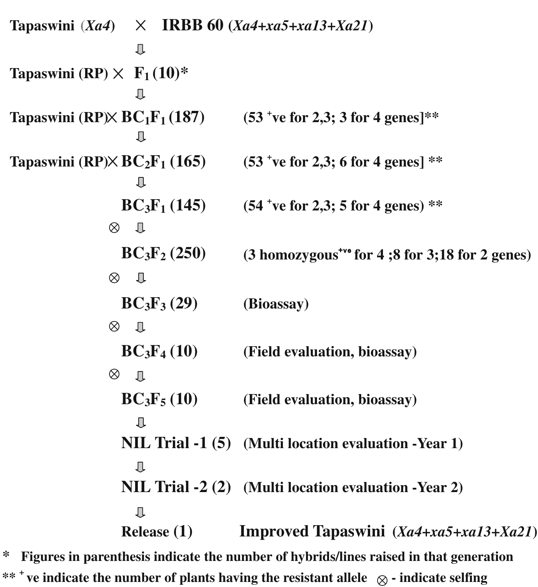
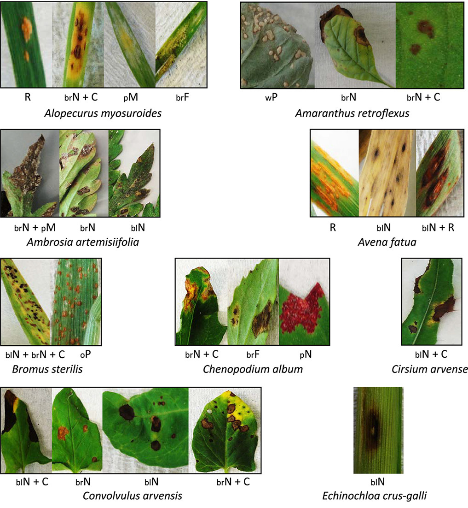
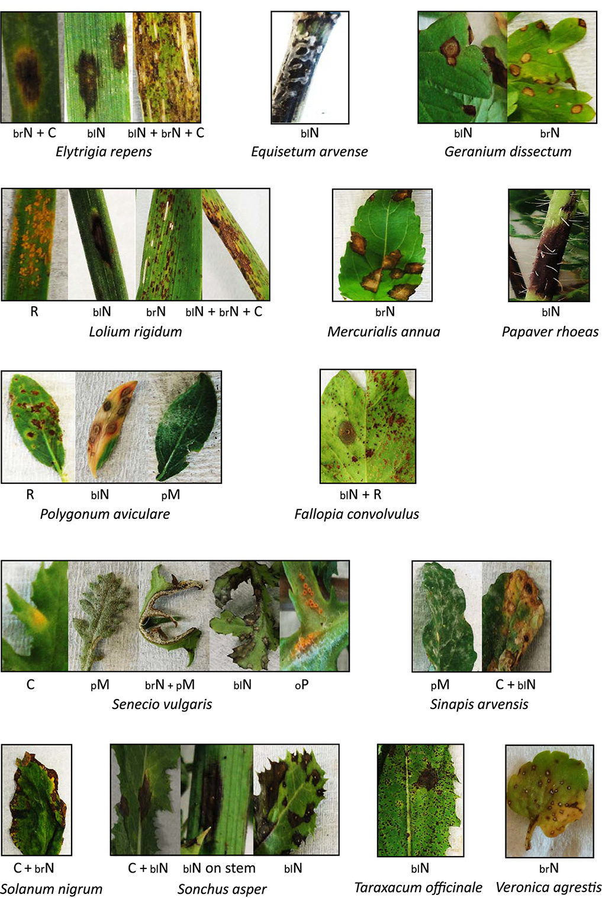
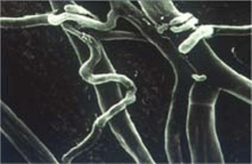

```{r setup, include=FALSE}
library(knitr)
require(tidyverse)
require(janitor)
require(viridis)
require(viridisLite)
set.seed(453)
# invalidate cache when the package version changes
knitr::opts_chunk$set(tidy = FALSE, echo = FALSE, 
                  message = FALSE, warning = FALSE,
                  out.width = "45%", cache = TRUE, 
                  dev.args=list(bg=grey(0.9), pointsize=11))
options(knitr.table.format = "latex")
options(knitr.kable.NA = "", digits = 2)
options(kableExtra.latex.load_packages = FALSE)
theme_set(theme_bw())
```

# Boom and bust cycle of disease development

##

# Durability of Resistance

## Importance

- Continued growth of population has faced us with daunting task of repeating the accomplishments of the Green Revolution.
- All plant species are subject to disease as a natural part of life's evolution
  - Just as the remains of dying plants serve as food for saprophytes that recycle nutrients accumulated during plants' growth, living plants are rich source of food for those parasites that have evolved the means to attack them.
  - Efforts of plant breeders to increase production of crops also increase the potential food supply for pathogen.
- Diseases alone casue at least 10% losses in global food production annually.

##

- Losses to diseases caused by fungi tend to be greater in the humid tropics where crops may be grown continuously throughout the year and weather conditions favor infection
- Although a range of chemical crop protectants are available for effective control, disease resistance is generally the preferred method above all.
  - does not entail potential risk to non-target organisms including farm worker safety
  - avoids additional labor and fuel usage cost involved in pesticide application
- It is not necessary nor useful to seek either complete resistance or complete understanding thereof.
- Resistance matters only in so far as it protects yield.

\begin{quote}
'enough resistance is enough'
\end{quote}
\hfill\raggedright{-- Simmonds, 1988}

<!-- Note: Refer to Advances in Agronomy, Chapter Breeding Crops for Durable Resistance to Disease -->

## Concept of durability 

\footnotesize
- Cultivars with durable resistance is prized when varietal change is slow; it is less critical in breeding programs that regularly release new varieties with novel resistances.
- Cannot be selected for directly $\because$ it is defined in a retrospective fashion.
- Durability of resistance is dependent on factors such as -- including biology, genetics and evolution of pathogen to which it confers resistance
- Factor responsible for limiting disease development is expressed independently of the presence or absence of the pathogen
- It is unlikely that genotypes in the population of a particular pathogen species will contain significant genetic variation with regard to their abilities to overcome the factor leading to disease escape/resistance
- Durable resistance is a form of resistance that does not suffer any significant loss of \alert{effectiveness} after many years of widespread use in the presence of the pathogen.

(\scriptsize For background discussion of the topic including broader inheritance basis of durable resistance, refer to Lecture 1 on Introduction to Resistance Breeding. )

##

\small
- \alert{Monogenic resistance} based on R-genes are often easily overcome by evolving pathogen population, mostly in monoculture environment.
- When a pathogen avoids recognition as the result of a mutation, it can incur a fitness penalty
  - 'Cost of virulence/mutation' varies among effectors
- It has been proposed that it might be possible to predict R-gene durability on the basis of knowledge of its cognate effector [@leach2001pathogen].
  - An R-gene is more likely to remain effective if it targets an effector that is critical for the survival or virulence of the pathogen (generally, highly conserved or target plant protein is important)
- QTL analysis of a traditional rice variety known for its durable resistance revealed that it has resistance alleles at many R-genes and QRLs
- It has been observed, although rigorous experimental evidence is lacking, that durability in context of genotype with \alert{complex resistance} is long lasting as a major gene can contribute to resistance without imposing a strong selection pressure for development of compatible pathogen variants.

## 

\small
- Sexual reproduction or parasexual genetic exchanges among pathogen population produces novel genetic combinations, and mutations in cluster or in regulatory genes might permit rapid adaptation that can make pyramiding less effective.
- Alleles conferring QDR can be lost in the breeding process if major genes are present to mask their effect
- \alert{Lineage-exclusion hypothesis} is based on the premise that invariant responses to some resistance genes reflect the evolutionary constraints of each lineage in pathogens and that strategic combinations of resistances might
provide durable resistance.
  - In rice blast pathosystem, clonal lineages of the pathogen were found to have variable response to some rice resistance genes and invariant responses to others.
- Multiple R-genes do not always provide lasting resistance (resistance break-down in potato late blight)
- Most reliable strategy for building durable resistance is to combine multiple minor QRLs.
  - It has been suggested that a modest ($n \sim 5$) of minor genes is sufficient to provide adequate resistance to Ug99 races of wheat stem rust.

## Relationship between specificity and durability

- The differential virulence of the new and old variants is influenced by the gene(s) underlying the defensive strategy and is reflected as strain specificity. 
- If a resistant crop variety encounters the new pathogen variant, its resistance is partially or completely ineffective and the resistance is said to have broken down.
- The epidemiological consequences of this depend on the fitness of the new variant.

## Pleiotropic effects of resistance and trade-off

\small
- For, both quantitative and qualitative genes that play roles in resistance or susceptibility to pathogens might traits such as yield or response to abiotic factors (water or nutrient stress).
  \bitemize
  \scriptsize
  \item R-genes are sometimes associated with yield costs in the absence of the disease to which they confer resistance
  \item One, for example, R-gene RPM1 in Arabidopsis incurs a 9% cost in the absence of pathogen
  \item Some are associated with positive effects on yield. Resistant and susceptible alleles of the gene RPS2 in Arabidopsis do not have different effects on yield, while lines deleted for the gene have lower yields because the gene serves as a negative modulator of the defence response
  \item Activation of the HR or similar programmed cell death pathways can confer growth penalties -- the widely deployed and durable \textit{mlo} powdery mildew resistance gene in barley is associated with necrotic flecking and yield loss.
  \eitemize
- Field based breeding methods that involve a holistic assessment of plant performance across diverse environments can allow for effective management of trade-offs
- Analysis of specific alleles at particular genes will become possible as more isogenic QRLs become available or causal genes are isolated
- In most cases, it is essential to select for effective forms of resistance with low fitness penalties without requiring knowledge of the mechanisms at play.

## 

\small
- While single R-genes are often non-durable, they can contribute to crop protection when combined with QDR.
- It is feasible to assemble polygenic resistance through phenotypic and/or genotypic selection.
- Transgenics and/or genome editing can also contribute to producing desired allelic combinations.
- Recycling of elite lines in modern breeding programs have led to concerns about potential erosion of diversity and resistance.
- Large-effect QRLs can be identified using of genome sequencing technologies (MAS) by genetic mapping of potential resistance containing germplasm.
- Issue of linkage drag with crossing of non-elite and elite germplasm for introgression of QRL of large effect into the latter
- Approaches that support prediction and early identification of emerging pathogens and corresponding QRLs before epidemics occur are crucial.
- Although transfer of polygenic resistance with crossing designs in difficult as enormous number of plants needs to be assessed, complex resistance can be created using techniques such as recurrent selection. 

# Application of non-Durable Resistance

# Gene Pyrimiding

\small
- If all genes cannot be fixed in a single step of selection, it is necessary to cross again selected individuals with incomplete, but complementary, sets of homozygous loci.
- Pyramiding of $R$ genes in a variety provides opportunity for simulataneous expression of more than one gene in a variety so that breakdown of host resistance is delayed.
- $R$ gene pyramids generally result from introgression of a new $R$ gene into an adapted variety with an existing complement of 'defeated' $R$ genes -- avoids the issue of agronomic performance of the pyramid (recipient) variety.
- In theory pyramiding several 'undefeated' $R$ genes should provide more durable resistance since mutational events at several $Avr$ loci would be required to produce a new virulent pathotype.

##

\small
- Gene pyramiding is nearly impossible through conventional means due to dominance and epistasis effects of genes governing disease resistance and linkage with undesirable traits that is difficult to break.
- MAS for molecular markers linked to $R$ genes or for the $R$ genes themselves, enables pyramiding of several effective $R$ genes.
- Even in genomes with clustered $R$ genes, MAS may be be used select for rare recombinants containing loci in coupling to create new $R$ gene combinations for which the matching virulence may not readily evolve.

(\footnotesize Refer to @ye2010marker (or Volume 33, Plant Breeding Reviews) for extensive discussion)

##

```{r gene-pyramiding-rice-blast, fig.cap="Tapaswini (rice variety popular in eastern India) has high and stable yield but is susceptible to bacterial blight. Study introgressed 4 resistance genes -- $Xa4$, $xa5$, $xa13$ and $Xa21$ -- from a donor IRBB 60, a gene pyramid developed at IRRI, Philippines, with Tapaswini as recurrent parent. Conventional BC was followed upto BC3 and around 150 plants/lines were genotyped at each generation for the presence of the target genes and only positive plants having the resistance alleles were advanced to the next generation. Foreground selection continued till BC3F3 to identify pure homozygous lines for all four target genes. Selection based on morphological and grain quality traits was practiced from BC3F2 onwards for recovery of recurrent parent characteristics. The latter was assisted by selection with SSR marker", out.width="38%"}
# pdftools::pdf_convert("../literatures/accessory/dokku2013.pdf", pages = 3, filenames = "../images/gene_pyramiding_rice_blast.png", format = "png", dpi = 300)

```


# Multilines, Cultivar Mixtures

- Wild plants appear to use heterogeneity for R genes as a strategy for avoiding disease epidemics.
- Growing crops heterogeneous for their R gene complement inflicts disruptive selection upon the pathogen population reducing the selection pressure against any one avirulence allele or combination of avirulence alleles -- idea of multilines or variety mixtures.
- Multilines and mixtures can be distinguished by the relationship between their components.
  - In multilines, the components are usually closely related 
  - In mixtures, the components can be unrelated or distantly related.
  - Variety mixtures are more haphazardly composed than multilines and are often considered as a deployment strategy rather than a breeding strategy

##

- There is convincing evidence that crop heterogeneity for R gene complement reduces the incidence of disease in modern agricultural systems.
- A major concern in using multilines/mixtures has been whether they would select for complex races.
  - Studies in \textit{E. graminis} in barley have suggested there is little unidirectional selection for complex races and their evolution will be slow.
  - Any loss of resistance in the mixture/multiline is more likely to be due to an increase in frequency of a simpler pathotype with matching virulence to one component.

(Refer to Chapter 4 of @newton1997cultivar and Chapter 17 of @reddy2017agro.)

##

\small
- Advantage of multilines over mixtures is due to their greater agronomic uniformity. However, they take time and effort to breed and it can be difficult to respond to changes in market requirements or in the frequency of virulence alleles in the pathogen population.
- Mixtures were proposed as a pragmatic alternative to multilines.
  \begin{itemize}
  \footnotesize
  \item It is possible to respond relatively rapidly to changes in the frequency of virulence alleles within a pathogen population or the relative importance of different pathogens by changing the mix of varieties.
  \item However, because breeders have continually introgressed new R genes into adapted varieties thereby maintaining defeated $R$ genes in the crop, it can be difficult to find components with sufficient $R$ gene diversity.
  \item Greater 'background' heterogeneity can buffer mixtures against abiotic stresses providing greater yield stability.
  \item An alternative would be the use of transformation to produce 'mix and match' multilines by transforming elite cultivars with different transgenes giving isogenic (uniform) components differing only in their $R$ gene complement
  \item As with pyramiding transgenes, the transgenic multiline approach requires a collection of cloned $R$ genes.
  \end{itemize}

# Integrated Control

##

\small
- Concerns over the potential toxicity of pesticides and over the continuing loss of appropriate, effective pesticide available for disease control increased since 1970s\footnote[frame]{\scriptsize By 1960s US government banned mercury containing pesticides; existing pesticides were subjected to stricter reviews on their carcinogenic and mutagenic properties}. 
- Re-examination and improvement of many old practices with incorporation of new cultural practices led to development of idea of integrated control of plant diseases. It embodies:
  \begin{multicols}{2}
  \begin{itemize}
  \footnotesize
  \item proper cultural practices (removal of plant debris and infected parts)
  \item use of seed free of pathogens
  \item crop rotation
  \item soil fallow
  \item reduced or no tillage
  \item destruction of weeds
  \item fertilization with appropriate amounts and forms of fertilizer
  \item appropriate irrigation
  \item adjusting the time and rate of sowing and date of harvest
  \item minimizing the influx of pathogen vectors into crops through border plants
  \item use of resistant varieties
  \item deployment of 'cross-protection' or immunization
  \item monitoring of the appearance and development of disease epidemics allowing for reduced use of pesticides
  \end{itemize}
  \end{multicols}

<!-- ## -->

<!-- - Allelopathy is a naturally occuring ecological phenomenon of interference among organisms. -->
<!--   - a pragmatic approach to resolving multiple issues, including pest management, stress management and growth enhancement -->
<!--   - resolves problem of resistance development, soil and environment pollution caused by non-judicious use of synthetic pesticides -->
<!--   - employed through crop rotations, crop cover, intercropping, mulching, incorporation of crop residues, and application of botanical extracts -->
<!--   - strategy could be used in multiple conjunctions -->
<!-- - Allelopathy is the result of chemicals released (allelochemicals), mostly secondary metabolites produced by plants. -->
<!--   \bdescription -->
<!--   \item[Allelochemicals] alkaloids, amino acids, brassinosteroids, carbohydrates, flavonoids, glucosinolates, hydroxamic acids, jasmonates, momilactone, phenolics, salicylates, and terpenoids -->
<!--   \edescription -->

## Weed and host crop management

\small
- Allelopathic species suppress weeds when employed in the field following crop rotation, or as cover/smother crops, intercrops, crop residues.
- Soil application of essential oils from (possibly) intercropped plants such as _Mentha_ spp., _Satureja montana_ and those of genus _Ocimum_ can replace commonly used methyl bromid for soil fumigation against soil-borne pathogens
- Aggressive competitors crops like sweet potato ( _Ipomoea batatas_) can be utilized for successful management of noxious weeds and parasitic plants such as strigas ( _Striga hermonthica_ and _Striga asiatica_)
- Intercropping of maize with leguminous plants such as greenleaf Desmodium is employed for effective management of _S. hermothica_
  - C-glycosylflavonoid called isoschaftoside released by Desmodium is the allelochemical responsible for suppression of Striga
- In rice-wheat system, integration of smothering allelopathic crops, such as maize, perl millet or sorghum after harvesting wheat and before rice transplantation offers effective weed suppression for upcoming rice crop.

##

\small
- Wheat rotated with Egyptian clover or oat provides natural weed control.
- Cover crops suppress weeds through chemical allelopathy when used as green manure by inhibiting weed seed germination.
  - Barnyard grass ( _Echinochloa crus-galli_) population was substantially reduced in maize by the use of bean as legume cover crop.
- Noxious paddy weeds such as Barnyard grass, flat sedge( _Cyperus difformis_), jungle rice ( _Echinochloa colonum_) can be suppressed by more than 70% through application of allelopathic plant mulches.
- Water extract of sorghum plant as a natural herbicide is illustrated in wheat, cotton and sunflower, which suppresses weed biomass and density (~45%) of _C. album_, _Fumaria indica_, _P. minor_ and _Rumex dentatus_, with simultaneous increase in grain yield.

##

\footnotesize
Weeds harboring various pathogenic fungi. Different symptoms observed on the sampled symptomatic weed species. Symptoms were identified in different groups as follows: black necrosis (blN), brown felting (brF), brown necrosis (brN), chlorosis (C), orange pustule (oP), pink necrosis (pN), powdery mildew (pM), rust (R), and white pustule (wP).

```{r host-and-weed-harbors, out.width="54%", results='asis', fig.align='center'}
cat("\\begin{columns}")
cat("\\column{0.5\\textwidth}")

cat("\\column{0.5\\textwidth}")

cat("\\end{columns}")
```

## Insect pest management

- Chemicals of plant origin such as azadirachtin, nimbin and salanin in neem reduce/inhibit growth of insects like cicadellid and white fly (Bemisia tabaci)
- Neem oil serves anti-feedant action against strawberry aphids
- Flower thrips ( _Taeniothrips sjostedti_) and pod borer ( _Heliothis armigera_) in common beans are effectively controlled by plant extracts of tomato.
- Allelochemicals from weeds like chick weed ( _Ageratum conyzoides_), great ragweed ( _Ambrosia trifida_), and Spanish flag (Lantana camara) were not only inhibitory to insects such as cowpea weevil ( _Callosobruchus maculatus_)
- Stored grain insects have been known to be affected by:
  - _Sitophilus oryzae_: Bakaino, habulas ( _Myrtus communis_), lemon grass ( _Cymbopogon citratus_) and mint
  - _Callosobruchus chinensis_: _Cannabis sativa_, black pepper and garlic
  - _Corcyra cephalonica_: Red chillies and tea
  
## Disease management

\small
- Plant extracts like canola, different cereals, lentil, and sweet clover
at low concentrations was very effective in suppressing the fungus _Sclerotinia
sclerotiorum_ in beans
- The allelochemicals produced by rice (momilactone A and momilactone B) exhibited antibacterial, antifungal, antioxidant and anticancer activities in vitro while the flavones and cyclohexenones had effect of suppressed spore formation of \textit{P. oryzae} and \textit{Rhizoctonia solanacearum} (Bacterial wilt agent).
- Wheat rust is controlled by leaf extract of jimson weed ( _Datura stramonium_)
- 50% growth reduction of Fusarium solani was caused by leaf water extracts of eucalyptus, neem, and tulsi.
- Intercropping of tomato with Chinese chive ( _Allium tuberosum_) suppressed bacterial wilt.
- Intercropping of tomato with marigold ( _Tagetes erecta_) controlled tomato early blight disease caused by _Alternaria_ by more than 90% through the release of certain volatile allelochemicals exuded from the aerial parts. 

## Nematode management

- Soil application of allelochemicals from neem leaves or neem cakes reduces the development of root-knot nematodes ( _Meloidogyne javanica_).
- Soil incorporation of _Brassica_ spp. releases sulfur compounds (glucosinolates), which are converted into isothiocyanates which inturn serve as natural nematicidal fumigants.

# Biological control of pests

##

\small
- First coined by Harry Smith in relation to the biological control of insects 
- Suppression of insect population by native or introduced enemies.
- Why use biological control ?
  - When control agents are expensive, labor intensive, host specific
  - While chemical pesticides are cost-effective, easy to apply and broad spectrum
- Obvious benefits
  - Non-toxic to humna
  - Not a concern for water contamination
  - Once colonized may last for years
  - Host specific

### Generic definition

A population-leveling process in which the population of one species lowers the number of another.

## Mechanisms

**Antibiosis**

- Inhibition of one organism by another as a result of diffusion of an antibiotic
  \begin{itemize}
  \small
  \item Common soil-dwelling bacteria and fungi generally produce antibiotics
  \item Example: zwittermicin A production by \textit{B. cereus} against Phytophthora root rot in Alfalfa.
  \end{itemize}

**Nutrient competition**

- Competition between microorganisms for $C$, $N$, $O$, $Fe$, and other nutrients
- Example: _P. fluorescens_, prevents bacterial blotch by competing with _P. tolaasii_.

##

\bcolumns
\column{0.6\textwidth}
**Destructive mycoparasitism**

- Parasitism of one fungus by another enabled (in one or more ways) by direct contact, cell wall degrading enzymes, antibiotic production
- Example: _Trichoderma harzianum_ used as seed treatment against pathogenic fungus and (possibly) promotes plant growth.
  - Competent rhizosphere colonizer
- But, why use a product for something that is readily available in the soil ?
  - Wild strains $\longrightarrow$ Heterokaryotic
  - Biocontrol strains $\longrightarrow$ Homokaryotic

\column{0.4\textwidth}

```{r trichoderma-coiling, fig.cap="Coiling of \\textit{Trichoderma} around a pathogen.", out.width="90%"}

```

\ecolumns

## Hyperparasitism and parasitoids

\footnotesize
- Parasitic wasps (Hymenoptera), ants (Hymenopters: Formicidae), ladybird beetles (Coleoptera: Coccinellidae), birds, rodents, and spiders (Araneae) have regulated the abundance of damaging insects for millions of years.
- Natural enemies in field should be conserved with a provision of sheltering and pollen resourceful flowering plants around. 

**Insect predators**
\bcolumns
\column{0.4\textwidth}
\footnotesize

- Insects of the family Coccinellidae feed on Aphids, scale insects and mealy bugs
  \begin{itemize}
  \scriptsize
  \item 2 spotted lady-beetle: \textit{Adalla bipunctata}
  \item 7 spotted lady-beetle: \textit{Coccinella septumpunctata}
  \item 9 spotted lady-beetle: \textit{Coccinella novenpunctata}
  \item Vadalia beetle: \textit{Rodolia cardinalis}
  \end{itemize}

\column{0.6\textwidth}
\scriptsize

- Mantids prey on smaller insects
- Syrphid fly predate on maggots and aphids
- Cicindellidae (Cicindella sexgutata) predate on rice earhead bug
- Lebellulidae: Naids feed on mosquito larvae
- Insects of family Chrysopidae feed on Aphids, scales, mealybugs and mites
- Crabidae
- Lampyridae
- Reduvidae
- _Xanthopimpla predator_ (Ichuenumonidae) predate on pupae of _Chilo partellus_

\ecolumns

##

\bcolumns
\column{0.5\textwidth}
\footnotesize

**Insect parasites**

- _Trichogramma minutum_ (Trichogrammatidae) and _Apantales flavipes_ (Braconidae) lay eggs on larvae of _Chilo partellus_
- _Tricholyga sorbillans_, _T. bomycis_ (Tachinidae)

**Nematode**: _Neoaplectema carpocarpsae_ parasite of codling moth

**Protozoa**: _Nosema bombycis_, _Farinocystis tribolii_

**Fungi**

- Aspergillus
- Beauveria
- Metarhizium anisopliae
- Spicaria
- Entomophthora lecanii
- Entomophthora sphaerosperma
- Coccus viridis

\column{0.5\textwidth}
\footnotesize

**Bacterial**

- Bacillus thuringiensis is effective against, _Heliocoverpa armigera_, _Pieries brassicae_, _Hellula undalis_, _Plodia interpunctella_ and _Tribolium confusum_

**Virus**

- NPV (Borrelina virus) is effective against Alfalfa caterpilla, Cabbage loper ( _Trichoplusia ni_), Tobaccoo caterpillar/Beet armyworm ( _Spodoptera litura_, _Spodoptera exigua_), _Heliothis zea_, Diamond back moth ( _Plutella xylostella_).
- Granulosis virus (Bergoldia virus) is effective against Potato tuber moth ( _Gnoremoschema opercullela_), Codling moth

- _Rhizoctonia solanii_ and _Didymella exitalis_ putrates kills hyphal cells of Ophiobolus graminis (Fungal pathogen of wheat)

\ecolumns

## Steps in classical biological control [@van2016integrating]

\footnotesize
1. Target selection: Ecological rationale for engaging in project; obtaining financing
2. Species confirmations: Verify identity of pest and, later, its potential natural enemies
3. Survey for natural enemies: Carried out initially in the invaded area
4. Identifying pest's native range: To locate areas to search for natural enemies
5. Collecting natural enemies in native range: To obtain candidate natural enemies
6. Judging potential efficacy and host range: Field estimates to guide initial selection of natural enemies
7. Establishing quarantine colonies: To preserve stocks of natural enemies of likely value
8. Estimating host ranges: Done for natural enemies of interest, usually in quarantine laboratories in receiving countries
9. Petitioning for release: Done for natural enemies believed safe and potentially effective
10. Release and establishment: Carried out in various parts of the invaded range
11. Post-release monitoring: To determine impacts on pest and non-target species
12. Assessing program outcomes: Assessment of the completeness and value of results via monitoring of pest and recovery of the invaded community.

# Bibliography

## References {.allowframebreaks}

\footnotesize