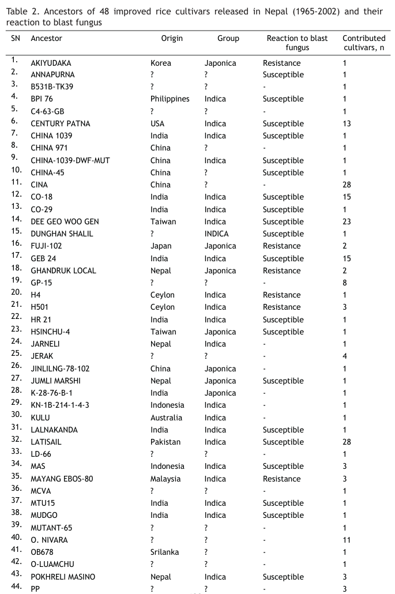
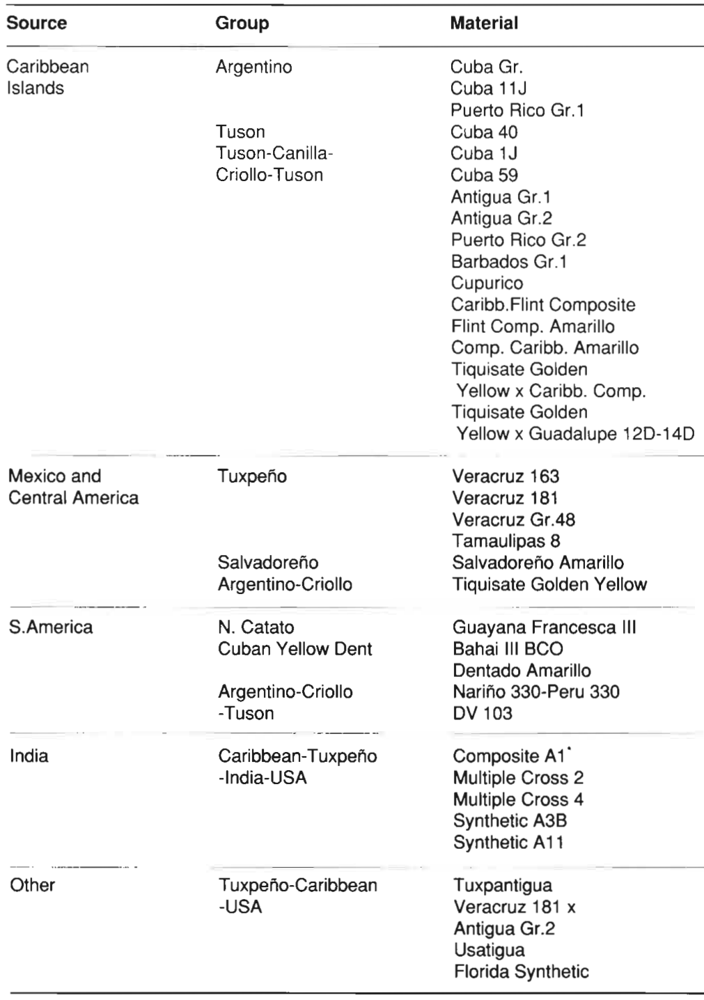

```{r setup, include=FALSE}
library(knitr)
require(tidyverse)
require(janitor)
require(viridis)
require(viridisLite)
set.seed(453)
# invalidate cache when the package version changes
knitr::opts_chunk$set(tidy = FALSE, echo = FALSE, 
                  message = FALSE, warning = FALSE,
                  out.width = "45%", cache = TRUE, 
                  dev.args=list(bg=grey(0.9), pointsize=11))
options(knitr.table.format = "latex")
options(knitr.kable.NA = "", digits = 2)
options(kableExtra.latex.load_packages = FALSE)
theme_set(theme_bw())
```

# Development of resistant varieties

## 

\small

- Recently (with amendments) Seed act, 2045; National seed policy, 2056; Seed regulation, 2069; National seed vision, 2013-2025 have paved forward a way for use and distribution of varieties in Nepal.
  - In attempts to promote use of quick generated/exotic/landraces varieties, regulations allow \alert{registration} alongside \alert{release}.
- Respective commodity research programs have primarily been responsible for development and improvement of varieties in the past, whereas private sector and I/NGOs also can lead the variety maintenance and development works of their own.

##

\small
- Most breeding efforts for building resistance in crop varieties of Nepal are aimed at improving population level resistance to specific pathogen and their races.
- In rice breeding, for example, selection methods have been modified to accomodate involvement of farming community to generate an _improved variety_. Most commonly employed methods include:
  \begin{itemize}
  \footnotesize
  \item Modified bulk selection
  \item Stratified mass selection
  \end{itemize}
- Aside from developing completely new varieties, adjustment of cropping practices to suit performance of existing varieties are of focus.
  - Integrated use of fungicide (e.g., fungicide spray for foliar fungal disease and seed treatment for seed-borne fungal disease) and cultivation practice (clean cultivation, solarization, residue burning) are practiced

\footnotesize Note: For a tabulation of resistant varieties of all crop categories developed in Nepal, refer to Lecture slides on "Source and Test of Resistance".

# Cereal Crops

## Breeding for rice blast resistance

- Breeding for durable blast (caused by _Magnaporthe grisea_ (Herbert) Borr.) resistance in rice requires multiple resistance genes to be combined into individual varieties with use of efficient selection and breeding strategies.
- Two types of rice blast resistance has been described -- complete (true or vertical) and field resistance (horizontal) [@fukuoka2019strategies].
  - breakdown of the resistance conferred by R-genes occurs every 1-7 years after their release due to emergence of new race of blast pathogen.
- Inheritance is of either types -- monogenic dominant (most common), monogenic recessive, two dominant independent genes, two dominant complementary genes and two recessive duplicate genes or resistance controlled by minor genes
- Resistance to infection by this fungus follows a classic gene for gene theory; _Pi-b_ and _Pi-ta_ are two major blast resistance genes.

<!-- - Mackill and Bonman (1992) developed 22 near isogenic lines (NILs) each having a single complete R gene from CO39 to study the genetics of blast resistance. At least four independent loci, _Pi-1_ to _Pi-4_ were identified after inheritance study using these NILs. -->
<!-- - Structural and functional analyses of many major R genes have shown that they encode proteins with similar structural motifs- nucleotide binding site, kinase domains, leucine-rich repeats- that are responsible for ligand recognition and signal transduction -->
<!-- - More than 40 qualitative resistance gens for blast fungus have been identified, most of them being dominantly inherited and located in chromosome 6, 11 and 12. -->
<!-- - Rice genome has 430 million bp with estimated 50,000 genes. -->
<!-- - Complete sequence of Rice genome is available publicly (Sequencing the rice genome; https://www.ncbi.nlm.nih.gov/pmc/articles/PMC526008/). -->

##

\footnotesize
- Every year NARC screens more than 1000 rice genotypes using conventional breeding approach and more than 50% are found to bear some form of resistance to blast fungus\footnote[frame]{\scriptsize Positive correlation between leaf and neck blast incidence are reported, hence necessiting breeding for broad spectrum resistance}.
- Most of the screening germplasm are breeding lines generated from national commodity research programs and those received from IRRI.
- International germplasm are ideal sources for introgression of new resistance genes in the varieties under cultivation.
- Screening sites distinguished based on a broad agro-ecology and potential disease hotspots,
  \begin{itemize}
  \footnotesize
  \item Hid hill: Khumaltar, Lumle
  \item Terai: Hardinath
  \item Blast hot-spot: Bijayanagar (Jumla), Gokarna (Lalitpur), Chaling (Lalitpur), Dharmasthali (Kathmandu), Kavresthali (Kathmandu), Bhawasi (Mahottari)\footnote[frame]{\scriptsize A hotspot location for neck blast screening} and Bharatpur (Dhanusha).
  \end{itemize}
- Laxmi, Sabitri, Janaki, Radha-12, Khumal-11 are some rice varieties found resistant to blast. Laxmi is resistant to the most virulent isolate ever tested (particular isolate could produce disease on rice genotype with 3 gene pyramid).
- Masuli or Sankharika have shown susceptible response when tested over several parts of Nepal.
- For screening purposes, CO39 and LTH may be regarded as susceptible lines and Tetap as resistant line, of cross-national origin. 

##

\bcolumns
\column{0.6\textwidth}
\footnotesize
- Pedigree analysis of Nepalese rice cultivars indicate that 14 ancestors of these cultivars are resistant to blast (Table tab:pedigree-rice-nepal) \footnote[frame]{\scriptsize Refer to (and transcribe, as assignment to students) the Table 2 of article by \cite{joshi2014molecular}; Link: \url{https://www.nepjol.info/index.php/AEJ/article/view/19831/16313}} fungus. The ancestor, Sigadis was used in deveopment of 13 cultivars. Because the genetic backgrounds of most modern day rice cultivars is rather narrow, due to being derived from a limited set of parent germplasm,  characterization of resistance genes in various sources of germplasm is critical for a durable fight against blast disease.  
- Introduction of exotic germplasm in breeding programs has led to resurgence/outbreak of previously minor races of blast fungus, therefore focus should be shifted towards building durable resistance from the use of locally adapted germplasm with native resistance. Marker assisted selection should definitely prove to be a valuable aid.

\column{0.4\textwidth}

```{r, out.width="75%"}
# Note: Table continues to second page in the article

```

\ecolumns

## Marker assisted screening of rice blast resistance

- Refer to the article title "Screening Nepalese rice germplasm for blast resistance characters using molecular markers" from "Proceedings of Marker Assisted Screening on Cereal in Nepal, 2012" (file contained within 'literatures/articles').

## Marker assisted screening of Rice BLB resistance

\footnotesize
- 96 Nepalese rice accessions were screened using eight SSR markers and one STS marker for presence and absence of BLB resistance genes [@amgai2015marker]. Resistance gene detected in respective number of accessions follows:
  \begin{itemize}
  \scriptsize
  \item Xa-10: 5 accessions
  \item Xa-13: 6 accessions
  \item Xa-7: 23 accessions
  \item Xa-3: 52 accessions
  \item Xa-4: 52 accessions
  \item Xa-5: 25 accessions
  \item Xa-8: 30 accessions
  \item Xa-21: None
  \end{itemize}
- Xa-13 was recovered from susceptible check germplasm, indicating that resistance has been overcome by the corresponding virulent strain of the bacteria ( _Xanthomonas oryzae_ pv. _oryzae_).

##

\small
- Resistant check IR-64 showed the presence of Xa-5, implying that the gene is effective against strains of BLB pathogen during the contemporary period.
- Xa-21 gene likely to have originated from _O. longistaminata_ and integrated into some IRRI developed rice varieties [@rao2002dna]. Base population of Nepalese variety possibly lack introgressions from _O. longistaminata_.
- Interestingly, 17 of the germplasm collections (including Masuli variety) possessed three or more genes for BLB resistance.

## Flood/submergence tolerance

- Refer to the tile "Identification of flood tolerant genes Sub1A and SNORKEL from Nepalese rice gene pool" from "Proceedings of Marker Assisted Screening on Cereal in Nepal, 2012" (file contained within 'literatures/articles').

## Helminthosporium leaf blight in Wheat

- Sonalika, BL 1473, and Nepal 297 are early-maturing commercial wheat cultivars that are susceptible to HLB [@duveiller2004controlling, @van1998breeding].
- NL 750, NL 781, and Milan/Shanghai-7 are late-maturing, well-adapted, advanced breeding lines with high levels of resistance to HLB [@van1998breeding, @hetzler1991interactions].

## Resistance for viral disease

- In rice, among the 44 screened germplasm 10 were observed to be tolerant while other were moderately to highly susceptible [@upadhyay1982tetep].
  - IR20, IR 2071-627-1, IR C3707-117 2, IR2797-125, Tetep, IR 1416-128-5-8 and IR 1905-81-3-1 showed the 0.5% seedling infection rates $\leadsto$ Highly tolerant.

## Unwavering legacy of Rampur composite

\bcolumns
\column{0.5\textwidth}
- In light of reports of downy mildew disease in Nepal beginning in 1966, Thai Composite #1 DMR was introduced and later released as Rampur Composite in 1975.
- It was one of the top yielders in variety trials conducted at 10 locations in 1985 and is resistant to the downy mildew pathogen.

<!-- The story of Suwan-l, though, cannot help but kindle a sense of wonder. Here is a maize product developed by Thai researchers for Thai farmers, yet so we.11 crafted that its welcome has extended far beyond the borders of that nation. -->

<!-- In retrospect, this outcome may also seem natural. Several factors combined serendiptously in Thailand of the 1960s to make the development and diffusion of Suwan-1 possible. The government began to promote maize as part of a national policy to diversify away from rice. The Rockefeller Foundation moved its Inter Asian Corn Program headquarters to Thailand, bringing in financial resources and experienced human capital. The country's previously fragmented national maize breeding efforts were consolidated into a single program under Kasetsart University and the Ministry of Agriculture. The Rockefeller Foundation and Thai researchers established a collaborative breeding program at Farm Suwan, a state-of-the-art research station where irrigation permitted up to three crops each year. Close collaboration with CIMMYT began which, in addition to providing useful germplasm, opened training opportunities for many Thai maize researchers. Later on, fruitful cooperative arrangements between public and private entities in Thailand benefited farmers with a steady supply of quality seed.  -->

<!-- The maize breeding group at Kasetsart University was optimistic that better products could be developed by crossing the variety Guatemala to exotic germplasm. They pursued this strategy by forming broad germplasm pools and performing recurrent selection within them. An effort was also made to discover heterosis in varietal crosses, some of which later underwent recurrent selection. None of these approaches, though, resulted in the superior varieties that researchers had sought. Finally, the Kasetsart maize breeders tried the route of converting an improved cycle of Guatemala to downy mildew resistance, but otherwise left the responsibility of improving "Guatemala" in the hands of the Department of Agriculture. -->

<!-- At this point, it dawned upon these researchers that the limited genetic diversity of the variety Guatemala, comprising mostly germplasm of Caribbean origin, could be holding back progress. The emphasis thus shifted to assembling new germplasm complexes and composites based on more diverse sources.  -->

\column{0.5\textwidth}

```{r thai-composite-germplasm-assembly, fig.cap="During the early-to-mid 1960s, staff at Farm Suwan gathered maize varieites and cultivars from around the world. Applying the criteria of known good performance, relative adaptability to Thailand's production conditions, diversity of origin, and useful genetic variability (particularly for traits of economic importance), they finally chose 36 germplasm sources to form a population designated 'Thai Composite \\#1'; Source: \\cite{sriwatanapongse1993suwan}", out.width="40%"}

```

\ecolumns

# Vegetable Crops

## Tomato

- ATY 3, ATY 5, and ATY 6 were resistant to Tomato Yellow Leaf Curl Virus (TYLCV) where as NCL1, BL410 and Pusa ruby showed moderate level of TYLCV incidence.
- All exotic tomato cultivars are susceptible to leaf curl virus, while some local indeterminate cultivars have shown tolerance to Tomato Leaf Curl Virus.

##

# Legumes

##

- Following genotypes (released or under screening) were reported due to resistance:
  - In soybean, 6 genotypes (PI 94159,G-8754, Dashratpur, SB0095, CM 9125 and TAMPOMAS) highly resistant to Mungbean Yellow Mosaic Virus (MYMV).
  - In mungbean, Pratikshya and Kalyan varieties (released) resistant to MYMV.
  - In mungbean, IPM-16 (highly resistant), Hum-12 (resistant) to MYMV
  - In blackgram, Bari Mash-1, Bari Mash-2, Bari Mash-3 (resistant) to MYMV

# Oil seed crops

##

# Bibliography

## References
