```{r setup, include=FALSE}
library(knitr)
require(tidyverse)
set.seed(453)
# invalidate cache when the package version changes
knitr::opts_chunk$set(tidy = FALSE, echo = FALSE, 
                  message = FALSE, warning = FALSE,
                  out.width = "45%", cache = TRUE, 
                  dev.args=list(bg=grey(0.9), pointsize=11))
options(knitr.table.format = "latex")
options(knitr.kable.NA = "", digits = 2)
options(kableExtra.latex.load_packages = FALSE)
# Beamer cheatsheet can be found at:
# http://www.cpt.univ-mrs.fr/~masson/latex/Beamer-appearance-cheat-sheet.pdf
# All beamer themes and colorthemes can be assessed at:
# https://hartwork.org/beamer-theme-matrix/

# A complete book on biolgy view this link
# https://github.com/philschatz/biology-book/blob/master/SUMMARY.md
```

# Natural Enemy: Classification

##

\bcolumns
\column{0.5\textwidth}

```{r natural-enemy-classification}
tribble(
  ~"Taxonomic group", ~"Enemy group", ~"Effect on plant", 
  "Virus", "Pathogen", "Disease infection",
  "Phytoplasma", "Pathogen", "Disease infection",
  "Fungus", "Pathogen", "Disease infection",
  "Fungus", "Parasite", "Disease infection",
  "Higher plant", "Parasite", "Infestation",
  "Nematode", "Parasite", "Infestation",
  "Insect", "Parasite", "Infestation",
  "Insect", "Herbivores", "Infestation",
  "Snail and slug", "Herbivores", "Infestation",
  "Vertebrate", "Herbivores", "Biting damage"
) %>% 
  relocate(`Effect on plant`, .before = 1) %>% 
  knitr::kable(booktabs = TRUE, caption = "Taxonomic group of organisms and nature of damage to crops", longtable = TRUE) %>% 
  kableExtra::kable_styling(latex_options = "striped", font_size = 6) %>% 
  kableExtra::collapse_rows(columns = 1:2, row_group_label_position = "identity")
```

\column{0.5\textwidth}

```{r, out.width="80%"}
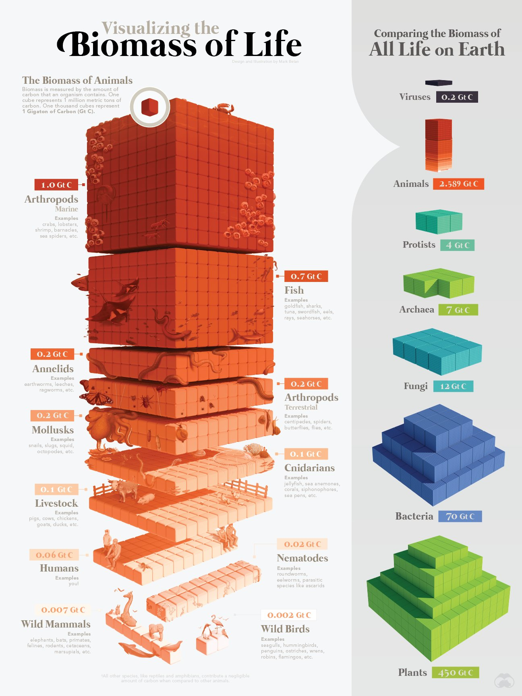
```

\ecolumns

## Distinction of stages of variation in plants and pathogens 

Refer to Page 134, @agrios2005plant.

## Identification of physiological races and pathotypes

\footnotesize
- Concepts of physiological races was introduced by Barrus in 1911.
- To identify and distinguish different species of a pathogen and races/strains within a species 'differential hosts' are used.
\begin{description}
\small
\item[Differential host] are the varieties of host species used to identify physiological races of a pathogen or sets of plant cultivars used to define pathotypes of pathogen based on known susceptible and resistant reactions
\end{description}

- Maximum number of races identifiable with $n$ number of differential hosts is given by relation,

$$
\small
\text{Number of races identifiable} = r^n
$$

- Where,
  \begin{itemize}
  \item $r$ = number of reaction types identifiable (e.g. resistant or susceptible, or others.)
  \end{itemize}
- If only two types of host-pathogen reaction are recorded (i.e. resistant and susceptible), a set of $n$ ideal differentials would identify $2^n$ physiological races. 
- Ideally, each of the differential hosts should posses a single resistance gene different from those present in the others.

##

...

(Also refer to Chapter 10, Host-parasite genetics, Plant Breeding Reviews, Volume 5.)

## Insects and Diseases of Major Crops in Nepal

```{r insect-pests-major}
tibble::tribble(
  ~"Crop", ~"Major insects", ~"Major disease",
  "Rice", "Rice bug, rice hispa, yellow stem borer, stripped stem borer, rice gall midge, mole cricket, plant hopper", "Bacterial blight (Xanthomonas oryzae), Blast (Pyricularia oryzae), False smut (Ustilaginoides virens), Brown leaf spot (Helminthosporium oryzae)", 
  "Wheat", "Armyworm, cutworm, shoot fly, stem borer, termites", "Leaf spots (Helminthosporium spp), rust, leaf streak (Xanthomonas spp), loose smut", 
  "Maize", "Stalk borer, shoot fly, cutworm, jassid, armyworm", "Rust, leaf blight (Helminthosporium maydis), smut (Specealothica reliana)", 
  "Barley", "Green bug, corn sawfly, fruitfly, wheat bulb fly", "Barley yellow dwarf virus, powdery mildew (Erysiphe graminis sp. hordii), Net blotch (Helminthosporium sativum)"
) %>% 
  knitr::kable(caption = "Major disease and insect pests of major cultivated crops in Nepal", booktabs = TRUE) %>% 
  kableExtra::kable_styling(latex_options = c("striped", "HOLD_position"), font_size = 6) %>% 
  kableExtra::column_spec(column = 2:3, width = c("20em", "20em"))
```

# Diseases

##

```{r fungal-pseudo-fungal-classification}
read_csv("../data/fungal_pseudo_fungal_classification.csv", skip = 1) %>% 
  knitr::kable(format = "latex", booktabs = TRUE, caption = "Classification of fungi and fungal-like organisms that cause disease on plants.", escape = TRUE) %>% 
  kableExtra::kable_styling(font_size = 4) %>% 
  kableExtra::collapse_rows(columns = 1:2, row_group_label_position = "identity") %>% 
  kableExtra::column_spec(column = 1:5, width = c("10em", "18em", "16em", "12em", "28em")) 
```


(\scriptsize For a more descriptive classification refer to @agrios2005plant, section on Classification of plant pathogenic fungi, Chapter 11 -- Plant diseases caused by fungi.)

##

```{r, out.width="80%", fig.align='center'}
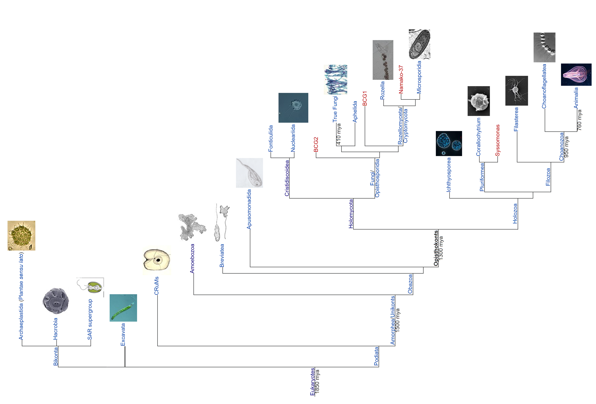
```

##

\bcolumns
\column{0.6\textwidth}

```{r phytophthora-infestans-life-cycle, fig.cap="Life cycle of phytophthora infestans", out.width="90%"}
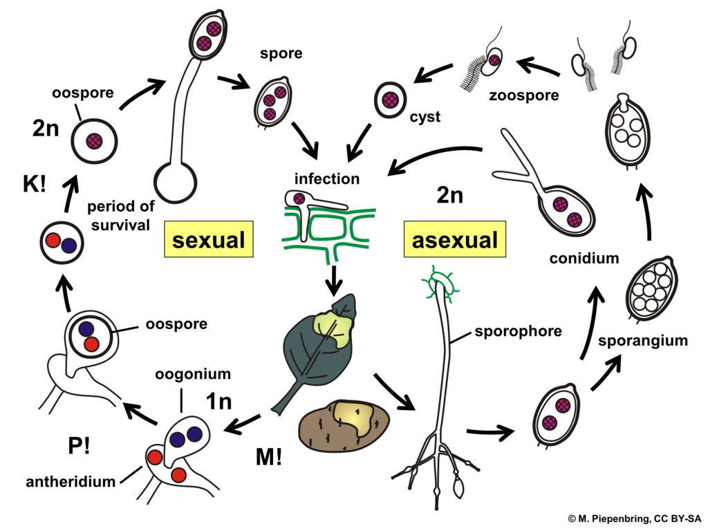
```

\column{0.4\textwidth}
```{r phytophthora-infestans-reproduction, out.width="80%"}
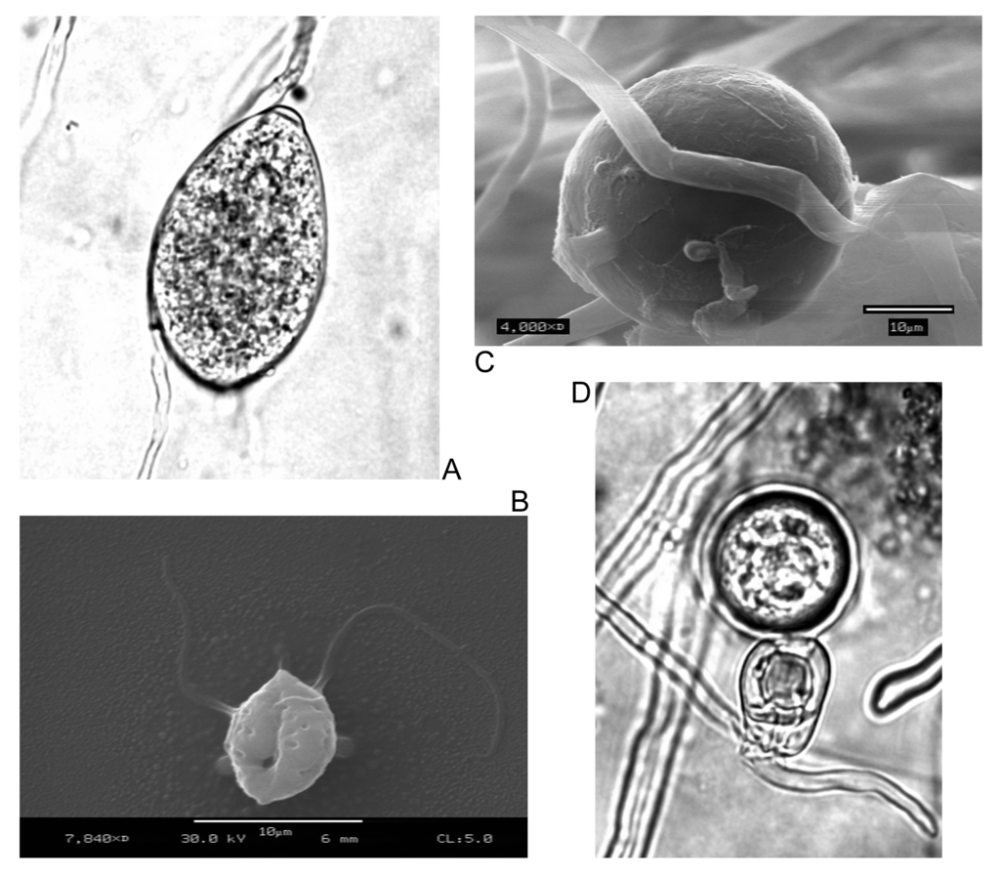
```

```{r phytophthora-infestans-symptom, out.width="80%"}
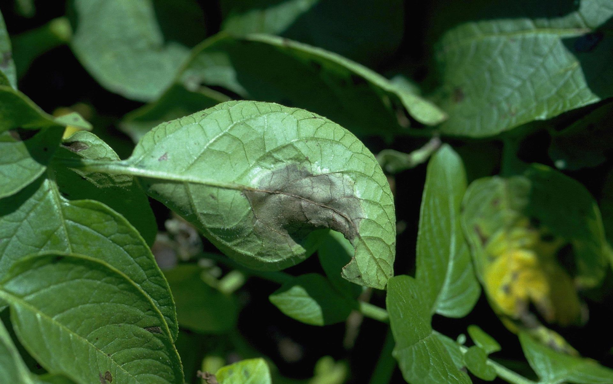
```

\ecolumns

##

<!-- ```{r slime-mold, fig.cap="Aethalium of a slime mold (\\textit{Fuligo septica})"} -->
<!-- 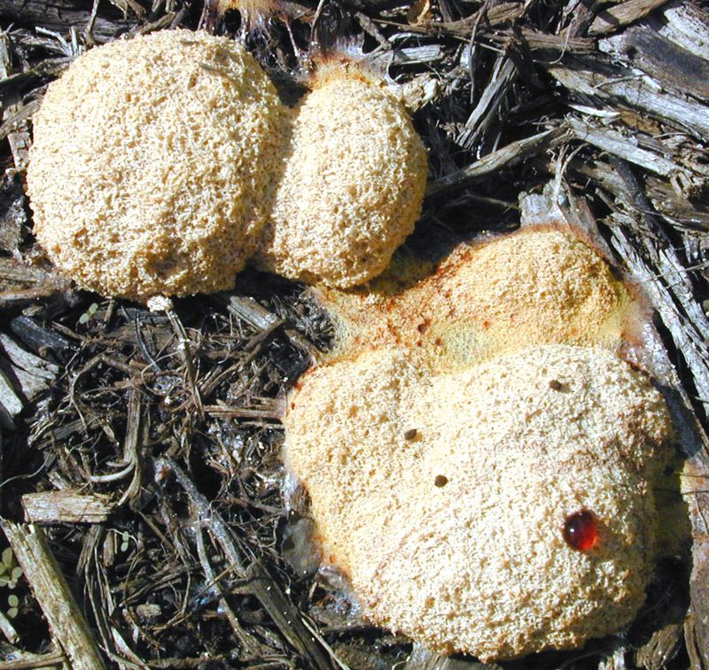 -->
<!-- ``` -->

- Most pathogenic fungi belong to phyla Ascomycota and Basidiomycota
- Fungi reproduce both sexually and asexually via the production of spores and other structures
- Basidiomycetes
  - produce sexual spores called basidiospores, on a club-shaped spore-producing structure called a basidium
  - mostly are fleshy fungi such as common mushrooms, the puffballs, and the shelf fungi or conks, and are either saprophytes or cause wood decay, including root and stem rots of trees.
  - two most destructive groups of plant pathogenic fungi -- rust (Pucciniomycotina) and smut (Ustilaginomycotina) -- are contained
  - characterized by basidia as meiosporocysts in the sexual life stage
  - karyogamy and meiosis proceed in the basidia and basidiospores are produced
  - basidiomycetous hyphae, which have an electron-dense (multi-layered or visually single-layered) wall, are divided by septa into mononucleate, binucleate, or multinucleate segments
  - according to Ainsworth and Bisby's Dictionary of Fungi (2008), there are 1589 genera and more than 30,000 species of Basidiomycoa (32% of all described fungal taxa)

##

- Ascomycota
  \begin{itemize}
  \footnotesize
  \item 98\% of lichens have an Ascomycota as the fungal part (symbiotic association) of the lichen.
  \item 2000 identified genera and 30,000 species of Ascomycota. Most ascomycetes are terrestrial or parasitic. However, some have adapted to marine or freshwater environments.
  \item Presence of a reproductive structure known as the ascus, though in some cases it has a reduced role in the life cycle.
  \item Used as yeasts in baking/brewing and treated as delicacies as truffles and morels. The mold Penicillium is used to produce the antibiotic penicillin.
  \item Many cause tree diseases, such as Dutch elm disease and apple blights. Some of the plant pathogenic ascomycetes are apple scab, rice blast, the ergot fungi, black knot, and the powdery mildews.
  \item Morels (a highly prized edible fungi) form important mycorrhizal relationships with plants, thereby providing enhanced water and nutrient uptake and, in some cases, protection from insects.
  \item The cell walls of the hyphae are variably composed of chitin and $\beta$-glucans, just as in Basidiomycota. However, these fibers are set in a matrix of glycoprotein containing the sugars galactose and mannose.
  \item The mycelium of ascomycetes is usually made up of septate hyphae. However, there is not necessarily any fixed number of nuclei in each of the divisions.
  \item The septal walls have septal pores which provide cytoplasmic continuity throughout the individual hyphae. Under appropriate conditions, nuclei may also migrate between septal compartments through the septal pores.
  \item A unique character (but not present in all ascomycetes) is the presence of Woronin bodies on each side of the septa separating the hyphal segments which control the septal pores.
  \end{itemize}

<!-- ## -->

<!-- ```{r} -->
<!-- # Refer to this image (source: https://upload.wikimedia.org/wikipedia/commons/thumb/6/6e/Conidia_Formation.png/501px-Conidia_Formation.png) for in-figure text description -->
<!-- 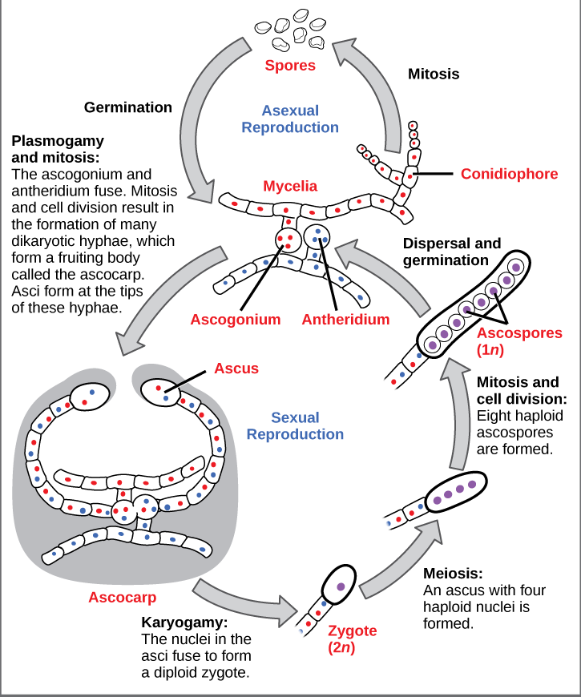 -->
<!-- ``` -->

<!-- ```{r conidiophore-structure, fig.cap="Conidophores of \\textit{P. hyoscyami} f.sp. \\textit{tabacina}. Conidiophores with this pathogen are dichotomous branched, eventually end with two teeth or sterigmata and on each sterigma is formed one conidia."} -->
<!-- 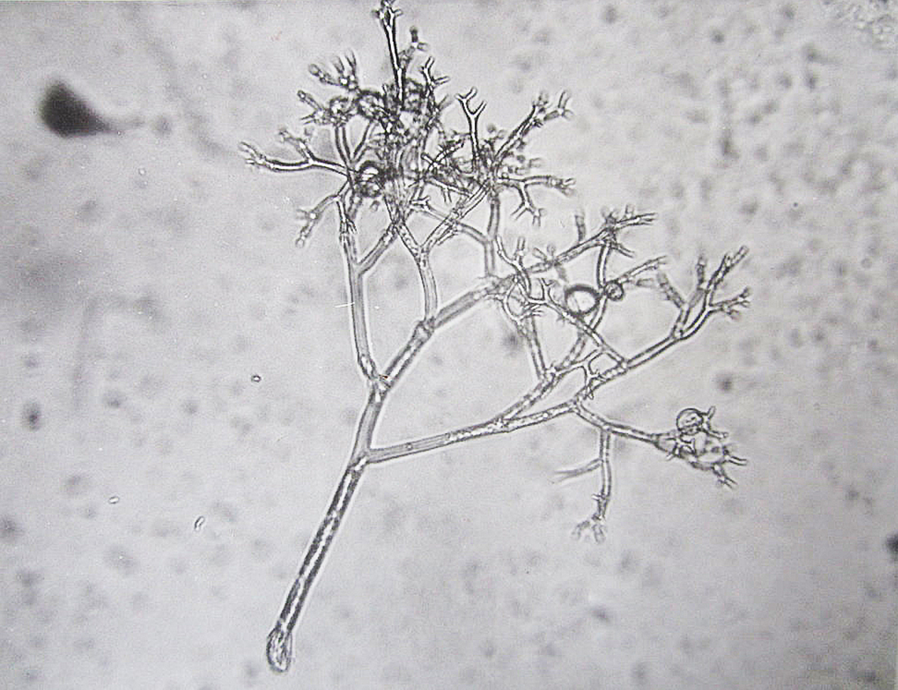 -->
<!-- ``` -->

##

```{r life-cycle-plant-pathogenic-fungi, fig.cap="Schematic representation of the genralized life cycles of oomycetes and the main groups of phytopathogenic fungi.", out.width="72%"}
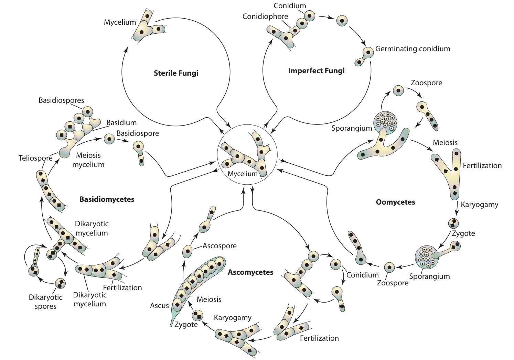
```

## Rust and smut

- Rust fungi are obligate parasites in nature
- Notorious on grain crops (wheat, oats, barley), vegetables (bean, asparagus), field crops (cotton, soybeans), ornamentals (carnation, chrysanthemum, snapdragon) and trees (pine, apple, coffee)
- Infection usually appear numerous rusty, orange, yellow, or even white-colored spots that rupture the epidermis. Some form swellings and even galls. Most rust infections are strictly local spots, but some may become systemic.
- There are about 5000 species of rust fungi.
- Sexual reproduction tends to promote rapid development of new races.
- Rust caused by fungi that produce only teliospores and basidiospores are called microcyclic or short cycled.

## Common rust fungi in agriculture

- _Hemileia vastatrix_ (Coffee rust); Primary host is coffee plant; unknown alternate host. Heteroecious
- _Phakopsora meibomiae_ and _P. pachyrhizi_ (Soybean rust); Primary host is soybean and various legumes. Unknown alternate host. Heteroecious
- _Puccinia coronata_ (Crown Rust of Oats and Ryegrass); Oats are the primary host; Rhamnus spp. (Buckthorn) is alternate host. Heteroecious and macrocyclic
- _Puccinia graminis_ (Stem rust of wheat and Kentucky bluegrass, or black rust of cereals); Primary hosts include: Kentucky bluegrass, barley, and wheat; Common barberry is the alternate host. Heteroecious and macrocyclic
- _Puccinia hemerocallidis_ (Daylily rust); Daylily is primary host; Patrina sp is alternate host. Heteroecious and macrocyclic
- _Puccinia triticina_ (Brown Wheat Rust) in grains
- _Puccinia sorghi_ (Common Rust of Corn)
- _Puccinia striiformis_ (Yellow Rust) of cereals
- _Uromyces appendiculatus_ (Bean Rust) in common bean (Phaseolus vulgaris)
- _Puccinia melanocephala_ (Brown Rust of Sugarcane)
- _Puccinia kuehnii_ (Orange rust of Sugarcane)

<!-- ## -->

<!-- - There are five spore stages that are produced and two hosts are required (heteroecious species) in the completion: -->
<!--   - Stage 0:Spermagonium -->
<!--     - Flask shaped structure containing haploid spermatia (male gamete) and receptive hyphae -->
<!--     - Spermatia fertilize receptive hyphae of the compatible mating type and subsequent production of dikaryotic mycelium. -->
<!--     - Produces (on upper surface of the barberry leaf) sex organs in rust -->
<!--     - Are of two mating types (due to being derived from basidiospores) -->
<!--   - Stage I: Aecium -->
<!--     - When spermatia are transferred to compatible receptive hyphae, this begins the dikaryotic stage of the life cycle and directly produces the aecium on the lower surface of the barberry leaf -->
<!--     - Chains of aeciospores (which burst through the lower surface of the leaf) are formed in aecium -->
<!--   - Stage II: Uredium -->
<!--     - Can attack and infect host plants -->
<!--   - Stage III: Telium -->
<!--     - Teliospores serve only as the sexual, overwintering stage  -->
<!--   - Stage IV: Basidium -->
<!--     - Heterothallic and basidia produce basidiospores that are of two mating types -->
<!--     - Basidiospores are capable of only infecting the leaves of \textit{Berberis} sp. (barberry) -->
<!--     - Cells of the teliospore germinates to produce a short germ tube that will develop into a basidium that is essentially transversely septate -->

<!-- ## -->

<!-- \begin{columns}[T, onlytextwidth] -->
<!-- \column{0.35\textwidth} -->

<!-- ```{r rust-spores-structures, fig.cap="Kinds and sequence of spores and spore-producing structures in rust fungi along with the nuclear condition of each. (Myc: Mycelium)", out.width="90%"} -->
<!-- 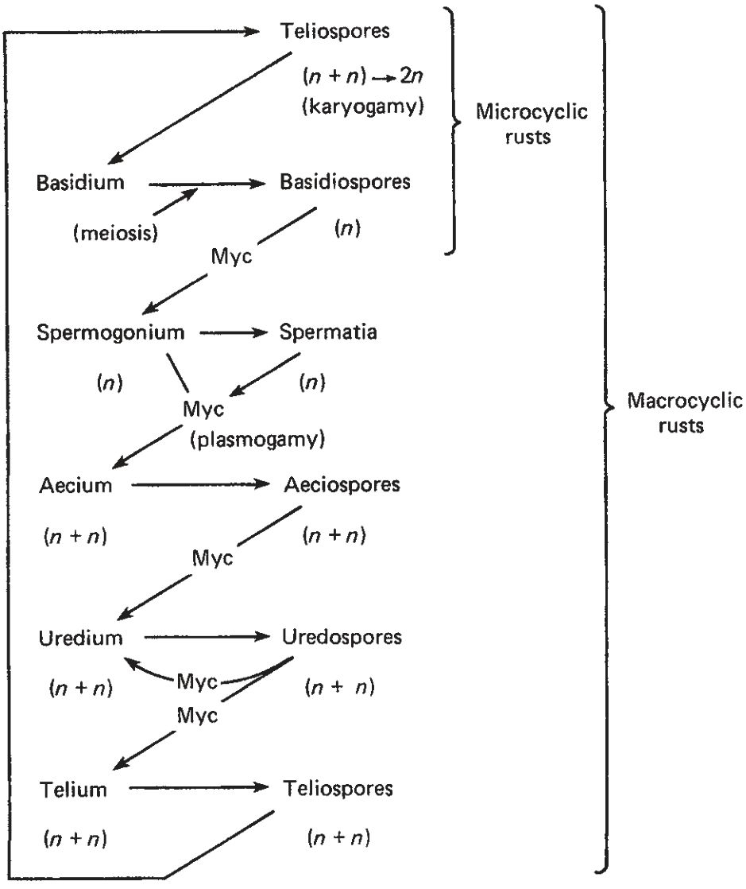 -->
<!-- ``` -->

<!-- \column{0.65\textwidth} -->

<!-- ```{r asexual-structures-fungi, fig.cap="Asexual complex multicellular structures produced by fungi in the Pucciniomycotina (spermogonium, aecium) and Ascomycota (acervulus, pycnidium, sporodochium, coremium = synnemata). Note that these structures, like all complex multicellular structures, have a genetically determined shape and size and a tightly integrated developmental program. Plant tissue is shaded in green.", out.width="85%"} -->
<!-- # pdftools::pdf_convert("../literatures/nagy2018.pdf", format = "png", pages = 5, filenames = "../images/asexual_multicellular_structures_fungi.png", dpi = 250) -->
<!-- 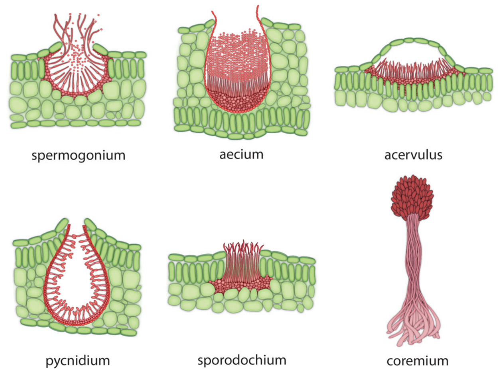 -->
<!-- ``` -->

<!-- \end{columns} -->

##

- _Puccinia graminis_ is a macrocyclic (produces one or more of spermatia, aeciospores and uredospores) heteroecious fungus that causes wheat stem rust disease.
- The repeating stage (allows the disease to persist) in this fungus occurs on wheat and not the alternate host, barberry. 
<!-- Planting resistant crops is the ideal form of disease prevention, however, mutations can give rise to new strains of fungi that can overcome plant resistance. Although the disease cannot be stopped by removal of the alternate host, the life cycle is disrupted and the rate of mutation is decreased because of reduced genetic recombination. This allows resistance bred crops to remain effective for a longer period of time. -->

\begin{columns}[T, onlytextwidth]
\column{0.5\textwidth}

```{r puccinia-graminis-wheat, fig.cap="Stem rust of Wheat (\\textit{Triticum aestivium}) caused by \\textit{Puccinia graminis} f. sp. tritici, here with urediniospores and teliospores (First pic shows telia and the second a mix of telia and uredinia).", out.width="80%"}
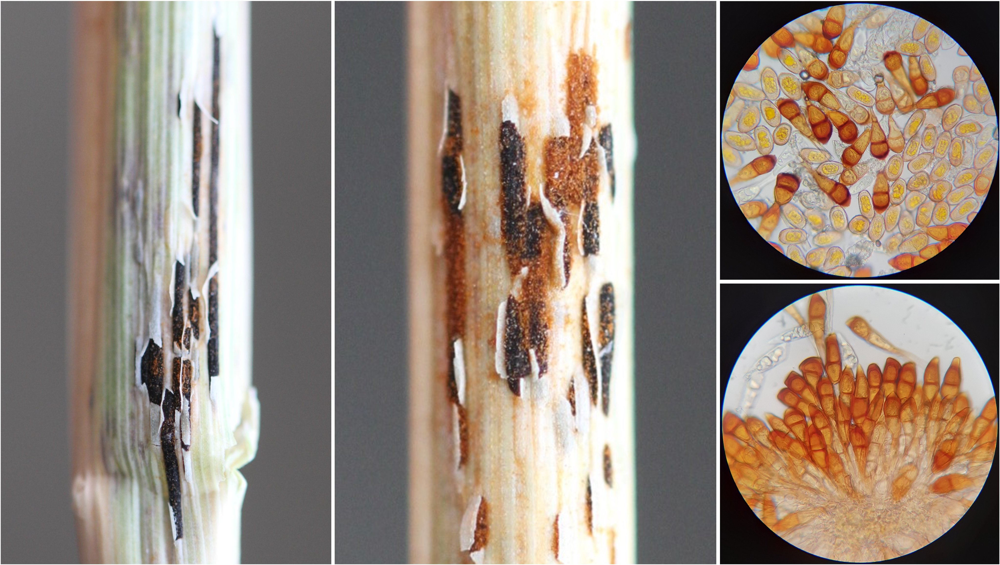
```

\column{0.5\textwidth}

```{r berberry-aecium, fig.cap="Wheat rust infection on barberry; Cross section of infected leaf, spermagonium on upper leaf, leafy bough of barberry, aecium with aeciospores on lower leaf surface. These spores are dikaryotic (they each have two haploid nuclei of different genetic make-up). These go on to infect wheat. The aeciospores are borne in chains and are held together by little rectangular cells called disjunctors.", out.width="85%"}
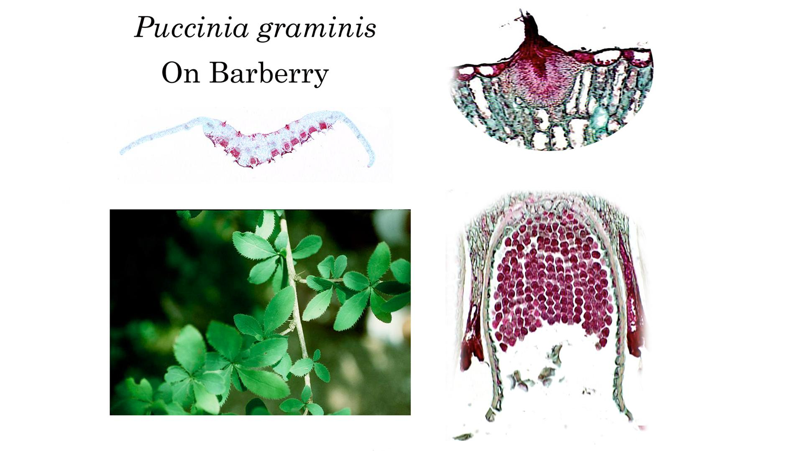
```

\end{columns}

##

- Because there is no repeating stage in the life cycle of demicyclic fungi, removal of the primary or the alternate host will disrupt the disease cycle.
- Cedar-apple rust disease, for example, can persist despite removal of one of the hosts since spores can be disseminated from long distances
  - severity of this disease can be managed by removal of basidiospore producing galls from junipers or the application of protective fungicides to junipers.
- Sulphur powder is known to stop spore germination. Fungicides such as Mancozeb and Triforine may help but may never eradicate the disease.

## UG99

\begin{columns}[T, onlytextwidth]
\column{0.6\textwidth}

It is a lineage of wheat stem rust ( \textit{Puccinia graminis} f. sp. \textit{tritici}), which is present in wheat fields in several countries in Africa and Middle east and is predicted to spread rapidly through these regions and possibly further afield, potentially causing a wheat production disaster that would affect food security worldwide. It can cause up to 100% crop losses and is virulent against many resistance genes which have previously protected against stem rust.

\column{0.4\textwidth}

```{r stem-rust, fig.cap="Stem rust (race B5) on Wheat.", out.width="60%"}
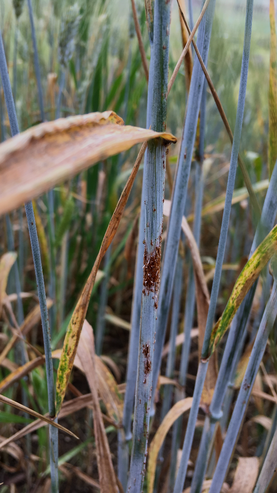
```

\end{columns}

##

\begin{columns}[T, onlytextwidth]
\column{0.4\textwidth}

```{r avenae-smut, fig.cap="Smut head of Oat caused by \\textit{Ustilago avenae}.", out.width="45%"}
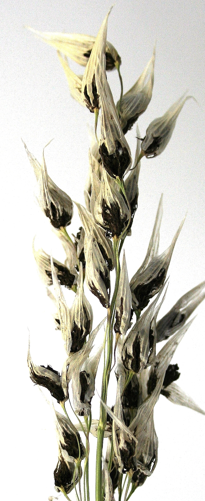
```

\column{0.6\textwidth}

```{r poplar-rust, fig.cap="Rust on White poplar \\textit{Populus alba} caused by \\textit{Melampsora} sp.. Uredinia are protruding on the upper face of some leaves and in cluster on ribs.", out.width="95%"}
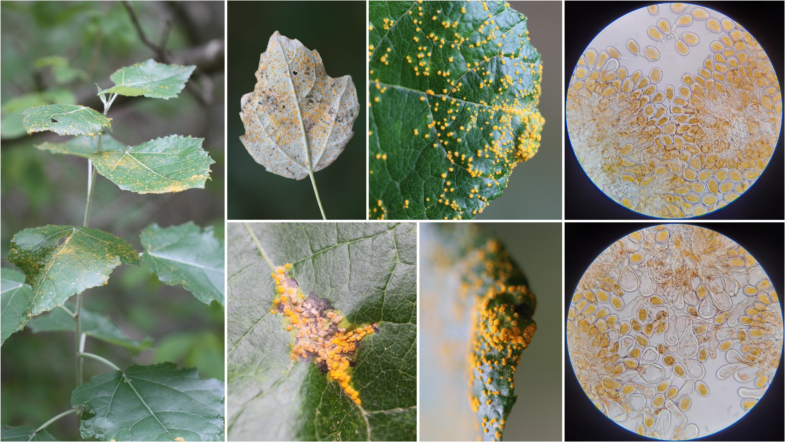
```

\end{columns}

##

```{r wheat-stem-rust, out.width="55%", results='asis', fig.align='center'}

cat("\\begin{figure}")
cat("\\caption{Stem rust on UK breeding nurseries}")
cat("\\begin{columns}")
cat("\\column{0.5\\textwidth}")
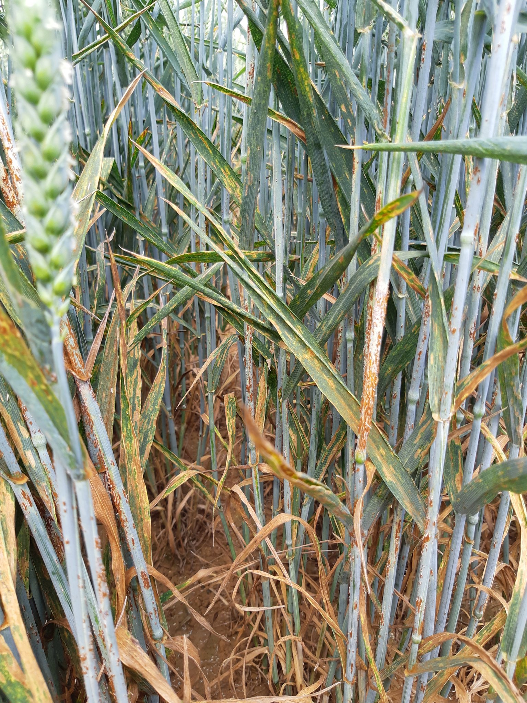
cat("\\column{0.5\\textwidth}")
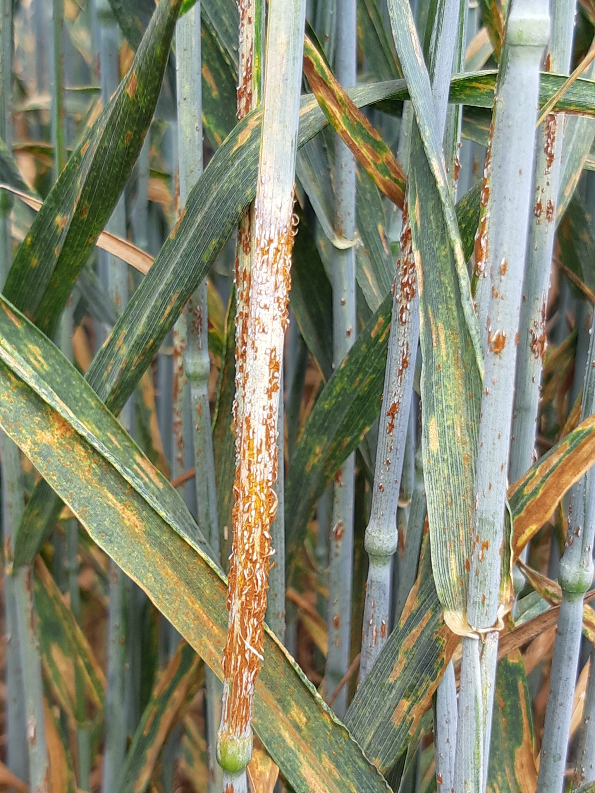
cat("\\end{columns}")
cat("\\end{figure}")
```

\footnotesize

- Wheat stripe rust is an air-borne and destructive disease caused by a heteroecious rust fungus \textit{Puccinia striiformis }f. sp. \textit{tritici} (Pst). Studies have demonstrated that the rust pathogen accomplishes sexual reproduction on susceptible barberry under natural conditions in spring, whereas Pst infection on barberry is still in blank in other seasons.

##

```{r secale-rust, results='asis', fig.align='center'}
cat("\\begin{figure}")
cat("\\caption{\\textit{Puccinia recondita} on \\textit{Secale cereale}} \n")
cat("\\begin{columns}")
cat("\\column{0.4\\textwidth}")
cat("\\includegraphics[width=0.72\\linewidth]{../images/FYCo7NmWQAkXvRB}")
# 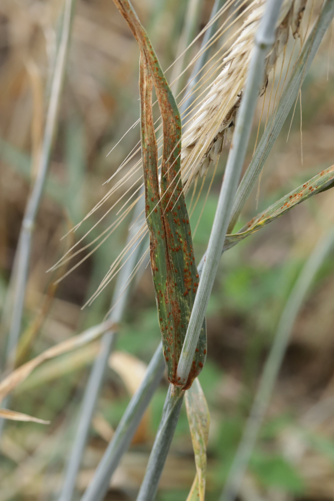
cat("\\column{0.6\\textwidth}")
cat("\\includegraphics[width=0.6\\linewidth]{../images/FYCo7NwXgAYe9r1} \\\\", "\n")
cat("\\includegraphics[width=0.6\\linewidth]{../images/FYCo7NrXkAAOJZh}")
cat("\\end{columns}")
cat("\\end{figure}")

```

##

```{r berberis-rust, fig.cap="Rust on flowering stage \\textit{Berberis vulgaris} caused by \\textit{Puccinia graminis} at the beginning of the aecial stage.", out.width="36%"}
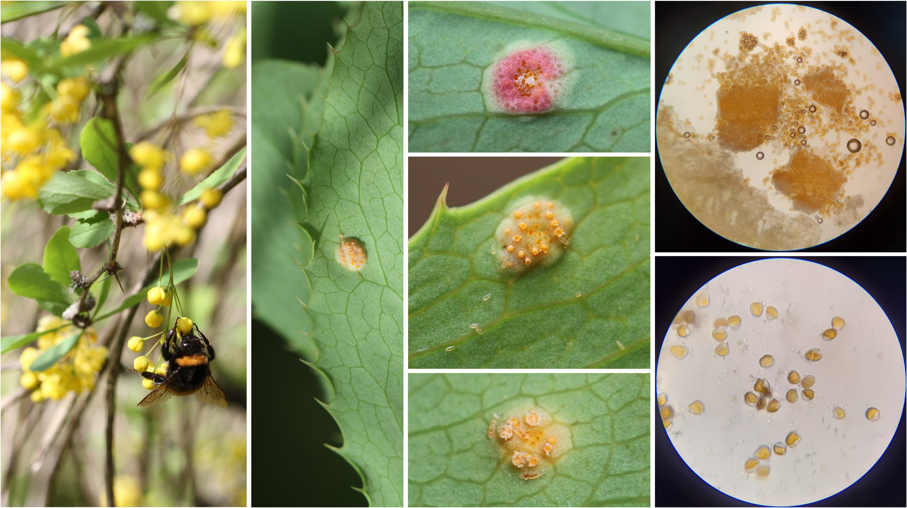
```


```{r pear-rust, fig.cap="Rust on a wild pear (\\textit{Pyrus communis}) likely caused by \\textit{Gymnosporangium sabinae}, here with a cluster of pycnia and pre-aecial tissues parasitized by \\textit{Tuberculina} sp. (A hyperparasite) which is specific to Gymnosporangium.", out.width="38%"}
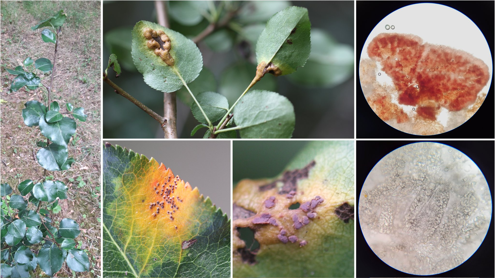
```

## Life cycle of Smut

```{r}
# Figure 1 of Molecular Interactions Between Smut Fungi and Their Host Plants
```


## Fusarium

- Fusariusm head blight/ear blight, foot rot, seedling blight Pathogen: _Fusarium spp._ and _Microdochium nivale_
- Hosts: Wheat, barley, oats, rye triticale and grasses.
- Symptoms
  \begin{itemize}
  \scriptsize
  \item Form a complex of diseases on seeds, seedlings and adult plants.
  \item \textit{Microdochium nivale} (formerly known as \textit{Fusarium nivale}) is seed-borne pathogen and causes seedling blight resulting in seedling death and thinning of plant stand.
  \item \textit{M}. spp (other than \textit{M. nivale}) cause a range of symptoms including brown lesions on stem bases, often restricted to outer leaf sheath.
  \item \textit{Fusarium lesions} often begin in the leaf sheath at the stem base where crown roots split the leaf sheath when emerging.
  \item This infection can spread up the leaf sheath causing long dark brown streaks at the stem base. The other symptom in cooler regions is brown staining of lower nodes.
  \item In older plants, fusarium infection can produce a true foot rot, where the stem base becomes brown and rotten, resulting in lodging and white heads.
  \item Symptoms are prevalent in very dry seasons as well.
  \item Ear blight causing fungus: \textit{F culmorum} and \textit{F graminearum} are common. Other are, \textit{F avenaceum}, \textit{F poae} and \textit{F langsethiae}.
  \item Infection frequently results in the whole or part of the ear becoming bleached.
  \item Symptoms seen when ears become infected during the early flowering stages, later infection may result in infection of grain but without obvious bleaching of the ears.
  \item Important due to its mycotoxin that gets accumulated in grains.
  \end{itemize}

## Fusarium: Life cycle

- Most important source is seed but fungus survives on debris in soil also.
- Spores are splashed in canopy causing ear blights and seed borne infection, in wet seasons, especially during flowering and grain formation.
- Most fusarium species have competative saprophytic abilities which allow them to colonize debris and stubble in soil.
- Importance:
  - When wet season coincides with flowering high levels of ear blight can occur.
  - Due to seed borne nature of pathogen, seed treatment plays role in preventing seedling loss in wheat.

##

```{r plantain-powdery-mildew, fig.cap="Powdery mildew on buckhorn plantain (\\textit{Plantago lanceolata}) caused by \\textit{Podosphaera plantaginis}, here with cleistothecia containing a single ascus and eight ascospores.", out.width="38%"}
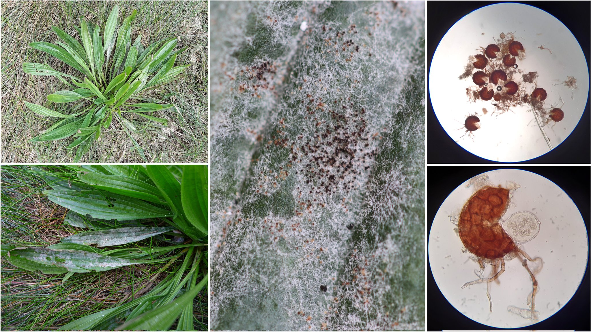
```

```{r blackberry-botrytis-rot, fig.cap="Botrytis fruit rot on blackberry (\\textit{Rubus fruticosus}).", out.width="38%"}
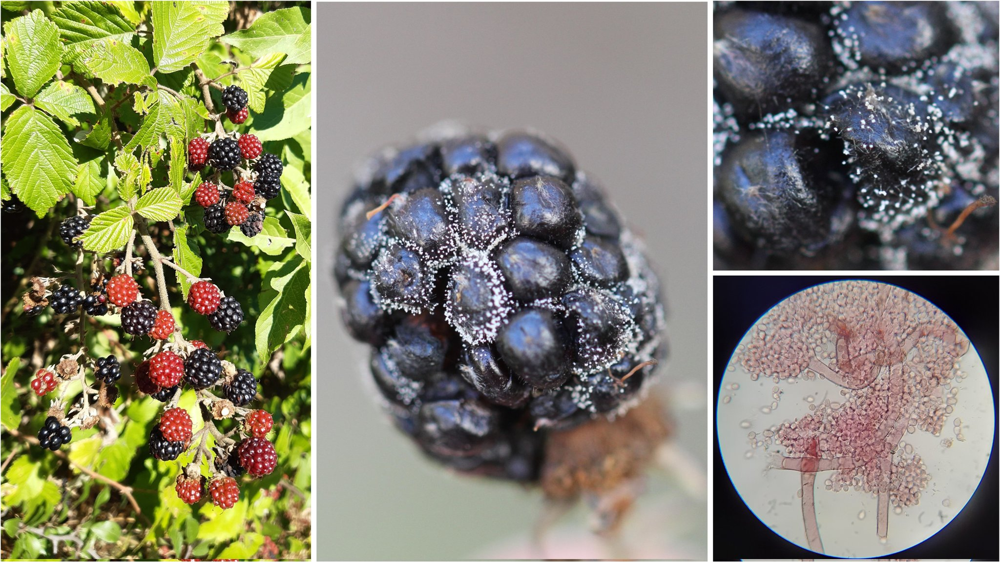
```

##

\begin{columns}[T, onlytextwidth]
\column{0.5\textwidth}

```{r rice-blast-tolerance, fig.cap="Suppression of rice miR168 improves yield, flowering time and immunity against rice blast using a target mimic approach.", out.width="90%"}
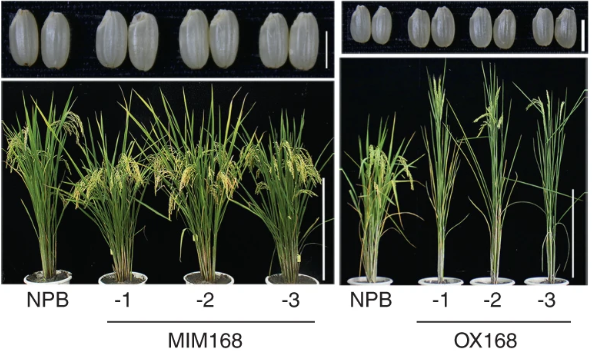
```

\column{0.5\textwidth}

```{r rice-blast-biology, fig.cap="Cell and developmental biology of plant infection by rice blast fungus \\textit{Magnaporthe oryzae}.", out.width="90%"}
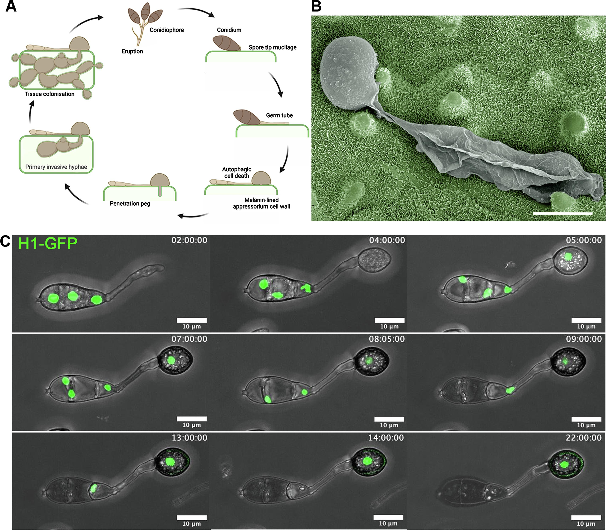
```

\end{columns}

\footnotesize Note: For cell and developmental biology of infection by blast fungus, refer to @eseola2021investigating.

##

\begin{columns}[T, onlytextwidth]
\column{0.45\textwidth}

```{r rice-panicle-blast, fig.cap="Panicle blast of rice caused by \\textit{Burkholderia glumae}", out.width="84%"}
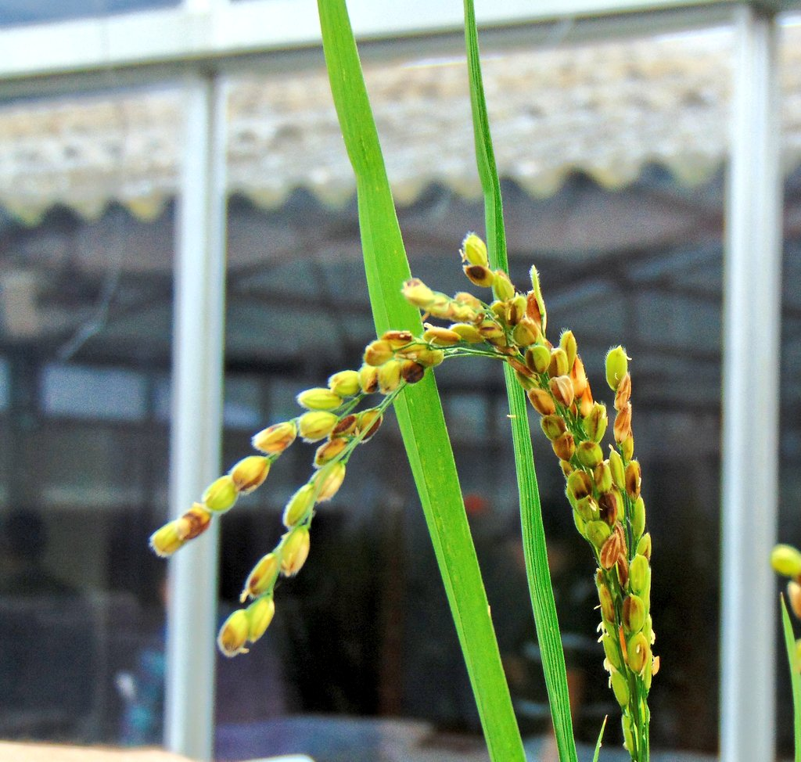
```

\column{0.55\textwidth}

```{r citrus-peel-rescuse, fig.cap="Tangeretin, an antioxidant commonly found in citrus peels, is a powerful antifungal in the fight against rice blast disease.", out.width="85%"}
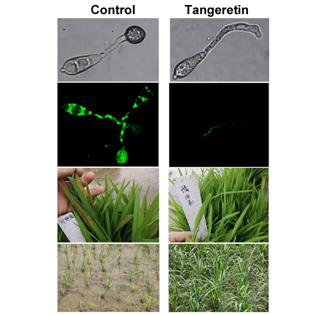
```

\end{columns}

\footnotesize Refer to @liang2021tangeretin on use of antioxidant against rice blast fungus.

##

```{r rice-hoja-blanca-virus, fig.cap="Rice hoja blanca virus", out.width="25%"}
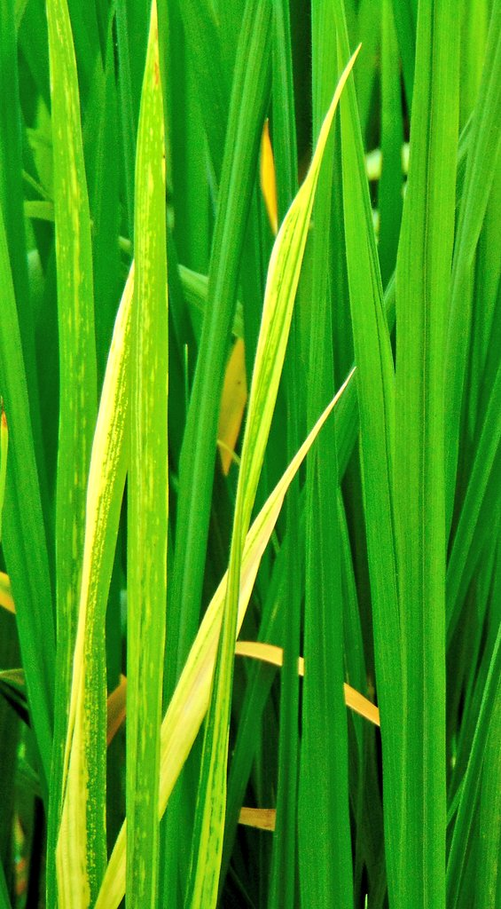
```

# Mechanisms of infection

\footnotesize
- Pathogens act in a variety of pathways to cause infection
- In pathogens that show a high level of gene flow, greater genetic diversity exists
- In pathogens reproducing asexually (with no recombination),  entire genotypes are transferred from one population to another -- phenomena called genotype flow
- Hardy spores or propagules (rust and powdery mildew) can spread over long distances, sometimes encompassing entire continents.
- Soil-borne fungi and nematodes move slowly and are present in small areas.
- Gene flow reduces genetic differences between populations, preventing delays in drastic evolution of the population in different geographical areas.
- Population size affects phenomena such as mutation, genetic drift and selection
  \begin{itemize}
  \footnotesize
  \item $\Uparrow$ population size $\thicksim$ $\Uparrow$ mutants alleles are conserved
  \item $\Uparrow$ population size $\thicksim$ $\Uparrow$ rare alleles are preserved under genetic drift 
  \end{itemize}

##

```{r infection-mechanism-extracellular, fig.cap="Resistance mechanisms at the tissue level. At the organismal and tissue levels, the success of a pathogen can be influenced by a range of features of the morphology, biochemistry and microbiome of the plant.", out.width="80%"}
# pdftools::pdf_convert("../literatures/nelson2017.pdf",
#                       format = "png", pages = 6,
#                       filenames = "../images/infection_process_plants.png",
#                       dpi = 600)
knitr::include_graphics("../images/infection_process_plants_extracellular.png")
```

##

```{r infection-mechanism-intracellular, fig.cap="At cellular level, factors that affect the ability of a pathogen to infect its plant host include defence responses triggered by recognition events in the host via PRRs, such as WAKs or RLKs, and resistance proteins (R-proteins), such as NLR proteins, nutrient availability in the apoplast and cytoplasm; pre-existing chemical factors; and cell wall constitution. These factors are affected by host genotype and are potential causes of quantitative variation. Qualitative variation in resistance usually, though not always, occurs at the level of resistance gene-effector interactions.", out.width="78%"}
# pdftools::pdf_convert("../literatures/nelson2017.pdf",
#                       format = "png", pages = 6,
#                       filenames = "../images/infection_process_plants.png",
#                       dpi = 600)
knitr::include_graphics("../images/infection_process_plants_intracellular.png")
```

# Genome comparisons of plant pathogens (filamentous)

##

```{r pathogenic-fungi-genome-compare, fig.cap="Main features of sequenced filamentous plant pathogen genomes. Filamentous eukaryotic plant pathogens belong to either the fungi or the stramenopiles (oomycetes). The representative phylogeny depicts filamentous plant pathogens with sequenced genomes and has been generated using iTOL with NCBI taxonomy identifiers (branch lengths are arbitrary). Isolate identifier, or the number of isolates sequenced, is indicated next to the species name. Pathogen lifestyles and major variations in gene families are indicated along the tree branches. The principal host plants, genome size, main insights gained from genome comparisons, number of predicted protein-coding genes and repetitive DNA content (as a percentage of genome size) are shown next to the tree branches. CDC, conditionally dispensible chromosome; chr., chromosome; CNV, copy number variation; CRN, Crinkler; CWDE, cell wall-degrading enzyme; GPCR, G protein coupled receptor; GSR, gene-sparse region; incl., including; LS, lineage-specific; ND, not determined; NRPS, non-ribosomal peptide synthetase; P/A, presence/absence; PKS, polyketide synthase; pos. sel., positive selection; rec., recombination; RIP, repeat-induced point; SMB, secondary metabolite biosynthesis; SNPs, single-nucleotide polymorphisms; SSP, small secreted protein; TE, transposable element", out.width="40%"}
# pdftools::pdf_convert("../literatures/NatureRevMicro_2012.pdf",
                      # format = "png", pages = 3, dpi = 250,
                      # filenames = "../images/genome_comparison_pathogenic_fungi.png")
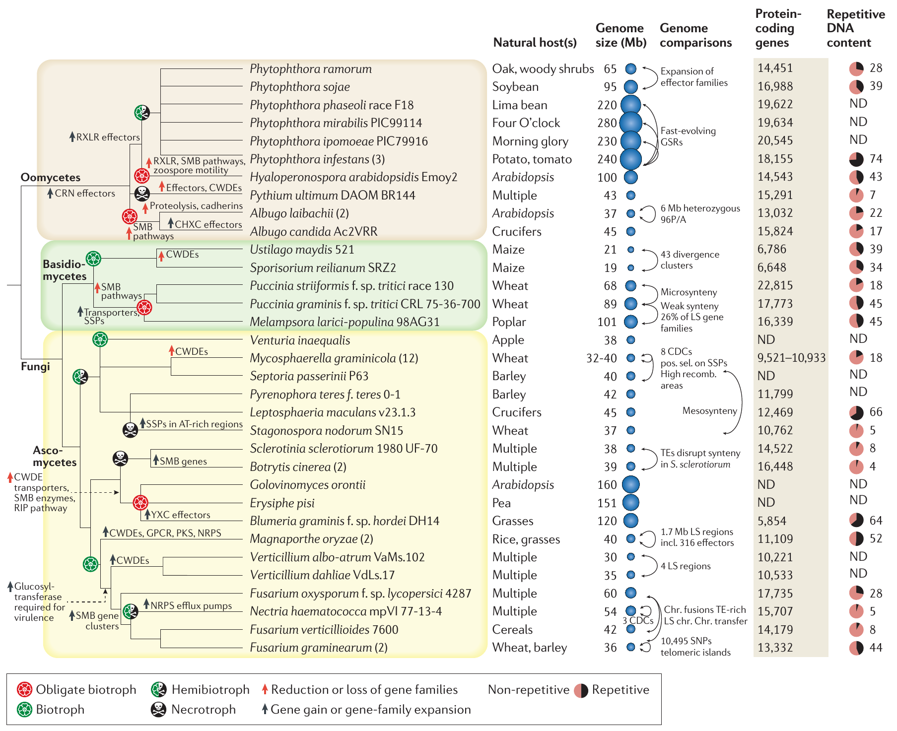
```


# Insects

## Major insects of Rice

\renewcommand{\arraystretch}{0.6}

```{r insects-damage, results='asis'}
tribble(
  ~"Damaged part", ~"Insect", ~"Scientific name",
  "Leaf", "Rice ear cutting caterpillar", "Mythimna seperata",
  "Leaf", "Rice swarming caterpillar", "Spodoptera mauritia",
  "Leaf", "Rice leaf folder", "Cnaphalocrosis medinalis",
  "Leaf", "Rice caseworm", "Nymphyla dpunctalis",
  "Leaf", "Rice grasshopper", "Hyeroglyphus banian",
  "Leaf", "Rice hispa", "Dickladispa armigera",
  "Leaf", "Field cricket", "Gryllus bimaculatus",
  "Stem", "Yellow stem borer", "Scripophaga incertulus",
  "Stem", "Rice pink borer", "Sesamia inferens",
  "Stem", "Gall midge", "Orselolia oryzae",
  "Stem", "Striped stem borer", "Chilo partellus",
  "Tender shoots", "Brown plant hopper", "Nilaparvata lugens",
  "Tender shoots", "Rice thrips", "Stenochaetothrips biformis",
  "Tender shoots", "Green leaf hopper", "Nephotettix virisens",
  "Root", "Mole cricket", "Gryllotalpa africana",
  "Grain, flower", "Rice earhead bug", "Leptocorisa oratorious",
  "Grain, flower", "Flower/pollen beetle", "Chiloloba acuta"
) %>%
  mutate(`Scientific name` = paste0("\\textit{", `Scientific name`, "}")) %>%
  knitr::kable(booktabs = TRUE, caption = "Major insects of rice and nature of their damange",
               escape = FALSE, linesep = "") %>%
  kableExtra::kable_styling(font_size = 5, position = "center") %>%
  kableExtra::column_spec(column = 2:3, width = c("14em", "18em")) %>%
  kableExtra::column_spec(column = 1, width = "8em") %>%
  kableExtra::collapse_rows(1)
```


## Major Insects of Fruits and Vegetables

```{r major-insects-fruits-vegetables, results='asis'}
fruits_veggies_insects <- tribble(
  ~"crop_meta", ~"crop_group", ~"common_name", ~"scientific_name", ~"family", ~"control", ~"remark",
  "Vegetable", "Cruciferous vegetables", "Cabbage butterfly", "Pieris brassicae", "Lepidoptera", "Dichlorovos 76 EC, Nuvan 1 ml, Malation 50\\% EC 2ml", NA,
  "Vegetable", NA, "Diamond-back moth", "Plutella xylostella", "Lepidoptera", "DBM lure, Azadirachtin 0.003\\% EC, Beauveria bassiana, Emamectin benzoate, Cypermethrin 10\\% EC 2ml", NA,
  "Vegetable", NA, "Tobaccoo caterpillar", "Spodoptera litura", "Lepidoptera", "Spodo-lure", NA,
  "Vegetable", NA, "Mustard aphid", "Lipaphis erysimi", "Homoptera", "Augmentation of natural predators Lady bird beetle (Coccinella septumpunctata) and Syrphid fly; Malathion 50 EC 1.5-2 ml per liter of water", NA,
  "Vegetable", NA, "Mustard sawfly", "Athalia lugens", "Hymenoptera", "Summer ploughing", NA,
  "Vegetable", NA, "Cutworm", "Agrotis ipsilon, A. segetum", "Lepidoptera", NA, NA,
  "Vegetable", NA, "Flea beetle", "Phyllotreta cruciferae", "Coleoptera", NA, NA,
  "Vegetable", NA, "Semi looper", "Thysanoplusia orichalcea", "Lepidoptera", NA, NA,
  "Vegetable", "Cucurbit crops", "Re pumpkin beetle", "Aulacophora foevicolis", "Coleoptera", NA, NA,
  "Vegetable", NA, "Cucurbit stink bug", "Cordius janus", "Hemiptera", NA, NA,
  "Vegetable", NA, "Pumpkin fruit fly", "Bactrocera cucurbitae", "Diptera", NA, NA,
  "Vegetable", NA, "Spotted beetle", "Epilachna vigintioctopunctata", "Coleoptera", NA, NA,
  "Vegetable", NA, "Cutworm, Semi-looper, Flea beetle, Aphid, White fly, Stem boring beetle, Banded blister beetle", "Mylabris orientalis", NA, NA, "Minior insects",
  "Vegetable", "Tomato", "Tomato fruit borer", "Helicoverpa armigera", "Lepidoptera", NA, NA,
  "Vegetable", "Potato", "Potato tuber moth", "Phthorimaea operculella", "Lepidoptera", NA, NA,
  "Vegetable", "Potato", "Red ant", "Dorylus orientalis", "Hymenoptera", NA, NA,
  "Vegetable", "Potato", "Silver white fly", "Bemisia tabaci", "Homoptera", NA, "Variants of white flies of economic importance are: Aleurocanthus woglumi (citrus blackfly), which, in spite of its color, is a whitefly that attacks citrus. Aleyrodes proletella (cabbage whitefly), is a pest of various Brassica crops. Trialeurodes vaporariorum (greenhouse whitefly), a major pest of greenhouse fruit, vegetables, and ornamentals.",
  "Vegetable", "Tomato", "Jassid", "Amarasca biguttula", "Hemiptera", NA, NA,
  "Vegetable", "Solanaceous crops", "Aphid", "Aphis gossypii, Myzus persicae", "Hemiptera", NA, NA,
  "Vegetable", "Solanaceous crops", "Pea leaf miner", "Liriomyza huidobrensis", "Agromyzidae", NA, NA,
  "Vegetable", "Tomato", "Tomato leaf miner", "Tuta absoluta", "Lepidoptera", NA, NA,
  "Vegetable", "Solanaceous crops", "Cutworm, Spotted beetle, White grub, Wireworm, Tobaccoo caterpillar, Flea beetle, Soybean, Hairy caterpillar", NA, NA, NA, "Minor insects",
  "Vegetable", "Brinjal", "Shoot and fruit borer", "Leucinodes orbonalis", "Lepidoptera", NA, NA,
  "Vegetable", NA, "Leaf folder", "Eublemma olivacea", "Lepidoptera", NA, NA,
  "Vegetable", NA, "Leaf webber", "Herpetogramma bipuncatalis", "Lepidoptera", NA, NA,
  "Vegetable", NA, "Spotted beetle", "Epilachna vigintioctopunctata", "Coleoptera", NA, NA,
  "Vegetable", NA, "Aphid, Cotton jassid, Tobaccoo caterpillar, Soybean hairy caterpillar, White fly, Green semilooper, Grasshopper, Red ant, White grub", NA, NA, NA, "Minor insects",
  "Vegetable", "Cotton", "American bollworm/Fruit borer", "Helicoverpa armigera", "Noctuidae", NA, "Bolls how regular, circular bore holes; A single larvae can damage 30-40 bolls; Inundative release of egg parasitoid, Trichogramma spp., at 6.25 cc/ha at 15 days interval, 3 times from 45 DAS; Releasing of predator Chrysoperla carnea 100000/ha at 6th, 13th and 14th week after sowing; During bolling and maturation apply one of the following (1000 liter per hectare spray): Quinalphos 25EC 2.0 liter per hectare, Carbaryl 50 WP 2.5 kg per hectare, Cypermethrin 10 EC 600-800 ml per hectare.",
  "Vegetable", "Cotton", "Pink bollworm", "Pectinophora gossypiella", "Lepidoptera (Gelechiidae)", NA, NA,
  "Vegetable", "Cotton", "Spotted bollworm", "Earias vittella", "Lepidoptera (Noctuidae)", NA, NA,
  "Vegetable", "Cotton", "Tobaccoo cutworm", "Spodoptera litura", "Lepidoptera (Noctuidae)", NA, NA,
  "Vegetable", "Cotton", "Cotton aphid", "Aphis gossypii", "Hemiptera (Aphididae)", NA, NA,
  "Vegetable", "Cotton", "Thrips", "Thrips tabaci", "Thysanoptera", NA, NA,
  "Vegetable", "Cotton", "White fly", "Bemisia tabaci", "Hemiptera (Aleyrodidae)", NA, NA,
  "Vegetable", "Cotton", "Red cotton bug", "Dysdercus cingulatus", "Hemiptera (Pyrrhocoridae)", NA, NA,
  "Fruit", "Citrus", "Citrus psylla", "Diaphorina citri", "Hemiptera", NA, NA,
  "Fruit", "Citrus", "Oriental fruit fly", "Bactocera dorsalis", "Diptera (Tephritidae)", NA, NA,
  "Fruit", "Citrus", "Stink bug", "Rhynchocoris poseidon", "Hemiptera", NA, NA,
  "Fruit", "Citrus", "Red scale", "Aonideiella aurantii", "Hemiptera", NA, NA,
  "Fruit", "Citrus", "Citrus aphid", "Toxoptera citricidus", "Hemiptera", NA, NA,
  "Fruit", "Citrus", "Orange stem borer", "Stomatimum barbatum", "Coleoptera", NA, NA,
  "Fruit", "Citrus", "Citrus mealy bug", "Planococcus citri", "Hemiptera", NA, NA,
  "Fruit", "Banana", "Rhizome weevil", "Cosmopolites sordidus", "Coleoptera", NA, NA,
  "Fruit", "Banana", "Pseudostem weevil", "Odoiporus longicollis", "Coleoptera", NA, NA,
  "Fruit", "Banana", "Skipper", "Erionata thrax thrax", "Lepidoptera", NA, NA,
  "Fruit", "Banana", "Leaf and fruit scarring beetle", "Nodostoma viridipennis", "Coleoptera", NA, NA,
  "Fruit", "Banana", "Aphid", "Pentalonia nigronervosa", "Hemiptera", NA, NA,
  "Fruit", "Banana", "Lace-wing bug", "Stephanitis typica", "Hemiptera", NA, NA,
  "Fruit", "Banana", "Fruit fly", "Bactrocera musae", "Hemiptera (Tephritidae)", NA, NA,
  "Fruit", "Mango", "Hopper", "Idioscopus nitidulus", "Hemiptera (Cicadellidae)", NA, NA,
  "Fruit", "Mango", "Fruit fly", "Bactrocera dorsalis", "Hemiptera (Tephritidae)", NA, NA,
  "Fruit", "Mango", "Mealy bug", "Drosicha mangiferae", "Hemiptera", NA, NA,
  "Fruit", "Mango", "Stem borer", "Bactrocera rufomaculata", "Coleoptera", NA, NA,
  "Fruit", "Mango", "Leaf webber", "Orthaga spp.", "Lepidoptera", NA, NA,
  "Fruit", "Mango", "Stone weevil", "Sternochetus mangiferae", "Coleoptera", NA, NA,
  "Fruit", "Mango", "Gall psyllid", "Apsylla cistella", "Hemiptera", NA, NA,
  "Fruit", "Mango", "Slug caterpillar, Mango leaf cutting weevil", NA, NA, NA, NA,
  "Fruit", "Peach", "Tent caterpillar", "Malacosoma indicum", "Lepidoptera", NA, "Also affects apricot and walnut",
  "Fruit", "Apple", "Wolly aphid", "Eriosoma langierum", "Hemiptera", NA, NA,
  "Fruit", "Apple", "San jose scale", "Quadraspidiotus perniciosus", "Hemiptera", NA, NA,
  "Fruit", "Apple", "Stem borer", "Apriona cinera", "Coleoptera", NA, NA,
  "Fruit", "Apple", "Root borer", "Dorysthenes hugeli", "Coleoptera", NA, NA,
  "Fruit", "Apple", "Codling moth", "Cydia pomonella", "Lepidoptera", NA, NA,
  "Fruit", "Peach", "Leaf curl aphid", "Brachycaudia helichrysi", "Hemiptera", NA, NA,
  NA, "Coffee", "White stem borer", "Xylotrechus quadripes", "Coleoptera", NA, NA,
  NA, "Coffee", "Berry borer", "Hypothenemus hampei", "Coleoptera", NA, NA,
  NA, "Coffee", "Shoot-hole borer", "Xylosandrus compactus", "Coleoptera", NA, NA,
  NA, "Coffee", "Stripped mealy bug", "Ferrisia virgata", "Hemiptera", NA, NA,
  NA, "Coffee", "Helmet scale", "Saissetia coffeae", "Hemiptera", NA, NA,
  NA, "Coffee", "Gren bug", "Coccus viridis", "Hemiptera", NA, NA,
  NA, "Tea", "Mosquito/Plant bug", "Belopeltis theivora", "Hemiptera", NA, NA,
  NA, "Tea", "Red spider mite", "Oligonychus coffeae", "Acarina", NA, NA,
  NA, "Tea", "Scarlet mite", "Brevipalpus phoenicis", "Acarina", NA, NA,
  NA, "Tea", "Purple mite", "Calacarus carinatus", "Acarina", NA, NA,
  "Storage", "Storage pests", "Rice weevil", "Sitophus oryzae", "Coleoptera (Curculionidae)", NA, NA,
  "Storage", NA, "Maize weevil", "Sitophus zeamais", "Coleoptera (Curculionidae)", NA, NA,
  "Storage", NA, "Angoumois grain moth", "Sitotroga cerealella", "Lepidoptera (Gelechiidae)", NA, NA,
  "Storage", NA, "Lesser grain borer", "Rhizopertha dominica", "Coleoptera (Bostrichidae)", NA, NA,
  "Storage", NA, "Rice moth", "Corcyra cephalonica", "Lepidoptera (Pyralidae)", NA, NA,
  "Storage", NA, "Khapra beetle", "Trogoderma granarium", "Coleoptera (Dermastidae)", NA, NA,
  "Storage", NA, "Pulse beetle", "Callosobruchus chinensis", "Coleoptera (Bruchidae)", NA, NA,
  "Storage", NA, "Cowpea beetle", "Callosobruchus maculates", "Coleoptera (Bruchidae)", NA, NA,
  "Storage", NA, "Rust red flour beetle", "Tribolium castaneum", "Coleoptera (Tenebrionidae)", NA, NA,
  "Storage", NA, "Confused flour beetle", "Tribolium confusum", "Coleoptera (Tenebrionidae)", NA, NA,
  "Storage", NA, "Warehouse moth", "Ephestia cautella", "Lepidoptera (Pyralidae)", NA, NA,
  "Storage", NA, "Indian meal moth", "Plodia interpunctella", "Lepidoptera (Phycitidae)", NA, NA,
  "Storage", NA, "Bean weevil", "Acanthoscelides obtectus", "Coleoptera (Bruchidae)", NA, NA,
  "Storage", NA, "Granary weevil", "Sitophilus granaries", "Coleoptera (Curculionidae)", NA, NA
) 

cat("\\renewcommand{\\arraystretch}{0.6} \n")

fruits_veggies_insects %>% 
  tidyr::fill(crop_group, .direction = "down") %>%
  arrange(crop_meta, crop_group) %>%
  select(-1) %>%
  rename_all(function(x)str_to_sentence(str_replace_all(x, "_", " "))) %>%
  filter(`Crop group` %in% c("Apple", "Banana", "Peach")) %>% 
  knitr::kable(booktabs = TRUE, caption = "Insect pests of fruits and vegetables", escape = FALSE) %>%
  kableExtra::kable_styling(font_size = 4, position = "center") %>% # do not set font here because it is already set above
  kableExtra::column_spec(column = 2:6, width = paste0(c(10, 14, 12, 8, 10), "em")) %>%
  kableExtra::column_spec(column = 1, width = "6em") %>%
  kableExtra::collapse_rows(1)
```

##

```{r}
fruits_veggies_insects %>% 
  tidyr::fill(crop_group, .direction = "down") %>%
  arrange(crop_meta, crop_group) %>%
  select(-1) %>%
  rename_all(function(x)str_to_sentence(str_replace_all(x, "_", " "))) %>%
  filter(`Crop group` %in% c("Citrus", "Mango")) %>% 
  knitr::kable(booktabs = TRUE, caption = "Insect pests of fruits and vegetables (...continued)", escape = FALSE) %>%
  kableExtra::kable_styling(font_size = 4) %>% # do not set font here because it is already set above
  kableExtra::column_spec(column = 2:6, width = paste0(c(13, 14, 14, 7, 12), "em")) %>%
  kableExtra::column_spec(column = 1, width = "5em") %>%
  kableExtra::collapse_rows(1)
```

##

```{r}
fruits_veggies_insects %>% 
  tidyr::fill(crop_group, .direction = "down") %>%
  arrange(crop_meta, crop_group) %>%
  select(-1) %>%
  rename_all(function(x)str_to_sentence(str_replace_all(x, "_", " "))) %>%
  filter(`Crop group` %in% c("Storage pests")) %>% 
  knitr::kable(booktabs = TRUE, caption = "Insect pests of fruits and vegetables (...continued)", escape = FALSE) %>%
  kableExtra::kable_styling(font_size = 5) %>% # do not set font here because it is already set above
  kableExtra::column_spec(column = 2:6, width = paste0(c(12, 14, 14, 8, 8), "em")) %>%
  kableExtra::column_spec(column = 1, width = "6em") %>%
  kableExtra::collapse_rows(1)
```

##

```{r}
fruits_veggies_insects %>% 
  tidyr::fill(crop_group, .direction = "down") %>%
  arrange(crop_meta, crop_group) %>%
  select(-1) %>%
  rename_all(function(x)str_to_sentence(str_replace_all(x, "_", " "))) %>%
  filter(`Crop group` %in% c("Brinjal", "Potato")) %>% 
  knitr::kable(booktabs = TRUE, caption = "Insect pests of fruits and vegetables (...continued)", escape = FALSE) %>%
  kableExtra::kable_styling(font_size = 4) %>% # do not set font here because it is already set above
  kableExtra::column_spec(column = 2:6, width = paste0(c(12, 15, 14, 6, 16), "em")) %>%
  kableExtra::column_spec(column = 1, width = "6em") %>%
  kableExtra::collapse_rows(1)
```

##

```{r}
fruits_veggies_insects %>% 
  tidyr::fill(crop_group, .direction = "down") %>%
  arrange(crop_meta, crop_group) %>%
  select(-1) %>%
  rename_all(function(x)str_to_sentence(str_replace_all(x, "_", " "))) %>%
  filter(`Crop group` %in% c("Cotton")) %>% 
  knitr::kable(booktabs = TRUE, caption = "Insect pests of fruits and vegetables (...continued)", escape = FALSE) %>%
  kableExtra::kable_styling(font_size = 4) %>% # do not set font here because it is already set above
  kableExtra::column_spec(column = 2:6, width = paste0(c(10, 15, 12, 6, 22), "em")) %>%
  kableExtra::column_spec(column = 1, width = "5em") %>%
  kableExtra::collapse_rows(1)
```

##

```{r}
fruits_veggies_insects %>% 
  tidyr::fill(crop_group, .direction = "down") %>%
  arrange(crop_meta, crop_group) %>%
  select(-1) %>%
  rename_all(function(x)str_to_sentence(str_replace_all(x, "_", " "))) %>%
  filter(`Crop group` %in% c("Cruciferous vegetables")) %>% 
  knitr::kable(booktabs = TRUE, caption = "Insect pests of fruits and vegetables (...continued)", escape = FALSE) %>%
  kableExtra::kable_styling(font_size = 4) %>% # do not set font here because it is already set above
  kableExtra::column_spec(column = 2:6, width = paste0(c(12, 14, 14, 14, 8), "em")) %>%
  kableExtra::column_spec(column = 1, width = "6em") %>%
  kableExtra::collapse_rows(1)
```

##

```{r}
fruits_veggies_insects %>% 
  tidyr::fill(crop_group, .direction = "down") %>%
  arrange(crop_meta, crop_group) %>%
  select(-1) %>%
  rename_all(function(x)str_to_sentence(str_replace_all(x, "_", " "))) %>%
  filter(`Crop group` %in% c("Cucurbit crops", "Solanaceous crops")) %>% 
  knitr::kable(booktabs = TRUE, caption = "Insect pests of fruits and vegetables (...continued)", escape = FALSE) %>%
  kableExtra::kable_styling(font_size = 4) %>% # do not set font here because it is already set above
  kableExtra::column_spec(column = 2:6, width = paste0(c(12, 14, 14, 14, 8), "em")) %>%
  kableExtra::column_spec(column = 1, width = "6em") %>%
  kableExtra::collapse_rows(1)
```


##

```{r}
fruits_veggies_insects %>% 
  tidyr::fill(crop_group, .direction = "down") %>%
  arrange(crop_meta, crop_group) %>%
  select(-1) %>%
  rename_all(function(x)str_to_sentence(str_replace_all(x, "_", " "))) %>%
  filter(`Crop group` %in% c("Tomato", "Coffee", "Tea")) %>%
  knitr::kable(booktabs = TRUE, caption = "Insect pests of fruits and vegetables (...continued)", escape = FALSE) %>%
  kableExtra::kable_styling(font_size = 5) %>% # do not set font here because it is already set above
  kableExtra::column_spec(column = 2:6, width = paste0(c(10, 14, 12, 8, 8), "em")) %>%
  kableExtra::column_spec(column = 1, width = "6em") %>%
  kableExtra::collapse_rows(1)
```

# Bibliography

## References
