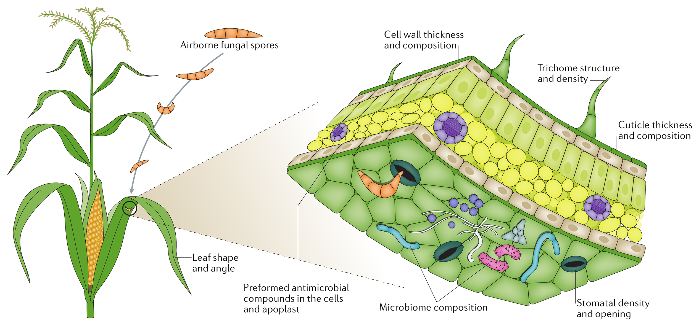
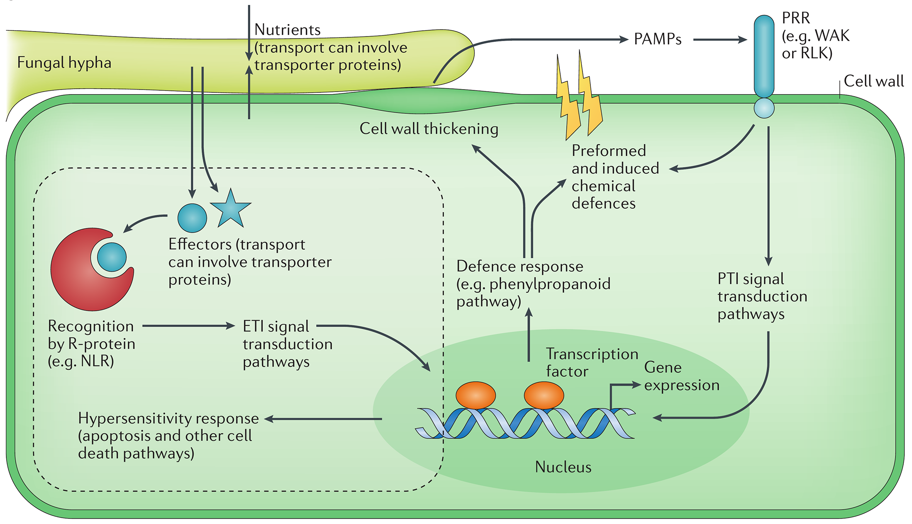
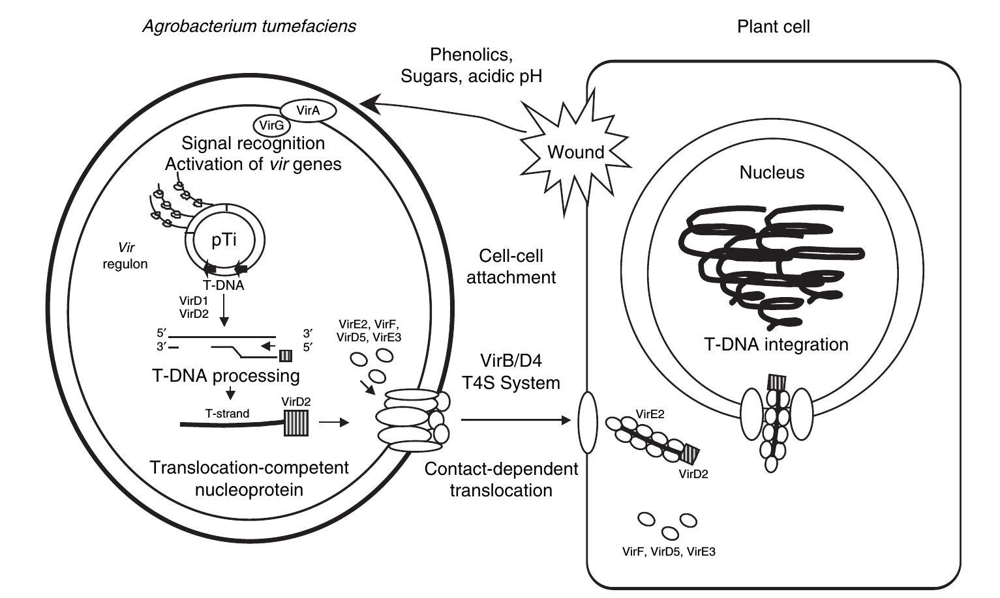
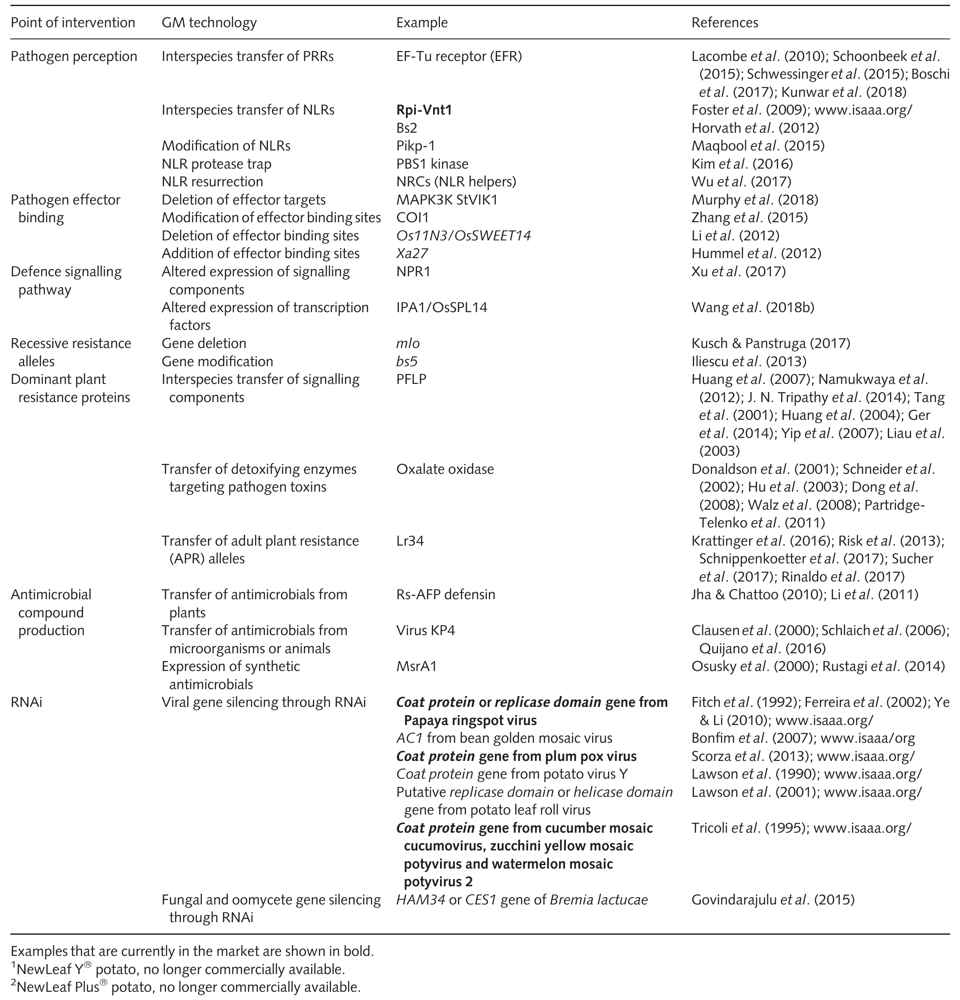

```{r setup, include=FALSE}
library(knitr)
require(tidyverse)
set.seed(453)
# invalidate cache when the package version changes
knitr::opts_chunk$set(tidy = FALSE, echo = FALSE, 
                  message = FALSE, warning = FALSE,
                  out.width = "45%", cache = TRUE, 
                  dev.args=list(bg=grey(0.9), pointsize=11))
options(knitr.table.format = "latex")
options(knitr.kable.NA = "", digits = 2)
options(kableExtra.latex.load_packages = FALSE)
# Beamer cheatsheet can be found at:
# http://www.cpt.univ-mrs.fr/~masson/latex/Beamer-appearance-cheat-sheet.pdf
# All beamer themes and colorthemes can be assessed at:
# https://hartwork.org/beamer-theme-matrix/

# A complete book on biolgy view this link
# https://github.com/philschatz/biology-book/blob/master/SUMMARY.md
```

# Defense mechanisms against pathogens, parasites

## 

- Genetic information (determines the form and function) is encoded as DNA or (exceptionally) RNA.
  - Nucleus
  - Mitochondria
  - Plasmid (autonomously replicating)
  - Chloroplasts
- A gene (in general) is characterized by:
  - 100-500 codon triplets
  - Coding and and non-coding region
  - Protein or RNA as code product
- Genetic processes
  - Replication
  - Transcription
  - Translation
  - Regulatory elements -- promoters, enhancers, silencers or terminators

# Mechanisms of infection

##

```{r infection-mechanism-extracellular, fig.cap="Resistance mechanisms at the tissue level. At the organismal and tissue levels, the success of a pathogen can be influenced by a range of features of the morphology, biochemistry and microbiome of the plant.", out.width="80%"}
# pdftools::pdf_convert("../literatures/nelson2017.pdf",
#                       format = "png", pages = 6,
#                       filenames = "../images/infection_process_plants.png",
#                       dpi = 600)

```

##

```{r infection-mechanism-intracellular, fig.cap="At cellular level, factors that affect the ability of a pathogen to infect its plant host include defence responses triggered by recognition events in the host via PRRs, such as WAKs or RLKs, and resistance proteins (R-proteins), such as NLR proteins, nutrient availability in the apoplast and cytoplasm; pre-existing chemical factors; and cell wall constitution. These factors are affected by host genotype and are potential causes of quantitative variation. Qualitative variation in resistance usually, though not always, occurs at the level of resistance gene-effector interactions.", out.width="80%"}
# pdftools::pdf_convert("../literatures/nelson2017.pdf",
#                       format = "png", pages = 6,
#                       filenames = "../images/infection_process_plants.png",
#                       dpi = 600)

```


## Genetic processes involved in infection

```{r mechanism-of-infection, fig.cap="Overview of agrobacterium tumefaciens infection process. Upon activation of the VirA/VirG two-component signal transduction system by signals released from wounded plant cells, a single-strand transferred DNA (T-DNA) is processed from the Ti plasmid and delivered as a nucleoprotein complex (T-complex) to plant nuclei. Expression of T-DNA genes in the plant result in the loss of cell growth control and tumor formation.", out.width="66%", fig.align='center'}
# pdftools::pdf_convert("/home/deependra/ddhakal/000readables/pathology/2009_Encyclopedia of Microbiology_3rd edition.pdf",
#                       pages = 8, format = "png",
#                       filenames = "../images/agrobacterium-transformation.png",
#                       dpi = 250)
# refer to text for more


```


## Mechanisms of genetic resistance [@van2020genetic]

```{r genetic-solution-to-pathogens, out.width="40%", fig.align='center'}
# pdftools::pdf_convert("../literatures/accessory/10.1111@nph.15967.pdf", filenames = "../images/genetic_solution_pathogens.png", format = "png", pages = 3, dpi = 300)

```


# Gene for gene hypothesis

##

- @flor1956complementary was the first to show there was a 'gene-for-gene' relationship between the pathogen's avirulence ( _Avr_) genes and the resistance ( _R_) genes of its host.

# Defense mechanisms against insects

# Bibliography

## References
