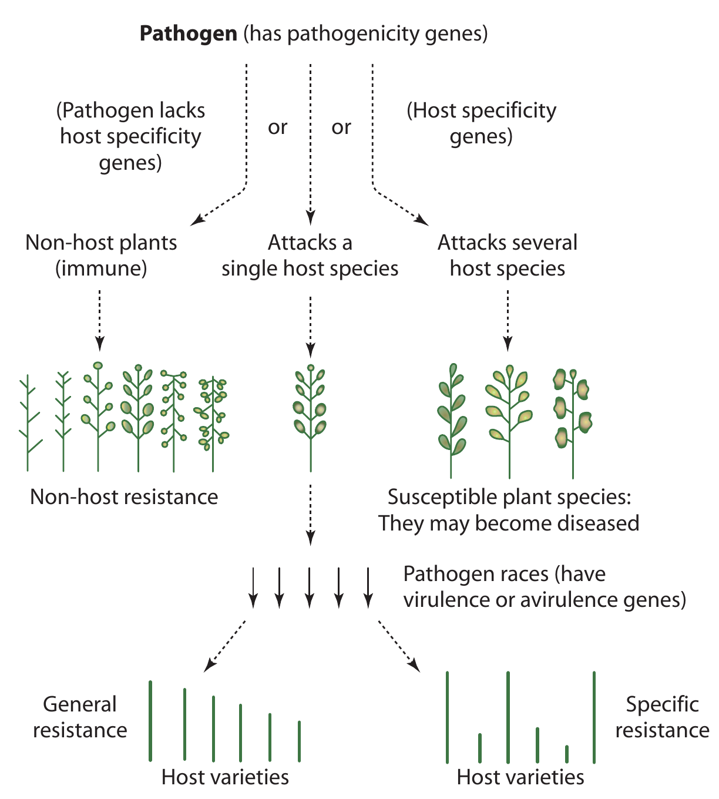

```{r setup, include=FALSE}
library(knitr)
require(tidyverse)
set.seed(453)
# invalidate cache when the package version changes
knitr::opts_chunk$set(tidy = FALSE, echo = FALSE, 
                  message = FALSE, warning = FALSE,
                  out.width = "45%", cache = TRUE, 
                  dev.args=list(bg=grey(0.9), pointsize=11))
options(knitr.table.format = "latex")
options(knitr.kable.NA = "", digits = 2)
options(kableExtra.latex.load_packages = FALSE)
# Beamer cheatsheet can be found at:
# http://www.cpt.univ-mrs.fr/~masson/latex/Beamer-appearance-cheat-sheet.pdf
# All beamer themes and colorthemes can be assessed at:
# https://hartwork.org/beamer-theme-matrix/

# A complete book on biolgy view this link
# https://github.com/philschatz/biology-book/blob/master/SUMMARY.md
```

# Mechanisms of infection

##

\footnotesize
- Pathogens act in a variety of pathways to cause infection
- In pathogens that show a high level of gene flow, greater genetic diversity exists
- In pathogens reproducing asexually (with no recombination),  entire genotypes are transferred from one population to another -- phenomena called genotype flow
- Hardy spores or propagules (rust and powdery mildew) can spread over long distances, sometimes encompassing entire continents.
- Soil-borne fungi and nematodes move slowly and are present in small areas.
- Gene flow reduces genetic differences between populations, preventing delays in drastic evolution of the population in different geographical areas.
- Population size affects phenomena such as mutation, genetic drift and selection
  \begin{itemize}
  \footnotesize
  \item $\Uparrow$ population size $\thicksim$ $\Uparrow$ mutants alleles are conserved
  \item $\Uparrow$ population size $\thicksim$ $\Uparrow$ rare alleles are preserved under genetic drift 
  \end{itemize}

##

```{r infection-mechanism-extracellular, fig.cap="Resistance mechanisms at the tissue level. At the organismal and tissue levels, the success of a pathogen can be influenced by a range of features of the morphology, biochemistry and microbiome of the plant.", out.width="80%"}
# pdftools::pdf_convert("../literatures/nelson2017.pdf",
#                       format = "png", pages = 6,
#                       filenames = "../images/infection_process_plants.png",
#                       dpi = 600)
knitr::include_graphics("../images/infection_process_plants_extracellular.png")
```

##

```{r infection-mechanism-intracellular, fig.cap="At cellular level, factors that affect the ability of a pathogen to infect its plant host include defence responses triggered by recognition events in the host via PRRs, such as WAKs or RLKs, and resistance proteins (R-proteins), such as NLR proteins, nutrient availability in the apoplast and cytoplasm; pre-existing chemical factors; and cell wall constitution. These factors are affected by host genotype and are potential causes of quantitative variation. Qualitative variation in resistance usually, though not always, occurs at the level of resistance gene-effector interactions.", out.width="78%"}
# pdftools::pdf_convert("../literatures/nelson2017.pdf",
#                       format = "png", pages = 6,
#                       filenames = "../images/infection_process_plants.png",
#                       dpi = 600)

```


## Physiology of defense

- In many cases of host-pathogen interaction, genes in one organism are triggered to be expressed by a substance produced by the other organism. For example,
  - genes for cell wall-degrading enzymes in the pathogen are induced by the presence of monomers or oligomers of host cell wall macromolecules that are substrates for these enzymes.
  - genes for defense reactions in the host, eg. phytoalexins, are triggered to expression by certain signal compounds activated by inducer molecules (elicitors) produced by the pathogen.

# Genetics of disease and resistance mechanism

##

\bcolumns
\column{0.55\textwidth}
\footnotesize
- In order to understand disease, genetics of causal agent need to be elucidated 
- Characters in individuals including pathogens are variable mostly as a result of
  \begin{itemize}
  \scriptsize
  \item Sexual process -- oospores, ascospores and basidiospores (in oomycetes and fungi); seeds of higher plants and eggs of nematodes
  \item Asexual process -- (owing to astronomical number of microorganism individuals produced) conidia, zoospores, sclerotia and uredospores (in fungi); bacteria, mollicutes and viruses
  \end{itemize}
- Sexually reproducing organisms generate variability through segregation and recombination of genes, and even in asexually reproducing pathogens (bacteria) variants are produced by mutations.

\column{0.45\textwidth}

\footnotesize
- Genetic information (determines the form and function) is encoded as DNA or (exceptionally) RNA.
  \begin{itemize}
  \scriptsize
  \item Nucleus (follows Mendalian inheritance)
  \item Mitochondria
  \item Plasmid (autonomously replicating)
  \item Chloroplasts
  \end{itemize}
- A gene (in general) is characterized by:
  \begin{itemize}
  \scriptsize
  \item 100-500 codon triplets
  \item Coding and and non-coding region
  \item Protein or RNA as code product
  \end{itemize}
- Genetic processes
  \begin{itemize}
  \scriptsize
  \item Replication
  \item Transcription
  \item Translation
  \item Regulatory elements -- promoters, enhancers, silencers or terminators
  \end{itemize}

\ecolumns

##

\bcolumns
\small
- Factors affecting gene flow and genotype fitness are major drivers for evolution of both plant pathogen and host population\footnote[frame]{\scriptsize Refer to lecture notes of Population Genetics on factor affecting gene and genotype frequency changes}.
- Reproductive cycle of pathogen vary considerably, with oomycetes and fungi having some of the most 

```{r}
knitr::include_graphics("../images/genome-complexity-comparison-oomycete.PNG")
```


\ecolumns

## Genetic processes involved in infection

```{r mechanism-of-infection, fig.cap="Overview of agrobacterium tumefaciens infection process. Upon activation of the VirA/VirG two-component signal transduction system by signals released from wounded plant cells, a single-strand transferred DNA (T-DNA) is processed from the Ti plasmid and delivered as a nucleoprotein complex (T-complex) to plant nuclei. Expression of T-DNA genes in the plant result in the loss of cell growth control and tumor formation.", out.width="66%", fig.align='center'}
# pdftools::pdf_convert("/home/deependra/ddhakal/000readables/pathology/2009_Encyclopedia of Microbiology_3rd edition.pdf",
#                       pages = 8, format = "png",
#                       filenames = "../images/agrobacterium-transformation.png",
#                       dpi = 250)
# refer to text for more

knitr::include_graphics("../images/agrobacterium-transformation.png")
```


##

```{r genetic-solution-to-pathogens, out.width="40%", fig.align='center', results='asis'}
# pdftools::pdf_convert("../literatures/accessory/10.1111@nph.15967.pdf", filenames = "../images/genetic_solution_pathogens.png", format = "png", pages = 3, dpi = 300)

cat("\\tiny (Note: Refer to [@van2020genetic] for more on topic: Genetic modification to improve disease resistance in crops.")
```


# Gene for gene hypothesis

##

- @flor1956complementary was the first to show there was a 'gene-for-gene' relationship between the pathogen's avirulence ( _Avr_) genes and the resistance ( _R_) genes of its host.
- "A resistance gene, $R$ is only effective if the infecting pathogen carries the corresponding avirulence gene, $A$".
- Host resistance is conditioned by dominant allele, $R$.
- In the pathogen, virulence is conditioned by recessive allele, $a$
- Resistance reaction occurs when complementary genes in both host and pathogen are dominant.
- A host genotype that carries no dominant alleles at any of the loci is susceptible for all the races of pathogen (even if avirulent).
- An $A$ (avirulent) allele is dominant over $a$ (virulent) allele and resistant allele $R$ is dominant over susceptible allele $r$.
- Compatibility depends on the genotype of the host and the genotype of the pathogen.

##

\begin{columns}[T, onlytextwidth]
\column{0.4\textwidth}

```{r host-path-compatibility-mono}
host_path_compat_mono <- tribble(
  ~"Host genotype", ~"A (avirulence)", ~"a (non-avirulence)",
  "R (resistance)", "-", "+",
  "r (susceptible)", "+", "+"
) 

host_path_compat_mono %>% 
  knitr::kable(booktabs = TRUE, caption = "Host-pathogen compatibility reactions in monogenic resistance due to allelic variants of $R$ and $A$ genes. '-' symbol indicates incompatible reaction implying host immunity while '+' symbol denotes compatible interaction.") %>% 
  kableExtra::add_header_above(header = c(" "=1, "Pathogen genotype"=2)) %>% 
  kableExtra::kable_styling(font_size = 6) %>% 
  kableExtra::column_spec(column = 1:3, width = c("8em", "6em", "6em"))
```

\column{0.6\textwidth}

```{r host-path-compatibility-tri}

host_haplotype <- expand_grid(R1 = c("R_1", "r_1"),
                              R2 = c("R_2", "r_2"),
                              R3 = c("R_3", "r_3")) %>%
  unite("host_haplotype", sep = " ") %>% pull(host_haplotype)
pathogen_haplotype <- expand_grid(A1 = c("A_1", "a_1"),
                                  A2 = c("A_2", "a_2"),
                                  A3 = c("A_3", "a_3")) %>% 
  unite("pathogen_haplotype", sep = " ") %>% pull(pathogen_haplotype)

# map_dfr(list(host_haplotype = str_split(host_haplotype, "\\s|_"),
#              pathogen_haplotype = str_split(pathogen_haplotype, "\\s|_")), enframe, .id = "names")

host_path_compat_tri <- expand_grid(host_haplotype, pathogen_haplotype) %>% 
  mutate(h1 = str_sub(host_haplotype,start = 1,end = -12+1),
         h2 = str_sub(host_haplotype,start = 5,end = -12+5),
         h3 = str_sub(host_haplotype,start = 9,end = -12+9),
         a1 = str_sub(pathogen_haplotype,start = 1,end = -12+1),
         a2 = str_sub(pathogen_haplotype,start = 5,end = -12+5),
         a3 = str_sub(pathogen_haplotype,start = 9,end = -12+9)) %>% 
  mutate(compatibility_reaction = case_when(
    h1 == "R" & a1 == "A" ~ "-",
    h2 == "R" & a2 == "A" ~ "-",
    h3 == "R" & a3 == "A" ~ "-",
    TRUE ~ "+"
  )) %>% 
  select(-c(h1:a3)) %>% 
  pivot_wider(names_from = pathogen_haplotype, values_from = compatibility_reaction) %>% 
  mutate(host_haplotype = paste("$", host_haplotype, "$", sep = "")) %>% 
  rename_with(.cols = 2:9, ~paste("$", .x, "$", sep = "")) %>% 
  rename("Host haplotype" = host_haplotype)

host_path_compat_tri %>% 
  knitr::kable(booktabs = TRUE, caption = "Host-pathogen compatibility reactions in trigenic resistance due to allelic variants of $R_1, R_2, R_3$ and $A_1, A_2, A_3$ genes. '-' symbol indicates incompatible reaction implying host immunity while '+' symbol denotes compatible interaction.", escape = FALSE) %>% 
  kableExtra::add_header_above(header = c(" "=1, "Pathogen genotype"=8)) %>% 
  kableExtra::kable_styling(font_size = 6) %>% 
  kableExtra::column_spec(column = 1:9, width = c("7.5em", rep("2.2em", 8)))
```

\end{columns}

##

```{r}
tribble(
  ~"Variety", ~"Virus concentration", ~"Yellowing", ~"Yield with virus (kg)", ~"Yield without virus (kg)",
  "A", 100, 8, 80, 90,
  "B", 60, 5, 100, 110,
  "C", 50, 4, 75, 90,
  "D", 70, 6, 50, 100
) %>% 
  knitr::kable(booktabs = TRUE) %>% 
  kableExtra::kable_styling(font_size = 6) %>% 
  kableExtra::column_spec(column = 1:5, width = c("5em", "6em", "5em", "7em", "7em"))
```

- Which variety is the most susceptible and why ?
- Which variety is the most resistant and why ?
- Which variety is the most tolerant and why ?
- Which variety is the most sensitive and why ?

##

```{r pathotype-genotype-determination}
tribble(~Pathotype, ~A, ~B, ~F1, ~F2,
        "P1", "R", "S", "All R", "3 R, 1 S",
        "P2", "S", "R", "All R", "3 R, 1 S",
        "P3", "R", "R", "All R", "15 R, 1 S",
        "P1 + P2", "S", "S", "All R", "9 R, 7 S"
        ) %>% 
  knitr::kable(booktabs = TRUE) %>% 
  kableExtra::kable_styling(font_size = 7) %>% 
  kableExtra::add_header_above(c(" " = 1, "Variety" = 2, "Progeny ratio" = 2)) %>%
  kableExtra::column_spec(column = 1:5, width = c("6em", rep("2.5em", 2), "3.5em", "4.5em"))
```

##

- Var $A$: $AAbb$
- Var $B$: $aaBB$
- $F_1$: $AaBb$
- $P_1$: $A_1 A_1 a_2 a_2$ ($\because F_2$ ratio = $3:1$)
- $P_2$: $a_1 a_1 A_2 A_2$ ($\because F_2$ ratio = $3:1$)
- $P_3$: $A_1 a_1 A_2 a_2$ ($\because F_2$ ratio = $15:1$, phenotype is due to duplicate gene action)
- $P_1 + P_2$: $A_1 A_1 a_2 a_2 + a_1 a_1 A_2 A_2$ ($\because F_2$ ratio = $9:7$, phenotype is due to complementary gene action)

# Host and non-host resistance

##

\begin{columns}[T, onlytextwidth]
\column{0.5\textwidth}
\begin{itemize}
\small
\item Generally, the pathogen is specific to a certain infection of a host plant.
  \begin{itemize}
  \footnotesize
  \item \textit{F oxysporum} f. sp. \textit{lycopersici} is exclusive to tomato for tomato wilt
  \item \textit{Venturia inaequalis} only affects apple causing apple scab
  \item \textit{Puccinia graminis} f. sp. \textit{tritici} causing stem rust of wheat, attacks only wheat
  \end{itemize}
\item Development of disease in a host is conditioned by presence of one or more genes for pathogenicity, for specificity, and in pathogen the corresponding virulence gene
\end{itemize}

\column{0.5\textwidth}

```{r pathogen-host-non-host-interaction, out.width="70%", fig.cap="Gene interactions of a pathogen with its host and non-host plant"}
# pdftools::pdf_convert(pdf = "../../text-scientific/Plant Pathology, Fifth Edition (George N. Agrios) (z-lib.org).pdf", pages = 153, filenames = "host_non_host.png", format = "png", dpi = 400)

```

\end{columns}

##

\begin{description}
\small
\item[Host range] List of plant species that can be exploited to be a natural enemy as source of nutrients.
\item[Generalists/polyphagous] Natural enemy with a wide host range.
\item[Specialits/oligophagous/monophagous] Natural enemy with a narrow host range or even single plant species.
\end{description}

- The complex of characters of a plant species that are responsible for making it a non-host to a certain potential natural enemy is non-host resistance.
- No single individual plants of non-host species are susceptible to a natural enemy.

##

\small
- Non-host resistance (NHR) is largely modulated by PTI (discussed in Lecture: Introduction to Resistance Breeding)
- NHR triggers multi-layered basal resistance mechanisms:
  \begin{itemize}
  \footnotesize
  \item peroxisome-based biosynthesis
  \item restriction of pathogen growth by nutrient limitation
  \item papilla formation
  \item callose and lignin deposition
  \end{itemize}
- To contrast, genes involved in ETI pathways act on the basis of specific recognition, and develop hypersensitive response (HR) involving programmed cell death.
- Many genes involved in NHR have multi-functional roles (including in) -- plant development (G-proteins\footnote[frame]{\scriptsize highly conserved heterotrimers proteins, mutation of which compromises NHR agaist fungal and bacterial pathogens}), stomatal regulation and plant metabolism.
  \begin{itemize}
  \footnotesize
  \item glycolate oxidase pathway
  \item proline dehydrogenase
  \end{itemize}
- Both (above) enzymes modulate Reactive Oxygen Species (ROS) mediated signal transduction pathways in response to various environmental stresses! as well as providing NHR against bacterial pathogens.

##

\small
- NHR may be divided into 2 categories:
  \begin{itemize}
  \footnotesize
  \item Type I (does not show visible cell death symptoms)
  \item Type II (show localized hypersensitive response HR cell death, mediated through generation of ROS)
  \end{itemize}
- NHR against pathogens of more closely related species can involve mechanisms more similar to host resistance
  \begin{itemize}
  \footnotesize
  \item maize resistance gene \textit{Rxo1} can recognize the rice bacterial streak pathogen
  \end{itemize}
- Huanglongbing in citrus caused by vector-transmitted bacterial pathogen, _Candidatus_ spp. has been controlled through genetically modified alternative resistance gene from _Arabidopsis thaliana_
  \begin{itemize}
  \scriptsize
  \item \textit{NPR1} gene transformed into sweet orange cultivars -- Hamlin and Valencia, and endogenous expression of \textit{AtNPR1} (targets signaling pathway for plant immunity) constitutively down-regulated\footnote[frame]{\scriptsize Refer to the article: The Arabidopsis AtNPR1 inversely modulates defense responses against fungal, bacterial, or viral pathogens while conferring hypersensitivity to abiotic stresses in transgenic rice, DOI: \url{https://doi.org/10.1094/mpmi-21-9-1215}}
  \end{itemize}

##

\small
- NHR resistance also sometimes provides broad spectrum resistance
  \begin{itemize}
  \footnotesize
  \item \textit{Rxo1} locus in maize confers resistance to all races of rice bacterial leaf streak pathogen \textit{Xanthomonas oryzae} pv. {oryzicola}.
  \item Tansgenic rice plants expressing \textit{Rxo1} showed strong resistance against \textit{X. oryzae} pv. {oryzicola}.
  \item This transgenic rice is resistant to another bacterial spot pathogen, \textit{Burkholderia andropogonis}.
  \end{itemize}
- For breeding NHR mechanisms, steps are:
  \begin{itemize}
  \footnotesize
  \item screening of related species accessions (looking for susceptible individuals) among non-host species
  \item crossing and study of inheritance within non-host species to identify causal loci
  \item introgression of gene to host via hybridization with the non-host species, if possible
  \end{itemize}
  
\footnotesize
- Ideally, interfertile host as well as non-host species are hybridized and QTL mapping studies are conducted as in \textit{Bremia lactuca}.
  \begin{itemize}
  \scriptsize
  \item Lettuce downy mildew (causal: \textit{Bremia lactucae}) non-host \textit{Lactuca saligna} was crossed to host species \textit{L. sativa}, and backcross inbred lines were developed to stack alleles at four recessive NHR QTL\footnote[frame]{Refer to Genetic dissection of Lactuca saligna nonhost resistance to downy mildew at various lettuce developmental stages. DOI: \url{doi: 10.1111/j.1365-3059.2009.02066.x}}.
  \end{itemize}

# Defense mechanisms against insects

# Bibliography

## References
