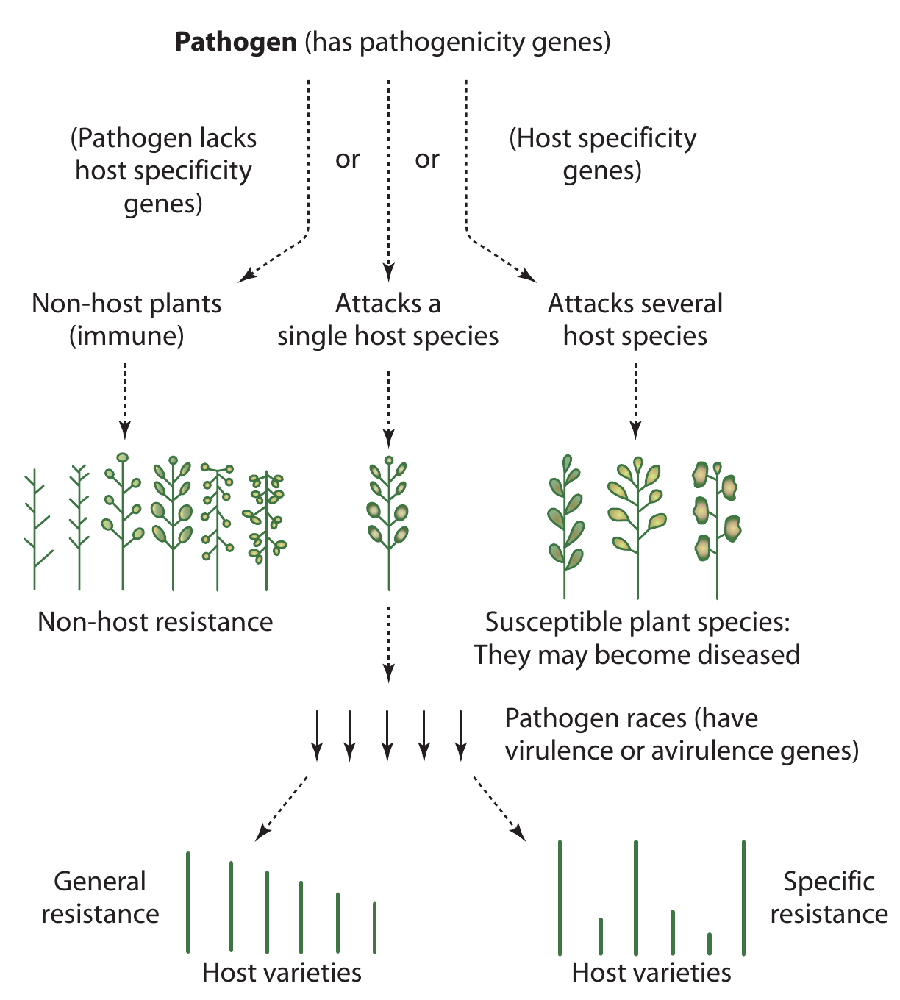
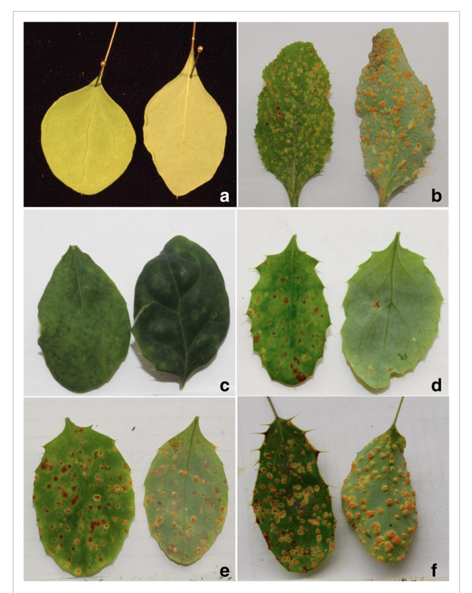
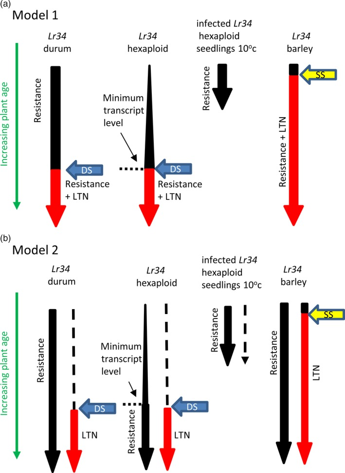

```{r setup, include=FALSE}
library(knitr)
require(tidyverse)
set.seed(453)
# invalidate cache when the package version changes
knitr::opts_chunk$set(tidy = FALSE, echo = FALSE, 
                  message = FALSE, warning = FALSE,
                  out.width = "45%", cache = TRUE, 
                  dev.args=list(bg=grey(0.9), pointsize=11))
options(knitr.table.format = "latex")
options(knitr.kable.NA = "", digits = 2)
options(kableExtra.latex.load_packages = FALSE)
theme_set(theme_bw())
```

# Broad resistance, host and non-host resistance

##

\begin{columns}[T, onlytextwidth]
\column{0.5\textwidth}
\begin{itemize}
\small
\item Generally, the pathogen is specific to a certain infection of a host plant.
  \begin{itemize}
  \footnotesize
  \item \textit{F oxysporum} f. sp. \textit{lycopersici} is exclusive to tomato for tomato wilt
  \item \textit{Venturia inaequalis} only affects apple causing apple scab
  \item \textit{Puccinia graminis} f. sp. \textit{tritici} causing stem rust of wheat, attacks only wheat
  \end{itemize}
\item Development of disease in a host is conditioned by presence of one or more genes for pathogenicity, for specificity, and in pathogen the corresponding virulence gene
\end{itemize}

\column{0.5\textwidth}

```{r pathogen-host-non-host-interaction, out.width="70%", fig.cap="Gene interactions of a pathogen with its host and non-host plant"}
# pdftools::pdf_convert(pdf = "../../text-scientific/Plant Pathology, Fifth Edition (George N. Agrios) (z-lib.org).pdf", pages = 153, filenames = "host_non_host.png", format = "png", dpi = 400)

```

\end{columns}

##

\begin{description}
\small
\item[Host range] List of plant species that can be exploited to be a natural enemy as source of nutrients.
\item[Generalists/polyphagous] Natural enemy with a wide host range.
\item[Specialits/oligophagous/monophagous] Natural enemy with a narrow host range or even single plant species.
\end{description}

- The complex of characters of a plant species that are responsible for making it a non-host to a certain potential natural enemy is non-host resistance.
- No single individual plants of non-host species are susceptible to a natural enemy.

##

\begin{columns}[T, onlytextwidth]

\column{0.25\textwidth}
\footnotesize

To determine disease responses to \textit{Puccinia graminis} (Pg), the parents and all $F_1$ progeny were inoculated with basidiospores ejected from germinated teliospores produced by over-wintered telia of Pg found on naturally infected \textit{Elymus repens}. The progeny segregated into four clear phenotypic classes, ranging from resistant to susceptible.

\column{0.75\textwidth}

```{r non-host-resistance, fig.cap="Representative disease response of the two mapping population parents and their $F_1$ progeny. (a) Resistant reaction of \\textit{B. thunbergii} accession 'BtUCONN1' showing no visual symptoms; (b) Susceptible reaction of \\textit{B. vulgaris} accession 'Wagon Hill', showing dense pycnia on the upper leaf surface and prolific, well-developed aecia on the lower surface; (c) Resistant reaction (score 1 on the four-point scale) of \\textit{B. x ottawensis} progeny 'WH15-039', showing sparse flecking; (d) Moderate resistant reaction (score 2) of \\textit{B. x ottawawensis} progeny 'WH15-063', showing evident necrotic lesions and some pycnia formation; (e) Moderate susceptible reaction (score 3) of \\textit{B. x ottawensis} progeny 'WH15-128', showing well-developed pycnia and aecia, alogside sparse necrotic lesions; and (f) Susceptible reaction (score 4) of \\textit{B x ottawensis} progeny 'WH15-149', showing well-developed pycnia and aecia and no evident necrosis. All photos were taken 14 days post-inoculation.", out.width="28%"}

```

\end{columns}

\footnotesize Note: Refer to @bartaula2019mapping for details on mapping of non-host resistance to stem rust.

<!-- - In cereal rust diseases several Infection Types (IT) are regarded as resistant reaction -->
<!--   - (IT0) reaction show no macroscopic evidence of pathogen attack (immunity) -->
<!--   - (IT;) reaction designated as fleck do not allow pathogen sporulation but do show visible evidence of pathogen-induced death of host tissue -->
<!--   - (IT1) reaction  is conditioned by genes when very small pustules surrounded by a ring of necrotic tissue appear -->
<!--   - (IT2) reaction is characterized by moderately small pustules surrounded by chlorotic halo -->

##

\small
- Non-host resistance (NHR) is largely modulated by PTI (discussed in Lecture: Introduction to Resistance Breeding)
- NHR triggers multi-layered basal resistance mechanisms:
  \begin{itemize}
  \footnotesize
  \item peroxisome-based biosynthesis
  \item restriction of pathogen growth by nutrient limitation
  \item papilla formation
  \item callose and lignin deposition
  \end{itemize}
- To contrast, genes involved in ETI pathways act on the basis of specific recognition, and develop hypersensitive response (HR) involving programmed cell death.
- Many genes involved in NHR have multi-functional roles (including in) -- plant development (G-proteins\footnote[frame]{\scriptsize highly conserved heterotrimers proteins, mutation of which compromises NHR agaist fungal and bacterial pathogens}), stomatal regulation and plant metabolism.
  \begin{itemize}
  \footnotesize
  \item glycolate oxidase pathway
  \item proline dehydrogenase
  \end{itemize}
- Both (above) enzymes modulate Reactive Oxygen Species (ROS) mediated signal transduction pathways in response to various environmental stresses! as well as providing NHR against bacterial pathogens.

##

\small
- NHR may be divided into 2 categories:
  \begin{itemize}
  \footnotesize
  \item Type I (does not show visible cell death symptoms)
  \item Type II (show localized hypersensitive response HR cell death, mediated through generation of ROS)
  \end{itemize}
- NHR against pathogens of more closely related species can involve mechanisms more similar to host resistance
  \begin{itemize}
  \footnotesize
  \item maize resistance gene \textit{Rxo1} can recognize the rice bacterial streak pathogen
  \end{itemize}
- Huanglongbing in citrus caused by vector-transmitted bacterial pathogen, _Candidatus_ spp. has been controlled through genetically modified alternative resistance gene from _Arabidopsis thaliana_
  \begin{itemize}
  \scriptsize
  \item \textit{NPR1} gene transformed into sweet orange cultivars -- Hamlin and Valencia, and endogenous expression of \textit{AtNPR1} (targets signaling pathway for plant immunity) constitutively down-regulated\footnote[frame]{\scriptsize Refer to the article: The Arabidopsis AtNPR1 inversely modulates defense responses against fungal, bacterial, or viral pathogens while conferring hypersensitivity to abiotic stresses in transgenic rice, DOI: \url{https://doi.org/10.1094/mpmi-21-9-1215}}
  \end{itemize}

##

\small
- NHR resistance also sometimes provides broad spectrum resistance
  \begin{itemize}
  \footnotesize
  \item \textit{Rxo1} locus in maize confers resistance to all races of rice bacterial leaf streak pathogen \textit{Xanthomonas oryzae} pv. {oryzicola}.
  \item Tansgenic rice plants expressing \textit{Rxo1} showed strong resistance against \textit{X. oryzae} pv. {oryzicola}.
  \item This transgenic rice is resistant to another bacterial spot pathogen, \textit{Burkholderia andropogonis}.
  \end{itemize}
- For breeding NHR mechanisms, steps are:
  \begin{itemize}
  \footnotesize
  \item screening of related species accessions (looking for susceptible individuals) among non-host species
  \item crossing and study of inheritance within non-host species to identify causal loci
  \item introgression of gene to host via hybridization with the non-host species, if possible
  \end{itemize}
  
\footnotesize
- Ideally, interfertile host as well as non-host species are hybridized and QTL mapping studies are conducted as in \textit{Bremia lactuca}.
  \begin{itemize}
  \scriptsize
  \item Lettuce downy mildew (causal: \textit{Bremia lactucae}) non-host \textit{Lactuca saligna} was crossed to host species \textit{L. sativa}, and backcross inbred lines were developed to stack alleles at four recessive NHR QTL\footnote[frame]{Refer to Genetic dissection of Lactuca saligna nonhost resistance to downy mildew at various lettuce developmental stages. DOI: \url{doi: 10.1111/j.1365-3059.2009.02066.x}}.
  \end{itemize}

# Hypersensitivity and partial resistance

## Hypersensitivity


## Partial resistance

- Determining the level of resistance of tolerant varieties is difficult.
- External signs of disease on cultivars with partial resistance can be indistinguishable from those in susceptible cultivars,
  - this can be solved by determination of dynamics of fungal biomass accumulation
- Higher the fungal colony mass accumulated during a period, lesser is the efficacy of the barrier that impede pathogen growth and development in plant
- Rate of accumulation of pathogenic (generally fungal) metabolite corresponds well to the degree of compatibility of the pathogens with wheat and rice cultivars.
- As a rare exception, _Lr34_ (single) gene for leaf rust resistance in wheat only manifests with moderate level of adult plant resistance, and is characterized by smaller pustules with less sporulation than on fully susceptible plants -- hence not a gene for complete resistance.
  - although (in transgenic durum), it has also been implicated in seedling stage resistance without symptoms of seedling leaf necrosis that appears to be an accelerated senescence response (in barley and common wheat) [@rinaldo2017lr34].

## _Lr32_ gene for Stem rust resistance (an exception) 

```{r lr34-partial-resistance, fig.cap="Lr34 expression and phenotype models. (a) Lr34 resistance requires a minimum transcriptional threshold (expression levels are depicted by arrow width), which is not reached in hexaploid wheat until later in plant maturity. In contrast, Lr34 durum seedlings, Lr34 barley seedlings and cold‐treated, infected hexaploid Lr34 seedlings are resistant due to higher Lr34 expression levels. Lr34 senescence, or leaf tip necrosis (LTN) (shown in red), is mechanistically the same pathway as resistance but also dependent upon developmental signals (blue arrow labelled DS) that occur later in plant maturation. Hence, cold‐grown, infected Lr34 hexaploid seedlings and Lr34 durum seedlings do not show leaf senescence, while adult plants of the same genotypes do. In Lr34 barley seedlings, signalling during normal developmental senescence of seedling leaves (yellow arrow SS) is sufficient to induce accelerated necrosis due to the heterologous nature of the wheat Lr34 gene. (b) This model is based upon the same assumptions except that Lr34 senescence is considered an independent pathway to resistance."}

```


# Bibliography

## References
