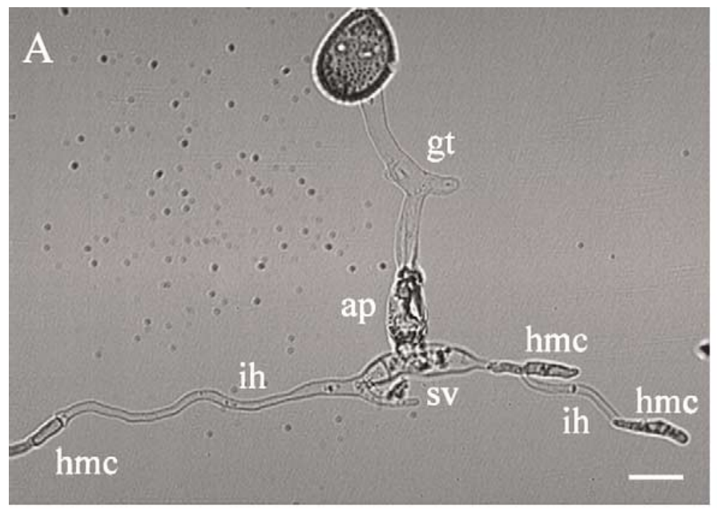

```{r setup, include=FALSE}
library(knitr)
require(tidyverse)
set.seed(453)
# invalidate cache when the package version changes
knitr::opts_chunk$set(tidy = FALSE, echo = FALSE, 
                  message = FALSE, warning = FALSE,
                  out.width = "45%", cache = TRUE, 
                  dev.args=list(bg=grey(0.9), pointsize=11))
options(knitr.table.format = "latex")
options(knitr.kable.NA = "", digits = 2)
options(kableExtra.latex.load_packages = FALSE)
theme_set(theme_bw())
```

# Non host, mutations, genetic modification

## Sources of resistance

1. Commercial cultivars
- Cultivars which are currently in cultivation or are available already somewhere
- Advantage: rapidly development of new commercially useful cultivar, without many undesirable characters
- With allogamous crops this is a more obvious possibility than for autogamous crops; i.e., in pea, an unsuspected resistance against \textit{Fusarium oxysporum} f. sp. \textit{pisi} was found in some cultivars
- Using exotic cultivar as source of resistance may be counterproductive, as
  \begin{itemize}
  \footnotesize
  \item introgression of the resistance may demand more efforts,
  \item exotic genotypes often have inadequate day length requirements
  \item possess properties that are not appreciated by local consumers
  \end{itemize}
- When a common source of resistance is used in multiple occasions, one or few of the same genes will occur in high frequency in acerage of the crop
  \begin{itemize}
  \footnotesize
  \item in the events of breakdown of the resistance, all cultivars with that resistance will become vulnerable
  \end{itemize}

## Crop varieties of Nepal with notable characters

\bcolumns
\column{0.5\textwidth}
```{r crop-notable-varieties}
readr::read_csv("../data/crop_notable_varieties.csv",
                show_col_types = FALSE) %>%
  filter(crop %in% c("Rice", "Maize")) %>% 
  rename_all(function(x)str_to_sentence(str_replace_all(x, "_", " "))) %>% 
  select(-1) %>% 
  knitr::kable(booktabs = TRUE) %>% 
  kableExtra::kable_styling(font_size = 4) %>% 
  kableExtra::collapse_rows(1) %>% 
  kableExtra::column_spec(column = 1:3, width = c("5em", "10em", "32em"))
```

\column{0.5\textwidth}

```{r}
readr::read_csv("../data/crop_notable_varieties.csv",
                show_col_types = FALSE) %>%
  filter(!crop %in% c("Rice", "Maize")) %>% 
  rename_all(function(x)str_to_sentence(str_replace_all(x, "_", " "))) %>% 
  select(-1) %>% 
  knitr::kable(booktabs = TRUE) %>% 
  kableExtra::kable_styling(font_size = 4) %>% 
  kableExtra::collapse_rows(1) %>% 
  kableExtra::column_spec(column = 1:3, width = c("5em", "8em", "26em"))

```

\ecolumns

##

\small
2. Other varieties
- Resistance to a certain natural enemy may occur in one variety but not in other
- Some variety serve as useful sources of resistance
- Perennial kale ( _Brassica oleracea_ var. _ramosa_) may be more resistant against club root ( _Plasmodiophora brassicae_) than for instance cabbage (_B. oleracea_ var. _capitata_)

3. Landraces
- Often contain significant genetic diversity and have been cultivated for a long period of time, usually under rather primitive cultural practices
- When the pathogenic outbreak/infestation due to natural enemy occured in the regions of the origin of the landrace, natural selection for resistance may have taken place.
- In a landrace collection panel of barley from Syria and Jordan, diversity of resistance (absolute and partial resistance as well as high susceptibility) was observed for each pathogen both between populations of different collection sites as well as between head progenies within collection sites[@van1989diversity].

##

4. Wild progenitor species
- Belongs to the same botanical species as the crop and can be crossed readily without problems of poor chromosome pairing or sterility
- Usually have a huge diversity for resistance
- Natural enemy and host species usually have occured side by side for ages and have co-evolved, leading to the variation in the host.
5. Related species
- Can be exploited when the resistance is not available in the botanical species itself
  - Potato resistance against bacterium _Pseudomonas solanacearum_ was found in _S. phureja_
  - Genera of closely related ancestory such as _O. sativa_ with _O. rufipogon_ and _O. nivara_ can be exploited as potential source of resistance (Sheath blight casused by _Rhizoctonia solani_, for exmaple) more easily than other (such as _O. officinalis_) which are distantly related.

##

\bcolumns
\column{0.3\textwidth}
\footnotesize
6. Related genera
- Is a long and difficult process and resistance obtained often appear to be not more durable than the resistance found in the cultiaved species
- A chromosome segment from rye ( _Secale cereale_) has been introduced into wheat that bear the genes conferring resistance to wheat yellow rust, leaf rust and stem rust

\column{0.7\textwidth}
\renewcommand{\arraystretch}{0.8}

```{r wild-related-species-disease-gene-transfer}
readr::read_csv("../data/wild_related_species_disease_gene_transfer.csv") %>%
  knitr::kable(booktabs = TRUE, caption = "Wild/related species of different crops with potential use, for bearing resistance gene, as source material in varietal breeding") %>% 
  kableExtra::kable_styling(font_size = 5) %>% 
  kableExtra::collapse_rows(1:2) %>% 
  kableExtra::column_spec(column = 1:3, width = c("5em", "20em", "28em"))
```

\ecolumns

## Difficulties with use of diverse source of germplasm

- Using exotic or landrace cultivar, including unadapted varieties, and wild progenitors as source require frequent back-crossing and selection to get rid of numerous undesirable traits of the donor parent.
  - breeding for late blight resistance in potato is challenging since the resistance is linked to late maturity and photoperiod sensitivity
- Even related species or adapted varieties may present complications due to
  - limited crossability
  - asynchrony
  - hybrid sterility and poor seed recovery
  - poor exchange of chromosome segments
- Althewhile, it is nearly impossible to eliminate all the characters of the donor genotype. 

## Non host species as source of resistance

\bcolumns
\column{0.70\textwidth}
\small
- Most plants are non-host to most pathogens
- Two plant species that are sufficiently closely related to be crossed, but still sufficiently unrelated to differ in host status to the target population
- Barley is typically susceptible to _P. hordei_, to which wheat is a non-host.
  - In wheat cultivar Duri, the majority of the colonies of _P. hordei_ produced no haustoria. The non-host resistance mechanism involves necrosis of mesophyll cells and blocking of the fungus before the haustorium development (more than 50% colonies in the studies could not form haustorium), possibly becuase of a failing recognition reaction at the interface of the Haustorial Mother Cell (HMC) and the plant cell wall.

\column{0.3\textwidth}
  
```{r haustorial-mother-cell, out.width="98%", fig.cap="In vitro differentiation of infection structures including haustorial mother cells by the wheat stem rust fungi \\textit{Puccinia graminis} f. sp. \\textit{tritici} after application of a mild heat shock (2h, \\SI{30}{\\celsius}) and trans-2-hexen-1-ol (0.5mM) in a humid atmosphere. Fully differentiated germlings using bright field optics is being shown (gt, germ tube; ap, appresorium; sv, substomatal vesicle; ih, infection hypha; hmc, haustorial mother cell) (bar: \\SI{15}{\\micro\\meter}); Source: \\cite{wietholter2003vitro}"}

```

\ecolumns

## Mutation breeding of resistance

- Alternatively, mutation is a viable strategy for breeding for resistance if
  - no other known sources of resistance are available against target pathogen, or if existing resistance types are ephemeral
  - resistance, although known to exist, is not a very difficult to introduce, like in vegetatively propagated crops as sugarcane and potato.
- A susceptible cultivar may be changed into a resistant one with mutation breeding, given a suitable procedure for induction and screening are practiced
- Usually side effects of the mutagenic treatments do occur, although much of the agronomic traits are unaffected
  - in barley, resistance against powdery mildew ( _Erysiphe graminis_) has been induced by mutagenesis repeatedly and in several cultivars. 
- Resistance obtained by mutagenesis are not necessarily stable (possibly epigenetic inheritance)
- Huge number of plants/lines should be tested because of low frequency of recovery of desired mutants for resistance

## Genetic modification

- Refer to @pavan2008map (Recessive gene \textit{ol-2} provides resistance to tomato powdery mildew) for how to clone a resistance gene based on sequence homology and linkage map.
- For a discussion of transformation techniques, refer to Lecture notes of Introductory Biotechnology.

# Test of resistance

## Field test

\small
- Only useful in field crops and not in greenhouse crops
- Are relatively simple nad not expensive and can be combined well with evaluation of other agronomic traits
- Growing conditions are quite representative for commercial cultivation

\footnotesize
**Disadvantages**

- Cannot perform a resistance test at any time of the year
- Natural enemy often is distributed heterogenously over the field, and consequently susceptible plants escape infection and may be erroneously rated as resistant
  \begin{itemize}
  \footnotesize
  \item to address issue of non-uniform distribution of natural enemy/disease inoculum increase number of replications, include check cultivars of known susceptibility in sufficient numbers
  \end{itemize}
- Due to sources of unchecked field variabilities -- moisture, humidity, temperature conditions,
  \begin{itemize}
  \footnotesize
  \item natural enemies may succumb to adverse environmental condition, e.g. drought, heat stress
  \item natural enemies may interact with exogenous biotic and abiotic factors, and \textit{vice versa}
  \end{itemize}
- For pathogen that have several reproduction cycles per years ( _Phytopthora infestans_, rusts) the field test will be polycyclic.

<!-- ## Distinguishing major-gene from field resistance to late blight (Phytophthora infestans) of potato (Solanum tuberosum) and selecting for high levels of field resistance [@solomon2007distinguishing]  -->

<!-- - Since 1984, new populations of _P. infestans_, comprising both (A1 and A2; former is responsible for the irish famine) mating types, have been spreading from Mexico to the rest of the world. -->
<!-- - Overwintering oospore can initiate disease epidemic early in the season, each year. -->
<!-- - Earlier century breeding strategy has primarily been utilization of the major dominant R-genes which had been discovered in the Mexican wild species _Solanum demissum_. -->
<!-- - Cultivar Pentland Dell (with genes R1, R2 and R3) entered production in Britain in 1963 when race 4 was the prevalent race of P. infestans, but succumbed to blight in 1967. -->
<!-- - Despite use of cultivars with newly discovered R-genes in Britain, races emerged that overcame the resistance. -->
<!-- - Many breeders started to select for quantitative resistance, either by using races of _P. infestans_ compatible with the R-genes present in their material, or by creating R-gene free germplasm, so that screening could be done with any race. -->
<!-- - Also, map-based cloning and (independently) genetic transformation using agrobacterium has been used in development of multilines composed of different R-genes -->
<!-- - Best breeding strategy is to combine R-genes with high levels of field resistance, $\therefore$ a distinction between major-gene resistance and field resistance have to be made. -->
<!-- - Clones of the cross between Stirling (possesses both a single copy of an _S. demissum_ derived R-gene and high levels of field resistance) and Maris Piper (moderately susceptible to late blight and lacks R-gene) were classified on the basis of presence or absence of the R-gene and for their level of field resistance by assessment with a compatible (able to overcome R-gene) and an incompatible (not able to overcome R-gene) isolate of _P. infestans_. -->
<!-- - F1 population from the cross was assessed for its resistance to foliage blight -->
<!-- - 3 F1 clones (94B13A29, apparently with R-gene but no field resistance, and 94B13A57 and 94B13A61, apparently with field resistance but no R-gene) were then backcrossed to Maris Piper (male parent) to produce 3 populations which were also assessed for their resistance to foliage blight -->
<!-- - Seedlings of each population were raised in a glasshouse to provide seed tubers for establishing the population in clonal form -->
<!-- - Population was maintained by planting three tubers of each clone in the glasshouse in subsequent years -->
<!-- - Blight tests were done on 58 clones of F1 and 112, 149 and 88 clones of each of backcross derived populations. -->
<!-- - 20 of the F1 clones tested in the first year were also included in the later years to allow for repeatablility of the assessments   -->
<!-- - For each assessment, in spring or early summer, plants of each clone were raised in a glasshouse in a randomized complete block design with four replicates (one plant per clone in each replicate). Two plants (three where possible) of each parent and Stirling were included in each replicate. When the majority of plants were at the flower bud stage (6 weeks after planting), two replicates were inoculated with an isolate of _P. infestans_ which is *compatible* with Stirling and the other two replicates with an isolate which is *incompatible* with Stirling. -->
<!-- - The Stirling compatible isolates (both 'complex' race 1,2,3,4,6,7) were 36.4.3 in 1999 and 99/23 in subsequent years. The incompatible isolates (both 'simple' race 1,4) were 16.5.2 in 1999 and 2000 and 15.5.1 in subsequent years. -->
<!-- - All isolates were naturally occuring in Scotland [@malcolmson1969races] (The original literature entitled 'Races of Phytophthora infestans occurring in Great Britain' can be found inside 'articles/' directory) . -->
<!-- - They were passaged through potato tubers to select for aggressiveness before use in the resistance tests. The reaction of each isolate with Stirling and Maris Piper was checked before use and its virulence characteristics were determined in a whole plant test using Black's differential series of R-gene-bearing clones. -->
<!-- - The whole-plant glasshouse test developed by Stewart et al. (1983) was used for all assessments of resistance to late blight. P. infestans inoculum was prepared as described by @malcolmson1976assessment (The original literature can be found inside 'articles/' directory), using the zoospore suspension resulting from a sporangial suspension at an initial concentration of $14 \times 10^3$ sporangia/ml. A hand sprayer was used to apply the inoculum and the spray was allowed to fall evenly on the plants from above. The plants were dampened, inoculated and incubated for 24 h in a misted controlled environment cabinet at \SI{15}{\celsius} and 95–100% humidity, then kept at \SI{15}{\celsius} in a cooled glasshouse. Seven days after inoculation each plant was scored using Malcolmson's 1-9 scale of increasing resistance as illustrated by Cruickshank et al. (1982). -->
<!-- - In addition to the blight scores with the simple and complex races, an attempt was made to confirm which clones had inherited Stirling's major R-gene by comparing their reactions to these races. Clones were considered to be R-gene free if there was no difference in response to the two races with all plants bearing spreading lesions. They were considered to have inherited the R-gene if the plants inoculated with the simple race were symptomless, or had only isolated necrotic lesions or spreading lesions on the oldest leaves alone, whilst those inoculated with the complex race had spreading lesions on all foliage. -->

## Green house test

- Greenhouse/glasshouse test are often applied with seedling or young plantlets, essentially when the host population is manageble within such conditions
  - number of host genotypes being low
  - plants do not form sparse canopies
  - environment for disease development relates well to natural conditions of exposure
  - greater control of inoculum dispersal or exposure to the host is required
- Can provide natural enemy with optimal environmental conditions for the infection to progress -- optimal humidity, temperature, etc.
- Chance of escape of susceptible host from exposure is minimized

##

- Observation of only one type/controlled type of natural enemy per test
- Designed as monocyclic test, even for polycyclic pathogens
- $\because$ sexual spores are scarcely available and are hard to screen for their respective isolates/biotypes, controlled testing necessitates use of asexual stage of the pathogen as inoculum
- A major limitation being that the condition created inside the greenhouse may not represent field conditions
- Much of the biotic and abiotic factors that interact in outdoors, conditioning the disease is absent which may lead to over- or under-estimation of host plant response

## Laboratory test

\footnotesize
- It is performed on germinating seeds, leaf disks and detached leaves, _in-vitro_.
- Primary aim is to establish a culture of pathogen on host tissues.
- _in vitro_ technique is used in conjunction with mutation breeding and for selection of colonal variation (plants derived from cell and tissue culture are referred to as somaclones)
- Initial applications of somaclonal variation in plant breeding was selecting sugarcane for resistance to eyespot (Helminthosporium sacchari) and downy mildew (Sclerospora sacchari) diseases, produced by regenerating plants from callus of susceptible parent clones and screening the somaclones.
- However, selection response to resistance might be physiological (non-genetic), which disappers as soon as the selective agent is retracted.
- In tobacco, haploid cells and protoplasts were selected for insensitivity to methionine sulfoxymine (MSO) (a compound that elicits chlorotic halos similar to that induced by tabtoxin of _Pseudomonas syringae_ pv. _tabaci_) on tobacco leaves.
  \begin{itemize}
  \footnotesize
  \item plants regenerated from the surviving MSO resistant calluses showed disease resistance, as they did not produce chlorotic halos after infection
  \end{itemize}
- _invitro_ biochemical testing of fungal mass is useful in studying diseases with complex signs
  \begin{itemize}
  \footnotesize
  \item example of such a disease can be head blight, where visual observation of the development of disease is fairly difficult, whereas the data on ergosterol localization and dynamics of its accumulation are very informative.
  \end{itemize}

##

\renewcommand{\arraystretch}{0.7}

```{r genetic-disease-resistance-by-invitro-selection}
tribble(
  ~"Crop", ~"Pathogen", ~"Selective agent", ~"Selection level", ~"Resistance observed",
  "Alfalfa", "Fusarium oxysporum f. sp. medicaginis", "Culture filtrate", "Callus", "Increased resistance",
  "Barley", "Helminthosporium sativum", "Crude toxin", "Callus", "Resistance",
  "Maize", "Helminthosporium maydis", "Hm Toxin", "Callus", "Resistance (maternally inherited)",
  "Rape", "Phoma lingam", "Culture filtrate", "Suspension cells, embryo cultures", "Increased resistance",
  "Rice", "Helminthosporium oryzae", "Crude toxin", "Callus", "Increased resistance",
  "Rice", "Xanthomonas oryzae", "Bacterial cells", "Callus", "Resistance",
  "Tomato", "Tobacco mosaic virus", "Virus", "Infected explants", "Tolerance",
  "Wheat", "Pseudomonas syringae pv. syringae", "Syringomycin", "Callus", "Diminished bacterial multiplication (inheritance not tested)",
  "Wheat", "Helminthosporium sativum", "Crude toxin", "Callus", "Resistance"
) %>% 
  knitr::kable(booktabs = TRUE, caption = "Disease resistant plants of various crops obtained by in-vitro selection having genetic inheritance (unless stated); Source: \\cite{van1991application}") %>% 
  kableExtra::kable_styling(font_size = 5) %>% 
  kableExtra::collapse_rows(1) %>% 
  kableExtra::column_spec(column = 1:5, width = c("5em", "16em", "10em", "10em", "14em"))
```

##

# Bibliography

## References
