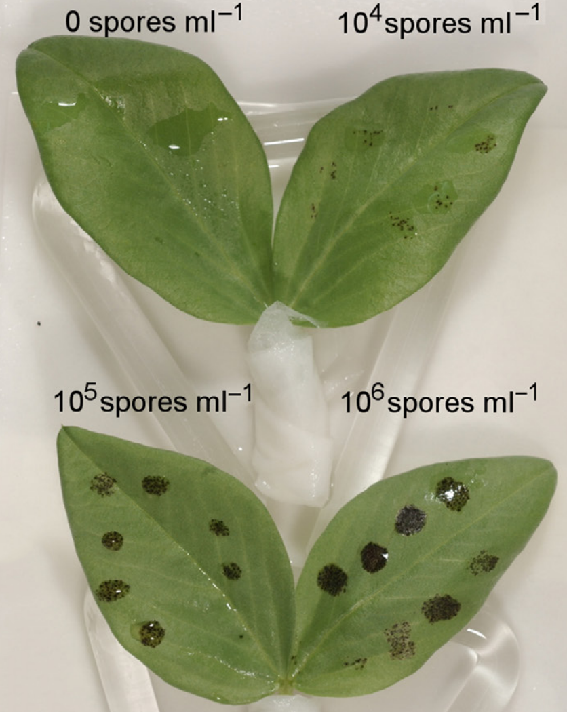
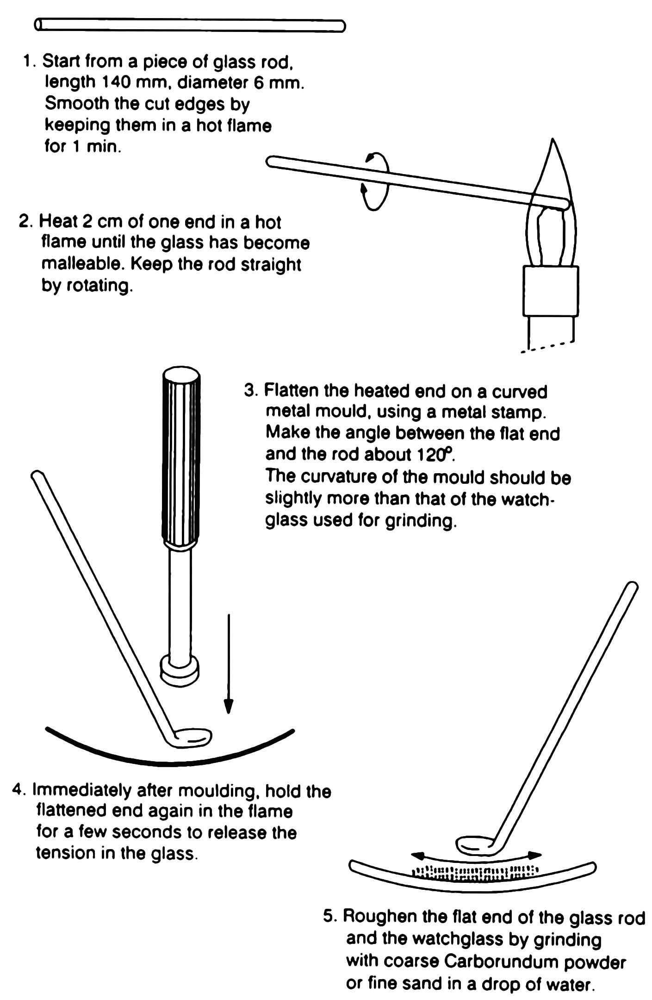
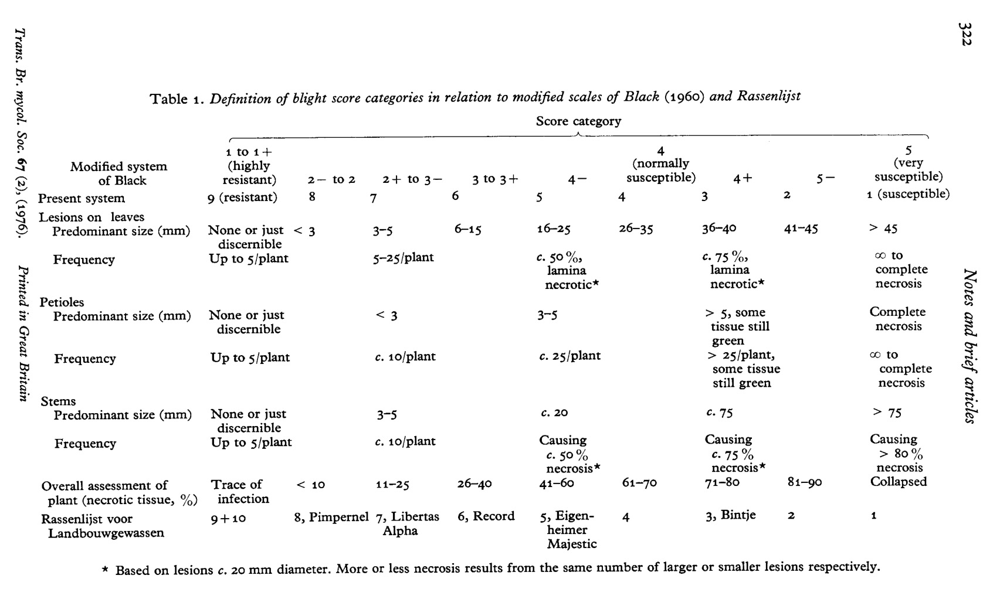
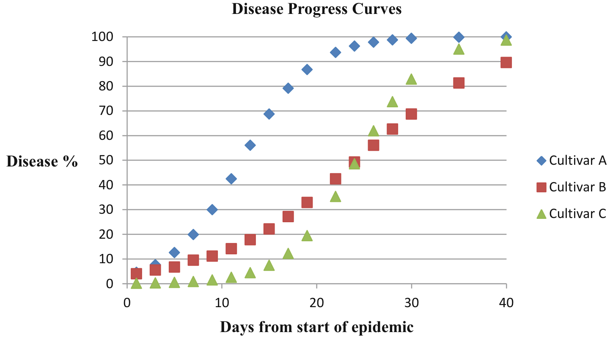

```{r setup, include=FALSE}
library(knitr)
require(tidyverse)
set.seed(453)
# invalidate cache when the package version changes
knitr::opts_chunk$set(tidy = FALSE, echo = FALSE, 
                  message = FALSE, warning = FALSE,
                  out.width = "45%", cache = TRUE, 
                  dev.args=list(bg=grey(0.9), pointsize=11))
options(knitr.table.format = "latex")
options(knitr.kable.NA = "", digits = 2)
options(kableExtra.latex.load_packages = FALSE)
theme_set(theme_bw())
```

# (Host) Stage of development for testing and application of natural enemy 

## Seedling versus mature plants

- Hypersensitive response of a host genotype during seedling stages is more pronounced, although the resistance type is effective even in the mature plants. Mature plants also express a greater number of hypersensitivity genes, in contrast.
- Obvious advantage of seedling tests are:
  - require less space
  - can be performed soon after growing
  - be inoculated more uniformly than large, mature plants
  - fairly uniform in their growth in early stages of development

##

- Partial resistance is less pronounced in seedling than in later stages of the plant development, for example, in biotrophic fungi (rusts, smuts and powdery mildew fungi).
  - in laboratory tests for level of resistance or susceptibility against _Septoria nodorum_ pathogen mature plants have to be used, such that inoculation of wheat is carried out after the complete formation of the third leaf.
  - effectiveness of genes for partial resistance are probably partly dependent on the stage of the development of plant
  - in natural enemies specialized to live on fruits, flower and stem, tests are usually carried out in the field on mature plants
- Detached plant parts such as leaf disks, entire leaves or branches of trees may be tested for resistance by exposing them to natural enemy (usually under controlled conditions)

<!-- Screening of cultivars with race-nonspecific resistance (e.g. slow-rusting cereal cultivars) that can be durable due to independence from variation of the race composition in the pathogen population can be used as a basis for the analysis of marker fungal metabolites. It is not easy to find cultivars with potentially race-nonspecific resistance in a field experiment but for no other reason that several strains or races have to be used for plant inoculation, while the plots must be securely isolated from each other. At the same time, a laboratory experiment requires much less effort. To determine the degree of race-nonspecificity of resistance, seedlings of the cultivars being tested are inoculated with fungal races/strains/biotypes possessing different sets of virulence genes. The growth rate of fungal biomass in the plants of the cultivars being tested is calculated by the content of marker metabolites in the infected tissue which is determined by chromatographic analysis. A cultivar universally susceptible to this pathogen serves as the reference. An equal inhibition of expansion of all biotypes in the tissues of the tested cultivar is indicative of race-nonspecific resistance of the given cultivar. @dyakov2007comprehensive -->

## Stage of plant inoculation (case with virus)

```{r plant-specis-inoculum-stage}
tribble(
  ~"Species/cultivar", ~"Age (days)", ~"Stage of development",
  "\\textit{Beta vulgaris}", "20-25", "2",
  "\\textit{Capsicum annum}", "35", "3",
  "\\textit{Chenopodium} spp.", "28", "3-4 well-developed",
  "\\textit{Cucumis sativus}", "10", "Cotyledons",
  "\\textit{Glycine max}", "14", "Cotyledons+1",
  "\\textit{Gomphrena globosa} (Makhamali)", "40-50", "2-3 pairs",
  "\\textit{Helianthus annus}", "16", "1 pair",
  "\\textit{Lycopersicon esculentum}", "21-28", "2-3",
  "\\textit{Nicotiana tabacum}", "28-30", "2 well-developed",
  "\\textit{Petunia hybrida}", "29", "3 well-developed",
  "\\textit{Phaseolus vulgaris}", "10", "2 primary",
  "\\textit{Pisum sativum}", "13", "2",
  "\\textit{Solanum melongena}", "30", "2",
  "\\textit{Vicia faba}", "14", "1",
  "\\textit{Vigna unguiculata}", "10", "2 primary"
) %>% 
  knitr::kable(booktabs = TRUE, escape = FALSE, caption = "Commonly used test plant species, with their age, and stage of development (number and/or type of leaves) suitable for inoculation.") %>% 
  kableExtra::kable_styling(font_size = 6) %>% 
  kableExtra::column_spec(column = 1:3, width = c("15em", "8em", "14em"))
```

## Applying natural enemy

- Important consideration is that each plant (part) is exposed to same amount of inoculum (per \si{\square\centi\meter}, per fruit)
- Variation in degree of infection between plants should not be result of escape or differences in density of inoculation.
- General methods of application comprise
  - Dipping
  - Mixing
  - Spraying
  - Dusting
  - Injecting

# Inoculation, composition, procedure

## Inoculumn

\bcolumns
\column{0.65\textwidth}
- Inoculation means bringing healthy plant parts, usually leaves, into contact with a pathogen-containing suspension (inoculum) in such as way that infection ensues. It can be brought about by:
  - mechanical inoculation
  - mechanical transmission
  - sap transmission
- Inoculation transmission is valuable method used upon test plants for
  - disease diagnosis
  - assay of infection signs and symptoms
  - propagation and maintenance of pathogen culture
  - study of pathogen-host interaction
  - detection

\column{0.35\textwidth}

```{r inoculum-potential, fig.cap="The inoculum potential (i.e. the amount of pathogen available) can influence success of colonisation, as illustrated here with different spore loads of the necrotrophic pathogen Botrytis cinerea added to the surface at eight points on broad bean (Vicia faba) leaves.", out.width="80%"}

```

\ecolumns

## Preparation and application

\footnotesize

**Preparation (case with virus)**

- Select a part of the diseased plant in which the virus concentration is expected to be highest, such as young leaves showing clear symptoms
- Leaf material is ground with water or 0.01 M phosphate buffer (less often borate, citrate or Tris buffer may be desirable), pH 7.0, in a tissue-to-maceration fluid ratio (w/v) of 1:5 to 1:10.
- Often plant cell contain constituents ( Protein inhibitors in _Chenopodiaceae_ family, polyphenoloxidases in plant sap, tannins in plants of Rosaceae family) which inhibit infection, either by inactivating the virus or by decreasing the susceptibility of the test plant.

##

- If fruiting structures (pycnidia, perithecia) are present on the leaf, it is sometimes possible to pick them out, drop them in the surface sterilant for a few seconds, and then plate them on the nutrient medium. This requires use of stereoscopic microscope.
- Structures may be crushed in a small drop of sterile water and then the spores in the water may be diluted serially in small tubes or dishes containing sterile water.

###

The serial dilution method is often used to isolate pathogenic bacteria from diseased tissues contaminated with other bacteria. After surface sterilization of sections of diseased tissues from the margin of the infection, the sections are ground aseptically but thoroughly in a small volume of sterile water and then part of the homogenate is diluted serially in equal volumes or 10 times the volume of the initial water.

(\scriptsize Refer to the youtube video by Katharine Hubbard)

## Application of inoculum

\small
- With soilborne pathogen, seed or root of seedlings is dipped in a spore suspension or inoculum or mix inoculum with the pot soil or apply with a pipette or syringe to the basis of each plant.
- With pathogens like powdery mildew and rust, spray or dust the inoculum over the plants.
- While applying virus inoculum, small wounds are made in plant itself to achieve infection. This can be achieved mechanically or by dusting with abrasives, e.g. Carborundum powder. Dusted leaves are inoculated by rubbing their surface with the inoculum.
- Rice is inoculated with _Xanthomonas campestris_ pv. _oryzae_ by clipping the leaf tips with a pair of scissors that are dipped in bacterium suspension and bacterium gets access to leaf tissue through the wound. 
- Field application must ensure that inoculum from polycyclic leaf pathogens reach to plants to be tested from the spreader rows, $\therefore$ spreader rows are inoculated early in the season. 

##

**Method of inoculation in (case with virus)**

\bcolumns
\column{0.65\textwidth}
\small

- Common method is rubbing with the forefinger, foam plastic blocks, glass spatulae, and artist's paint-brush.
- All these techniques may lead to satisfactory infection, provided they are able to create wounds small enough not to damage the cells too much and big enough to enable the virus particles to enter the cell.
- Using disposable materials for inoculation avoids the requirement for washing of hands.
- Use of glass spatulae is handy when many inocula in small amounts have to be prepared and applied, e.g., from a large number of single local lesions.
- Inoculum is gently rubbed over the leaf (no more than twice on the same area) from its base to the top.

\column{0.35\textwidth}

```{r inoculation-glass-spatula, out.width="76%", fig.align='center'}

```

\ecolumns

## Composing inoculum

\footnotesize
- In case or race-specific resistance results of the test depend very much on pathogen race that is applied, $\therefore$ isolates need to be characterized to select for proper races
- Steps
  \begin{itemize}
  \footnotesize
  \item Obtain a genetically homogeneous isolate
  \item Apply individual propagules of the pathogen on nutrient medium or on a susceptible plant
  \item Derive each sporulating colony or lesign from one single propagule (spore) that can be propagated in isolation to a genetically pure 'monospore isolate'
  \end{itemize}
- One may expect many different genes for race-specific resistance in some plant-pathosystems. In such case in order to detect new gene that provide complete resistance test will be carried out with the most complex race available or with a mixture of isolates.
- In partial resistance and application of a mixture of isolates, one may find differences in amount of infection among the germplasm and interpret results as,
  \begin{itemize}
  \footnotesize
  \item being caused by difference in level of race non-specific resistance against these isolates
  \item tested plants differ in genes for complete, race-specific resistance that is effective against one or more of the isolates in the mixture
  \end{itemize}

<!-- Example provided in Lecture note, Page 50 of TN Bhusal-->

## Handling of test plants

\small
- Plant species/cultivars of the families Amaranthaceae, Chenopodiaceae, Cucurbitaceae, Leguminosae and Solanaceae are known to be easily infected by a large number of viruses. Usually a selection of a number of test plant species from these families is made to study the host range of an unidentified virus.
- Susceptibility of a test plant depends on a number of factors, such as 
  \begin{itemize}
  \item genotype (to account for differences always grow replicates of test plants), 
  \item physiological condition determined by temperature,
  \item light intensity and humidity, under which it has been raised,
  \item nutrition,
  \item age
  \end{itemize}
- Leaves of young well-nurished plants grown rapidly in moderate light conditions and usually the most susceptible
- Primary leaves of _Phaseolus_ spp. and _Vigna_ spp. are more suceptible compared to their trifoliate leaves.
- Period of darkening of the plants for 1-2 days prior to inoculation leads to $\uparrow$ infection rate.

# Natural reserves of disease inoculum 

## Fungi

\small
- In Zygomycetes ( _Rhizopus_ spp., _Mucor_ spp.), sporangiospores float about if they land on wounds of fleshy fruits, roots, corms and bulbs thoughout the year.
  - Fungal mycelium does not invade cells but is instead surrounded by dead cells and non-living organic substances
  - Once fungus establishes in "soft tissue" (owing to the nature of damage it inflicts from secretion of pectinolytic enzymes), it emerges through wounds producing aerial sporangiophores/sporangia.
  - When food supply in the infected tissues diminish and compatible strains are present together, zygospores are produced which survive periods of starvation and adverse temperature/moisture.
- In Ascomycetes fungi, overwintering structure such as mycelium or even spores serve as inoculum for the disease development the following season (spring and summer).
  - In Powdery mildew of roses (caused by _Sphaerotheca pannosa_), shoots arising from buds containing mycelium or cleistothecia/ascocarp (which produce ascospores) become infected and provide inoculum for secondary infection and disease development on foliage and flowers.

##

\small
- ...
  \begin{itemize}
  \footnotesize
  \item Diseases caused by \textit{Alternaria} appear usually as leaf spots and blights (while also causing damping-off, stem rots, tuber/fruit rot) and the major infectious factor (primary inoculum) is the spore -- conidia (present in air and dust). Many species of this genera are saprophytic.
  \item \textit{Colletotrichum} spp. (Anthracnose of fruit, root rot and crown rot of developing plant), \textit{Cochliobolus miyabeanus} (Brown spot in rice), \textit{Pyrenophora} spp. (Net blotch of barley, Tan spot of wheat) groups of mitosporic fungi overwinter in or on infected or contaminated seeds, in plant debris of susceptible plants
  \item \textit{Monilinia} spp. overwinter as mycelium in mummified fruit on the tree and in the cankers of affected twigs or as pseudosclerotia above-ground which prduce new conidia in the spring. Pseudosclerotia buried in the ground produce apothecia, which form asci and ascospores.
  \item \textit{Fusarium} spp. (causing vascular wilt) survives in infected plants as mycelium and in soil debris it forms chlamydospores (most commonly in colder temperature) which are transported through water and contaminated equipments.
  \item Fusarium (Gibberella) head blight of cereals is more severe in warm, humid weather, wherein pinkish-red mycelium and conidia develop abundantly in the infected spikelets, and the infection spreads to adjacent spikelets or through the entire head. Purplish perithecia may also develop on the infected floral bracts. Infected kernels become shriveled and discolored with a white, pink, or light-brown scaly appearance as a result of the mycelial outgrowths from the pericarp.
  \end{itemize}
  
<!-- Cleistothecia, if present, discharge ascospores that also serve as primary inoculum. Ascospores or conidia are carried by wind to young green tissues, and if temperature and relative humidity are sufficiently high the spores germinate and infect these tissues. The germ tube produces a short, fine hypha that grows directly into the epidermal cells and forms a globose haustorium by which the fungus obtains its nutrients. The germ tube, however, continues to grow and branch on the surface of the plant tissue, producing a network of superficial mycelium that sends haustoria into the epidermal cells. The absorption of nutrients from the cells depletes their food supply, weakens them, and may sometimes lead to their death. Photosynthesis in the affected areas is reduced greatly. Infection of young tissues also causes irritation and uneven growth of the affected and the surrounding cells, resulting in slightly raised areas on the leaf and distortion of the leaf. The aerial mycelium produces numerous conidia, which cause new infections on the expanding leaves and shoots.-->
<!-- Page 451, @agrios2005plant -->

## Screening for Fusarium wilt resistance

- Done multiple times in a year
- Innoculation suspension

## Cautions about field inoculation study

- Screening methods are time taking, laborious and require larger area.
- The field inoculation techniques are inherently poor in terms of reproducibility as a result of uneven inoculum distribution, interaction with other pathogens, and variations in weather and other environmental factors which may affect disease severity.

# Evaluation aspects: Quantitative and Qualitative aspects

## Dilution test

- Agar dilution is a method used to determine the Minimum Inhibitory Concentration (MIC) of antibiotics.
- Method is useful when the effectiveness of a new antibiotic (among a few available antibiotics) is to be tested against a large panel of bacteria.
- Antibiotic is diluted with water to produce a series of concentrations

## Measurement of field infection (visual scoring) 

\footnotesize
- Amount of infection by polycyclic leaf pathogen is usually assessed by estimating the percentage of leaf tissue covered with lesions, mycelium or pustules.
- When such observations are repeated several times in the season on the same plant or field plots, an impression is obtained of the increase of the infection over time.
- The idea also forms basis for disease epidemiology and disease forcasting as it leads to formulation of model for a particular disease.
- 'Area Under the Disease Progress Curve' (AUDPC) can be calculated from the graph in which the amount of infection recorded is plotted against the time during which it occured.

\begin{equation}
AUDPC = \sum_{i = 1}^a \left [\left\{ \frac{Y_i + Y_{(i+1)}}{2}\right\} \times (t_{(i+1)}-t_i)\right ]
\end{equation}

- Where,
  \begin{itemize}
  \footnotesize
  \item $Y_i$ is the disease score at the time $t_i$
  \item $t_{(i+1)}-t_i$ is the duration (in days) between recording of two scores for the same unit
  \end{itemize}

##

```{r phytophthora-infection-assessment, fig.cap="Disease assessment by visual scoring, a case of potato late blight. Source: \\cite{malcolmson1976assessment}.", out.width="80%"}

```

##

```{r audpc-theoretical, fig.cap="Theoretical disease progress curves differing in infection rate ($r$) and intercept ($k$) (cultivar A: r = 0.2725 and k = -3.299; cultivar B: r = 0.13625 and k = -3.299; cultivar C: r = 0.2725 and k = -6.598).", out.width="80%"}

```

## Aspects of greenhouse screening and evaluation

Refer to Sections on Evaluation for spot blotch resistance, Evaluation for SNB resistance and Evaluation for tan spot resistance of article "Assessing genetic resistance to spot blotch, Stagonospora nodorum blotch and tan spot in wheat from Nepal" by @mahto2011assessing.

<!-- During 2009-2010, 116 local and commercial spring wheat cultivars and advanced breeding lines were selected from multi-year field experiments in Nepal and evaluated for seedling resistance to three leaf spot diseases: spot blotch ( _Stagonospora nodorum_) and tan spot races 1 and 5 (two of the most prevalent races) in the growth chambers at North Dakota State University, Fargo, ND, USA. The wheat cultivars and lines were artificially inoculated with individual pathogens or races at the two-leaf stage and disease reactions were evaluated 6-10 days after inoculation. -->

# Bibliography

## References

