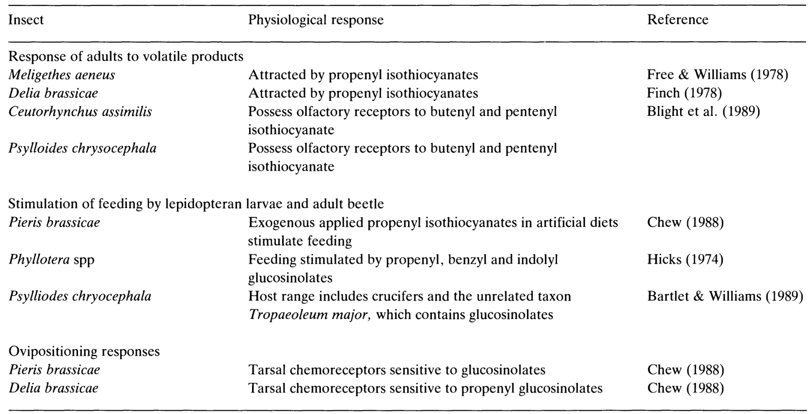
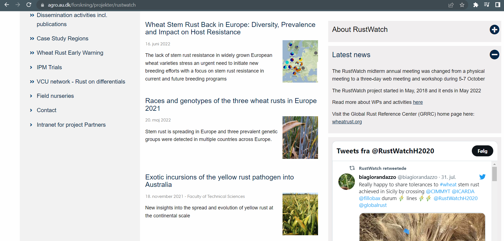

```{r setup, include=FALSE}
library(knitr)
require(tidyverse)

set.seed(453)
# invalidate cache when the package version changes
knitr::opts_chunk$set(tidy = FALSE, echo = FALSE, 
                  message = FALSE, warning = FALSE,
                  out.width = "45%", cache = TRUE, 
                  dev.args=list(bg=grey(0.9), pointsize=11))
options(knitr.table.format = "latex")
options(knitr.kable.NA = "", digits = 2)
options(kableExtra.latex.load_packages = FALSE)
theme_set(theme_bw())
```

# Biotic Stresses in Agriculture

##

- Selection for yield _per se_ is generally prohibitive.
- Breeding success in the last century was due to selection for individuals with resistance or tolerance to stress.
- Major cause of yield reduction on farmer's fields in most crops
  - FAO estimates that about 25% of the crop losses are due to diseases and pests.
  - Upto 100% yield losses have been reported
  - 80% of potato fields were lost due to \textit{Phytophthora infestans} during 1845 in Ireland and England
  - 37-67% of yield reduction in Soybean due to Asian Rust has been suggested in Brazil during 2006-2011 (US $4 billion loss)
- Economic and environmental burden of fungicide/pesticide application could be offset by development and use of resistant cultivar.

<!-- (For a brief description of Irish famine, Coffee rust, Downy mildew of grapes and Bengal famine refer to comprehensive crap guide (pp. 350)) -->


# Breeding for Insect Resistance

##

## Chemical signaling pathways

\bsmall

Example of involvement of glucosinolates in interactions with insect pests (also deterrs slugs). 

```{r glucosinolate-pathways-interaction, fig.align='center', out.width="66%", results='asis'}

cat("\\vspace{-0.4cm}")
```

- Besides interacting with insects,
  - isothiocyanates (a constituent in brassica) are toxic to _Peronospora parasitica_, _Mycosphaerella brassicae_ and _Alternaria_ spp.

\esmall

# Breeding for Disease Resistance

## Epidemiology and forcasting

```{r rust-epidemiology-network, fig.cap="A early-warning system to improve preparedness and resilience to emerging rust diseases on wheat, based on Europe by monitoring rust populations -- identification, and investigation of virulence, agressiveness and adaptation to warmer temperatures.", out.width="95%"}

```


# Bibliography

## References

