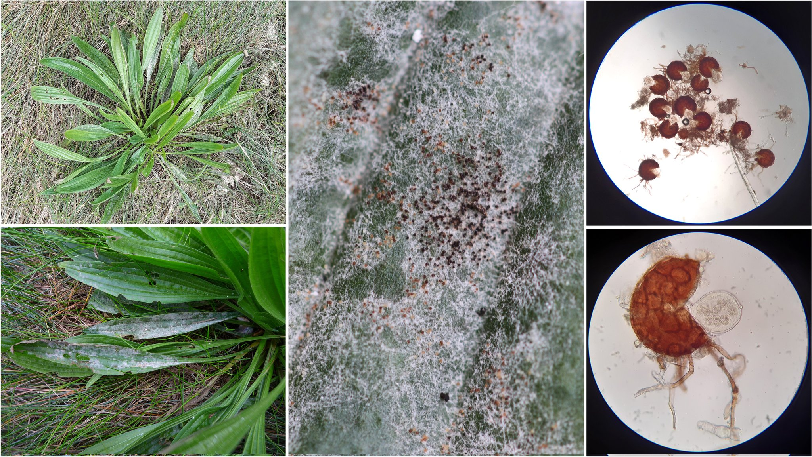
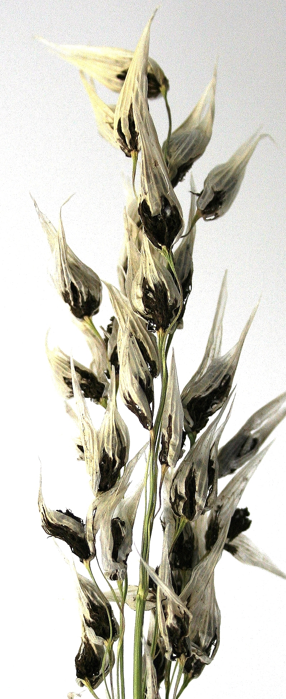
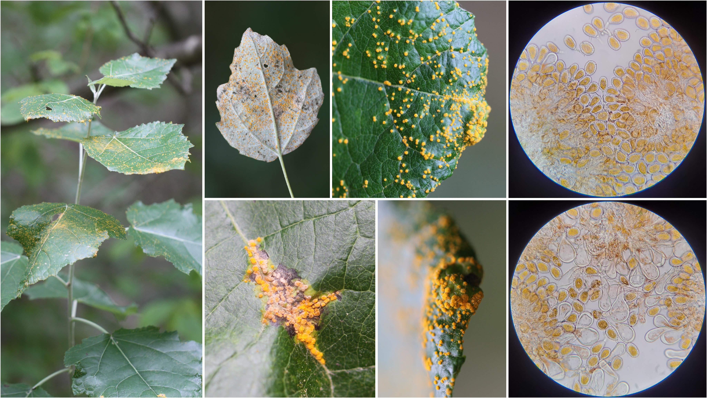
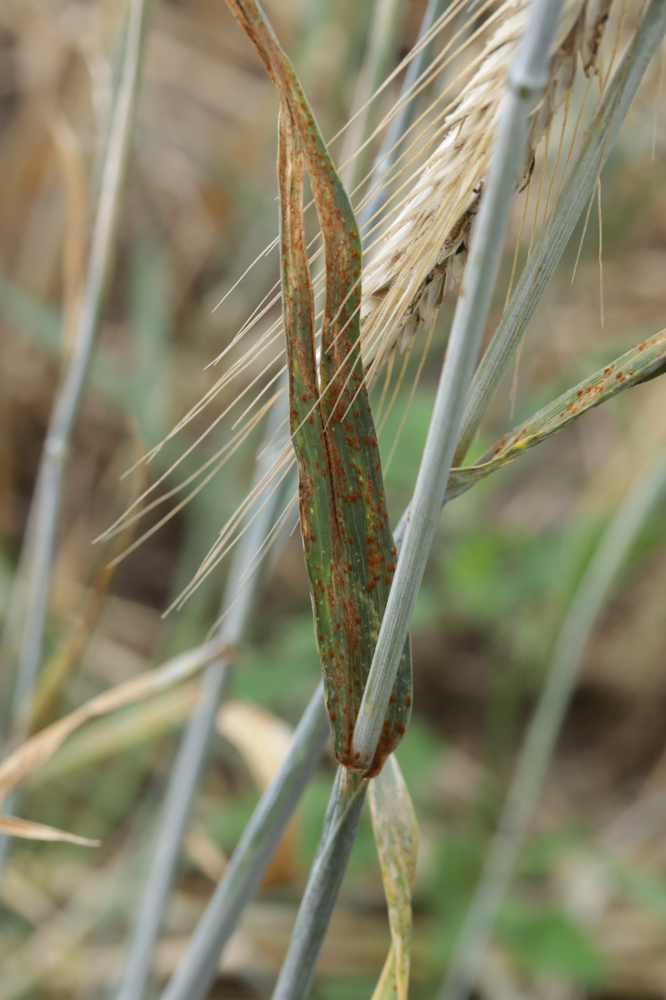
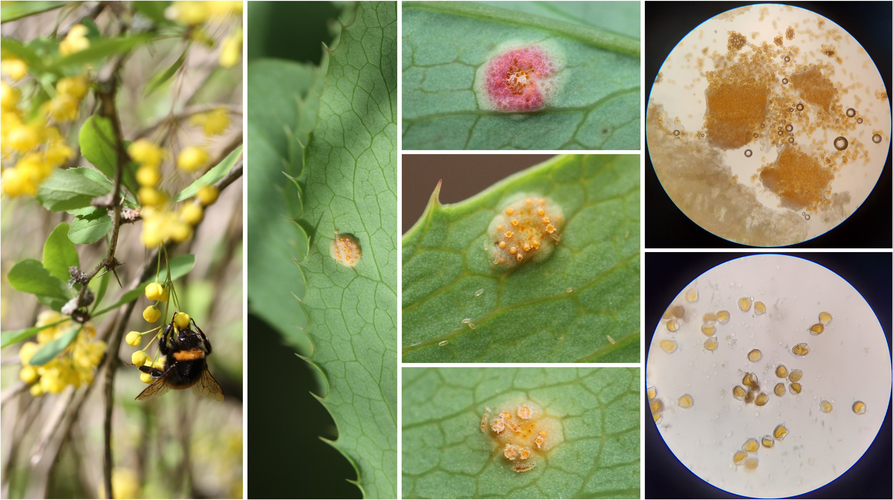
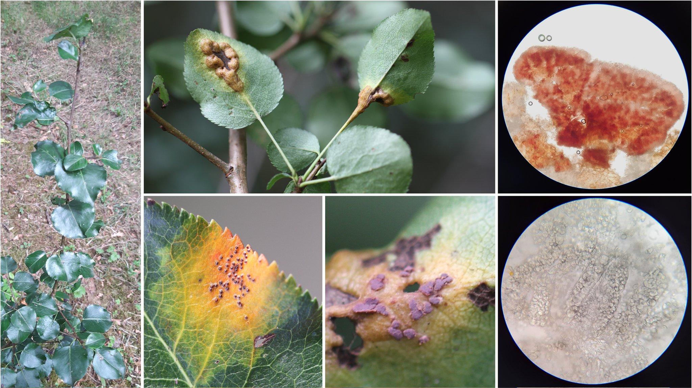

```{r setup, include=FALSE}
library(knitr)
require(tidyverse)
require(lavaan)
require(semPlot)

set.seed(453)
# invalidate cache when the package version changes
knitr::opts_chunk$set(tidy = FALSE, echo = FALSE, 
                  message = FALSE, warning = FALSE,
                  out.width = "45%", cache = TRUE, 
                  dev.args=list(bg=grey(0.9), pointsize=11))
options(knitr.table.format = "latex")
options(knitr.kable.NA = "", digits = 2)
options(kableExtra.latex.load_packages = FALSE)
theme_set(theme_bw())
```

# Biotic Stresses in Agriculture

##

- Selection for yield _per se_ is generally prohibitive.
- Breeding success in the last century was due to selection for individuals with resistance or tolerance to stress.
- Major cause of yield reduction on farmer's fields in most crops
  - FAO estimates that about 25% of the crop losses are due to diseases and pests.
  - Upto 100% yield losses have been reported
  - 80% of potato fields were lost due to \textit{Phytophthora infestans} during 1845 in Ireland and England
  - 37-67% of yield reduction in Soybean due to Asian Rust has been suggested in Brazil during 2006-2011 (US $4 billion loss)
- Economic and environmental burden of fungicide/pesticide application could be offset by development and use of resistant cultivar.

<!-- (For a brief description of Irish famine, Coffee rust, Downy mildew of grapes and Bengal famine refer to comprehensive crap guide (pp. 350)) -->

##

- There are over 45 virus, bacteria, fungi and nematodes of common beans that may reduce crop yield in different regions of the world.
  - most plant pathogens can present pathogenic races or biotypes -- a new cultivar, once resistant to a specific pathogen, may become susceptible to other races.
  - 

## Insects and Diseases of Major Crops in Nepal

```{r insect-pests-major}
tibble::tribble(
  ~"Crop", ~"Major insects", ~"Major disease",
  "Rice", "Rice bug, rice hispa, yellow stem borer, stripped stem borer, rice gall midge, mole cricket, plant hopper", "Bacterial blight (Xanthomonas oryzae), Blast (Pyricularia oryzae), False smut (Ustilaginoides virens), Brown leaf spot (Helminthosporium oryzae)", 
  "Wheat", "Armyworm, cutworm, shoot fly, stem borer, termites", "Leaf spots (Helminthosporium spp), rust, leaf streak (Xanthomonas spp), loose smut", 
  "Maize", "Stalk borer, shoot fly, cutworm, jassid, armyworm", "Rust, leaf blight (Helminthosporium maydis), smut (Specealothica reliana)", 
  "Barley", "Green bug, corn sawfly, fruitfly, wheat bulb fly", "Barley yellow dwarf virus, powdery mildew (Erysiphe graminis sp. hordii), Net blotch (Helminthosporium sativum)"
) %>% 
  knitr::kable(caption = "Major disease and insect pests of major cultivated crops in Nepal", booktabs = TRUE) %>% 
  kableExtra::kable_styling(latex_options = c("striped", "HOLD_position"), font_size = 7) %>% 
  kableExtra::column_spec(column = 2:3, width = c("12em", "12em"))
```

# Diseases

## Pathogenic fungi

- Most belong to phyla Ascomycota and Basidiomycota
- Fungi reproduce both sexually and asexually via the production of spores and other structures

## Rust

**Management**

Macrocyclic disease: _Puccinia graminis_ is a macrocyclic heteroecious fungus that causes wheat stem rust disease. The repeating stage in this fungus occurs on wheat and not the alternate host, barberry. The repeating stage allows the disease to persist in wheat even though the alternate host may be removed. Planting resistant crops is the ideal form of disease prevention, however, mutations can give rise to new strains of fungi that can overcome plant resistance. Although the disease cannot be stopped by removal of the alternate host, the life cycle is disrupted and the rate of mutation is decreased because of reduced genetic recombination. This allows resistance bred crops to remain effective for a longer period of time.

Demicyclic Disease: Because there is no repeating stage in the life cycle of demicyclic fungi, removal of the primary or the alternate host will disrupt the disease cycle. This method, however, is not highly effective in managing all demicyclic diseases. Cedar-apple rust disease, for example, can persist despite removal of one of the hosts since spores can be disseminated from long distances. The severity of Cedar-apple rust disease can be managed by removal of basidiospore producing galls from junipers or the application of protective fungicides to junipers.

Sulphur powder is known to stop spore germination. Fungicides such as Mancozeb and Triforine may help but may never eradicate the disease.

**Common rust fungi in agriculture**

- _Hemileia vastatrix_ (Coffee rust); Primary host is coffee plant; unknown alternate host. Heteroecious
- _Phakopsora meibomiae_ and _P. pachyrhizi_ (Soybean rust); Primary host is soybean and various legumes. Unknown alternate host. Heteroecious
- _Puccinia coronata_ (Crown Rust of Oats and Ryegrass); Oats are the primary host; Rhamnus spp. (Buckthorn) is alternate host. Heteroecious and macrocyclic
- _Puccinia graminis_ (Stem rust of wheat and Kentucky bluegrass, or black rust of cereals); Primary hosts include: Kentucky bluegrass, barley, and wheat; Common barberry is the alternate host. Heteroecious and macrocyclic
- _Puccinia hemerocallidis_ (Daylily rust); Daylily is primary host; Patrina sp is alternate host. Heteroecious and macrocyclic
- _Puccinia triticina_ (Brown Wheat Rust) in grains
- _Puccinia sorghi_ (Common Rust of Corn)
- _Puccinia striiformis_ (Yellow Rust) of cereals
- _Uromyces appendiculatus_ (Bean Rust) in common bean (Phaseolus vulgaris)[16]
- _Puccinia melanocephala_ (Brown Rust of Sugarcane)
- _Puccinia kuehnii_ (Orange rust of Sugarcane)

**UG99**

It is a lineage of wheat stem rust ( _Puccinia graminis f. sp. tritici_), which is present in wheat fields in several countries in Africa and Middle east and is predicted to spread rapidly through these regions and possibly further afield, potentially causing a wheat production disaster that would affect food security worldwide. It can cause up to 100% crop losses and is virulent against many resistance genes which have previously protected against stem rust.

## Fusarium

Fusariusm head blight/ear blight, foot rot, seedling blight
Pathogen: _Fusarium spp._ and _Microdochium nivale_
Hosts: Wheat, barley, oats, rye triticale and grasses.

Symptoms:

- Form a complex of diseases on seeds, seedlings and adult plants.
- _Microdochium nivale_ (formerly known as _Fusarium nivale_) is seed-borne pathogen and causes seedling blight resulting in seedling death and thinning of plant stand.
- _M. spp_ (other than _M. nivale_) cause a range of symptoms including brown lesions on stem bases, often restricted to outer leaf sheath.
- _Fusarium lesions_ often begin in the leaf sheath at the stem base where crown roots split the leaf sheath when emerging.
- This infection can spread up the leaf sheath causing long dark brown streaks at the stem base. The other symptom in cooler regions is brown staining of lower nodes.
- In older plants, fusarium infection can produce a true foot rot, where the stem base becomes brown and rotten, resulting in lodging and white heads.
- Symptoms are prevalent in very dry seasons as well.
- Ear blight causing fungus: _F culmorum_ and _F graminearum_ are common. Other are, _F avenaceum_, _F poae_ and _F langsethiae_.
- Infection frequently results in the whole or part of the ear becoming bleached.
- Symptoms seen when ears become infected during the early flowering stages, later infection may result in infection of grain but without obvious bleaching of the ears.
- Important due to its mycotoxin that gets accumulated in grains.

Life cycle:

- Most important source is seed but fungus survives on debris in soil also.
- Spores are splashed in canopy causing ear blights and seed borne infection, in wet seasons, especially during flowering and grain formation.
- Most fusarium species have competative saprophytic abilities which allow them to colonize debris and stubble in soil.

Importance:

- When wet season coincides with flowering high levels of ear blight can occur.
- Due to seed borne nature of pathogen, seed treatment plays role in preventing seedling loss in wheat.

##

```{r plantain-powdery-mildew, fig.cap="Powdery mildew on buckhorn plantain (\\textit{Plantago lanceolata}) caused by \\textit{Podosphaera plantaginis}, here with cleistothecia containing a single ascus and eight ascospores."}

```

```{r blackberry-botrytis-rot, fig.cap="Botrytis fruit rot on blackberry (\\textit{Rubus fruticosus})."}
knitr::include_graphics("../images/blackberry_botrytis_rot.jpeg")
```

##

```{r avenae-smut, fig.cap="Smut head of Oat caused by \\textit{Ustilago avenae}."}

```

```{r poplar-rust, fig.cap="Rust on White poplar \\textit{Populus alba} caused by \\textit{Melampsora} sp.. Uredinia are protruding on the upper face of some leaves and in cluster on ribs."}

```

##

```{r wheat-stem-rust, fig.cap="Stem rust on UK breeding nurseries"}
knitr::include_graphics("../images/FWGDjevXwAEBzeT.jpeg")
knitr::include_graphics("../images/FWGDkkkWYAA3yF4.jpeg")
```

##

- Wheat stripe rust is an air-borne and destructive disease caused by a heteroecious rust fungus \textit{Puccinia striiformis }f. sp. \textit{tritici} (Pst). Studies have demonstrated that the rust pathogen accomplishes sexual reproduction on susceptible barberry under natural conditions in spring, whereas Pst infection on barberry is still in blank in other seasons.

##

```{r secale-rust, fig.cap="\\textit{Puccinia recondita} on \\textit{Secale cereale}"}



```


```{r berberis-rust, fig.cap="Rust on flowering stage \\textit{Berberis vulgaris} caused by \\textit{Puccinia graminis} at the beginning of the aecial stage."}

```


```{r pear-rust, fig.cap="Rust on a wild pear (\\textit{Pyrus communis}) likely caused by \\textit{Gymnosporangium sabinae}, here with a cluster of pycnia and pre-aecial tissues parasitized by \\textit{Tuberculina} sp. (A hyperparasite) which is specific to Gymnosporangium."}

```

# Insects

## Major insects of Rice

```{r insects-damage}
tribble(
  ~"Damaged part", ~"Insect", ~"Scientific name",
  "Leaf", "Rice ear cutting caterpillar", "Mythimna seperata",
  "Leaf", "Rice swarming caterpillar", "Spodoptera mauritia",
  "Leaf", "Rice leaf folder", "Cnaphalocrosis medinalis",
  "Leaf", "Rice caseworm", "Nymphyla dpunctalis",
  "Leaf", "Rice grasshopper", "Hyeroglyphus banian",
  "Leaf", "Rice hispa", "Dickladispa armigera",
  "Leaf", "Field cricket", "Gryllus bimaculatus",
  "Stem", "Yellow stem borer", "Scripophaga incertulus",
  "Stem", "Rice pink borer", "Sesamia inferens",
  "Stem", "Gall midge", "Orselolia oryzae",
  "Stem", "Striped stem borer", "Chilo partellus",
  "Tender shoots", "Brown plant hopper", "Nilaparvata lugens",
  "Tender shoots", "Rice thrips", "Stenochaetothrips biformis",
  "Tender shoots", "Green leaf hopper", "Nephotettix virisens",
  "Root", "Mole cricket", "Gryllotalpa africana",
  "Grain, flower", "Rice earhead bug", "Leptocorisa oratorious",
  "Grain, flower", "Flower/pollen beetle", "Chiloloba acuta"
) %>% 
  mutate(`Scientific name` = paste0("\\textit{", `Scientific name`, "}")) %>% 
  knitr::kable(booktabs = TRUE, caption = "Major insects of rice and nature of their damange", longtable = TRUE, escape = FALSE) %>% 
  kableExtra::kable_styling(font_size = 8) %>% 
  kableExtra::column_spec(column = 2:3, width = c("8em", "10em")) %>% 
  kableExtra::column_spec(column = 1, width = "6em") %>% 
  kableExtra::collapse_rows(1)
```

## Major Insects of Fruits and Vegetables

```{r major-insects-fruits-vegetables}
tribble(
  ~"crop_meta", ~"crop_group", ~"common_name", ~"scientific_name", ~"family", ~"control", ~"remark",
  "Vegetable", "Cruciferous vegetables", "Cabbage butterfly", "Pieris brassicae", "Lepidoptera", "Dichlorovos 76 EC, Nuvan 1 ml, Malation 50\\% EC 2ml", NA,
  "Vegetable", NA, "Diamond-back moth", "Plutella xylostella", "Lepidoptera", "DBM lure, Azadirachtin 0.003\\% EC, Beauveria bassiana, Emamectin benzoate, Cypermethrin 10\\% EC 2ml", NA,
  "Vegetable", NA, "Tobaccoo caterpillar", "Spodoptera litura", "Lepidoptera", "Spodo-lure", NA,
  "Vegetable", NA, "Mustard aphid", "Lipaphis erysimi", "Homoptera", "Augmentation of natural predators Lady bird beetle (Coccinella septumpunctata) and Syrphid fly; Malathion 50 EC 1.5-2 ml per liter of water", NA,
  "Vegetable", NA, "Mustard sawfly", "Athalia lugens", "Hymenoptera", "Summer ploughing", NA,
  "Vegetable", NA, "Cutworm", "Agrotis ipsilon, A. segetum", "Lepidoptera", NA, NA,
  "Vegetable", NA, "Flea beetle", "Phyllotreta cruciferae", "Coleoptera", NA, NA,
  "Vegetable", NA, "Semi looper", "Thysanoplusia orichalcea", "Lepidoptera", NA, NA,
  "Vegetable", "Cucurbit crops", "Re pumpkin beetle", "Aulacophora foevicolis", "Coleoptera", NA, NA,
  "Vegetable", NA, "Cucurbit stink bug", "Cordius janus", "Hemiptera", NA, NA,
  "Vegetable", NA, "Pumpkin fruit fly", "Bactrocera cucurbitae", "Diptera", NA, NA,
  "Vegetable", NA, "Spotted beetle", "Epilachna vigintioctopunctata", "Coleoptera", NA, NA,
  "Vegetable", NA, "Cutworm, Semi-looper, Flea beetle, Aphid, White fly, Stem boring beetle, Banded blister beetle", "Mylabris orientalis", NA, NA, "Minior insects",
  "Vegetable", "Tomato", "Tomato fruit borer", "Helicoverpa armigera", "Lepidoptera", NA, NA,
  "Vegetable", "Potato", "Potato tuber moth", "Phthorimaea operculella", "Lepidoptera", NA, NA,
  "Vegetable", "Potato", "Red ant", "Dorylus orientalis", "Hymenoptera", NA, NA,
  "Vegetable", "Potato", "Silver white fly", "Bemisia tabaci", "Homoptera", NA, "Variants of white flies of economic importance are: Aleurocanthus woglumi (citrus blackfly), which, in spite of its color, is a whitefly that attacks citrus. Aleyrodes proletella (cabbage whitefly), is a pest of various Brassica crops. Trialeurodes vaporariorum (greenhouse whitefly), a major pest of greenhouse fruit, vegetables, and ornamentals.",
  "Vegetable", "Tomato", "Jassid", "Amarasca biguttula", "Hemiptera", NA, NA,
  "Vegetable", "Solanaceous crops", "Aphid", "Aphis gossypii, Myzus persicae", "Hemiptera", NA, NA,
  "Vegetable", "Solanaceous crops", "Pea leaf miner", "Liriomyza huidobrensis", "Agromyzidae", NA, NA,
  "Vegetable", "Tomato", "Tomato leaf miner", "Tuta absoluta", "Lepidoptera", NA, NA,
  "Vegetable", "Solanaceous crops", "Cutworm, Spotted beetle, White grub, Wireworm, Tobaccoo caterpillar, Flea beetle, Soybean, Hairy caterpillar", NA, NA, NA, "Minor insects",
  "Vegetable", "Brinjal", "Shoot and fruit borer", "Leucinodes orbonalis", "Lepidoptera", NA, NA,
  "Vegetable", NA, "Leaf folder", "Eublemma olivacea", "Lepidoptera", NA, NA,
  "Vegetable", NA, "Leaf webber", "Herpetogramma bipuncatalis", "Lepidoptera", NA, NA,
  "Vegetable", NA, "Spotted beetle", "Epilachna vigintioctopunctata", "Coleoptera", NA, NA,
  "Vegetable", NA, "Aphid, Cotton jassid, Tobaccoo caterpillar, Soybean hairy caterpillar, White fly, Green semilooper, Grasshopper, Red ant, White grub", NA, NA, NA, "Minor insects",
  "Vegetable", "Cotton", "American bollworm/Fruit borer", "Helicoverpa armigera", "Noctuidae", NA, "Bolls how regular, circular bore holes; A single larvae can damage 30-40 bolls; Inundative release of egg parasitoid, Trichogramma spp., at 6.25 cc/ha at 15 days interval, 3 times from 45 DAS; Releasing of predator Chrysoperla carnea 100000/ha at 6th, 13th and 14th week after sowing; During bolling and maturation apply one of the following (1000 liter per hectare spray): Quinalphos 25EC 2.0 liter per hectare, Carbaryl 50 WP 2.5 kg per hectare, Cypermethrin 10 EC 600-800 ml per hectare.",
  "Vegetable", "Cotton", "Pink bollworm", "Pectinophora gossypiella", "Lepidoptera (Gelechiidae)", NA, NA,
  "Vegetable", "Cotton", "Spotted bollworm", "Earias vittella", "Lepidoptera (Noctuidae)", NA, NA,
  "Vegetable", "Cotton", "Tobaccoo cutworm", "Spodoptera litura", "Lepidoptera (Noctuidae)", NA, NA,
  "Vegetable", "Cotton", "Cotton aphid", "Aphis gossypii", "Hemiptera (Aphididae)", NA, NA,
  "Vegetable", "Cotton", "Thrips", "Thrips tabaci", "Thysanoptera", NA, NA,
  "Vegetable", "Cotton", "White fly", "Bemisia tabaci", "Hemiptera (Aleyrodidae)", NA, NA,
  "Vegetable", "Cotton", "Red cotton bug", "Dysdercus cingulatus", "Hemiptera (Pyrrhocoridae)", NA, NA,
  "Fruit", "Citrus", "Citrus psylla", "Diaphorina citri", "Hemiptera", NA, NA,
  "Fruit", "Citrus", "Oriental fruit fly", "Bactocera dorsalis", "Diptera (Tephritidae)", NA, NA,
  "Fruit", "Citrus", "Stink bug", "Rhynchocoris poseidon", "Hemiptera", NA, NA,
  "Fruit", "Citrus", "Red scale", "Aonideiella aurantii", "Hemiptera", NA, NA,
  "Fruit", "Citrus", "Citrus aphid", "Toxoptera citricidus", "Hemiptera", NA, NA,
  "Fruit", "Citrus", "Orange stem borer", "Stomatimum barbatum", "Coleoptera", NA, NA,
  "Fruit", "Citrus", "Citrus mealy bug", "Planococcus citri", "Hemiptera", NA, NA,
  "Fruit", "Banana", "Rhizome weevil", "Cosmopolites sordidus", "Coleoptera", NA, NA,
  "Fruit", "Banana", "Pseudostem weevil", "Odoiporus longicollis", "Coleoptera", NA, NA,
  "Fruit", "Banana", "Skipper", "Erionata thrax thrax", "Lepidoptera", NA, NA,
  "Fruit", "Banana", "Leaf and fruit scarring beetle", "Nodostoma viridipennis", "Coleoptera", NA, NA,
  "Fruit", "Banana", "Aphid", "Pentalonia nigronervosa", "Hemiptera", NA, NA,
  "Fruit", "Banana", "Lace-wing bug", "Stephanitis typica", "Hemiptera", NA, NA,
  "Fruit", "Banana", "Fruit fly", "Bactrocera musae", "Hemiptera (Tephritidae)", NA, NA,
  "Fruit", "Mango", "Hopper", "Idioscopus nitidulus", "Hemiptera (Cicadellidae)", NA, NA,
  "Fruit", "Mango", "Fruit fly", "Bactrocera dorsalis", "Hemiptera (Tephritidae)", NA, NA,
  "Fruit", "Mango", "Mealy bug", "Drosicha mangiferae", "Hemiptera", NA, NA,
  "Fruit", "Mango", "Stem borer", "Bactrocera rufomaculata", "Coleoptera", NA, NA,
  "Fruit", "Mango", "Leaf webber", "Orthaga spp.", "Lepidoptera", NA, NA,
  "Fruit", "Mango", "Stone weevil", "Sternochetus mangiferae", "Coleoptera", NA, NA,
  "Fruit", "Mango", "Gall psyllid", "Apsylla cistella", "Hemiptera", NA, NA,
  "Fruit", "Mango", "Slug caterpillar, Mango leaf cutting weevil", NA, NA, NA, NA,
  "Fruit", "Peach", "Tent caterpillar", "Malacosoma indicum", "Lepidoptera", NA, "Also affects apricot and walnut",
  "Fruit", "Apple", "Wolly aphid", "Eriosoma langierum", "Hemiptera", NA, NA,
  "Fruit", "Apple", "San jose scale", "Quadraspidiotus perniciosus", "Hemiptera", NA, NA,
  "Fruit", "Apple", "Stem borer", "Apriona cinera", "Coleoptera", NA, NA,
  "Fruit", "Apple", "Root borer", "Dorysthenes hugeli", "Coleoptera", NA, NA,
  "Fruit", "Apple", "Codling moth", "Cydia pomonella", "Lepidoptera", NA, NA,
  "Fruit", "Peach", "Leaf curl aphid", "Brachycaudia helichrysi", "Hemiptera", NA, NA,
  NA, "Coffee", "White stem borer", "Xylotrechus quadripes", "Coleoptera", NA, NA,
  NA, "Coffee", "Berry borer", "Hypothenemus hampei", "Coleoptera", NA, NA,
  NA, "Coffee", "Shoot-hole borer", "Xylosandrus compactus", "Coleoptera", NA, NA,
  NA, "Coffee", "Stripped mealy bug", "Ferrisia virgata", "Hemiptera", NA, NA,
  NA, "Coffee", "Helmet scale", "Saissetia coffeae", "Hemiptera", NA, NA,
  NA, "Coffee", "Gren bug", "Coccus viridis", "Hemiptera", NA, NA,
  NA, "Tea", "Mosquito/Plant bug", "Belopeltis theivora", "Hemiptera", NA, NA,
  NA, "Tea", "Red spider mite", "Oligonychus coffeae", "Acarina", NA, NA,
  NA, "Tea", "Scarlet mite", "Brevipalpus phoenicis", "Acarina", NA, NA,
  NA, "Tea", "Purple mite", "Calacarus carinatus", "Acarina", NA, NA,
  "Storage", "Storage pests", "Rice weevil", "Sitophus oryzae", "Coleoptera (Curculionidae)", NA, NA,
  "Storage", NA, "Maize weevil", "Sitophus zeamais", "Coleoptera (Curculionidae)", NA, NA,
  "Storage", NA, "Angoumois grain moth", "Sitotroga cerealella", "Lepidoptera (Gelechiidae)", NA, NA,
  "Storage", NA, "Lesser grain borer", "Rhizopertha dominica", "Coleoptera (Bostrichidae)", NA, NA,
  "Storage", NA, "Rice moth", "Corcyra cephalonica", "Lepidoptera (Pyralidae)", NA, NA,
  "Storage", NA, "Khapra beetle", "Trogoderma granarium", "Coleoptera (Dermastidae)", NA, NA,
  "Storage", NA, "Pulse beetle", "Callosobruchus chinensis", "Coleoptera (Bruchidae)", NA, NA,
  "Storage", NA, "Cowpea beetle", "Callosobruchus maculates", "Coleoptera (Bruchidae)", NA, NA,
  "Storage", NA, "Rust red flour beetle", "Tribolium castaneum", "Coleoptera (Tenebrionidae)", NA, NA,
  "Storage", NA, "Confused flour beetle", "Tribolium confusum", "Coleoptera (Tenebrionidae)", NA, NA,
  "Storage", NA, "Warehouse moth", "Ephestia cautella", "Lepidoptera (Pyralidae)", NA, NA,
  "Storage", NA, "Indian meal moth", "Plodia interpunctella", "Lepidoptera (Phycitidae)", NA, NA,
  "Storage", NA, "Bean weevil", "Acanthoscelides obtectus", "Coleoptera (Bruchidae)", NA, NA,
  "Storage", NA, "Granary weevil", "Sitophilus granaries", "Coleoptera (Curculionidae)", NA, NA
) %>% 
  tidyr::fill(crop_group, .direction = "down") %>% 
  arrange(crop_meta, crop_group) %>%
  select(-1) %>% 
  rename_all(function(x)str_to_sentence(str_replace_all(x, "_", " "))) %>% 
  knitr::kable(booktabs = TRUE, caption = "Insect pests of fruits and vegetables", longtable = TRUE, escape = FALSE) %>% 
  kableExtra::kable_styling() %>% # do not set font here because it is already set above
  kableExtra::column_spec(column = 2:6, width = paste0(c(6, 12, 6, 12, 14), "em")) %>% 
  kableExtra::column_spec(column = 1, width = "5em") %>% 
  kableExtra::collapse_rows(1) %>% 
  kableExtra::landscape(margin = "1.25cm")
```

# Breeding for Insect Resistance

##

# Breeding for Disease Resistance

##

# Bibliography

## References

